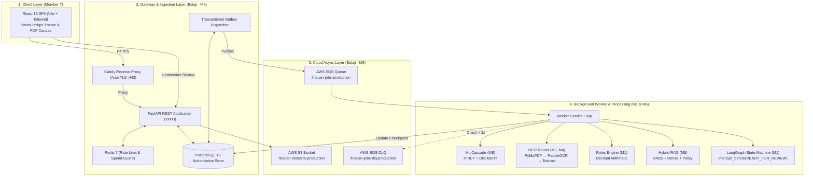
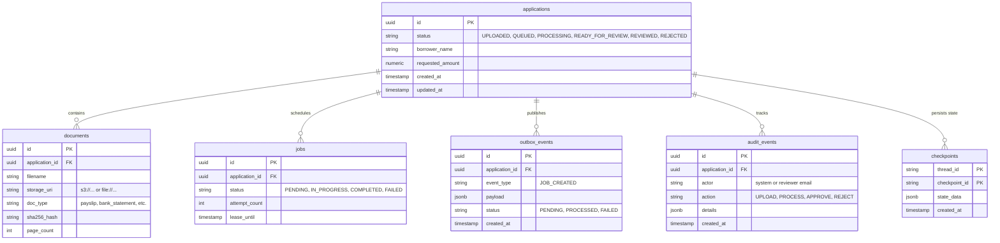
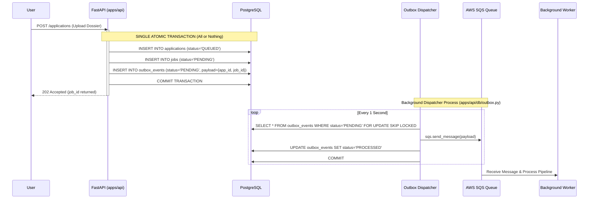
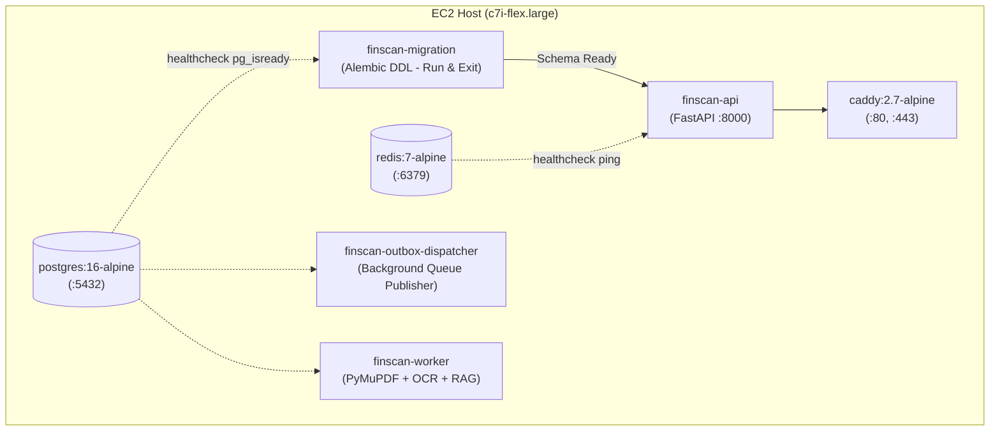
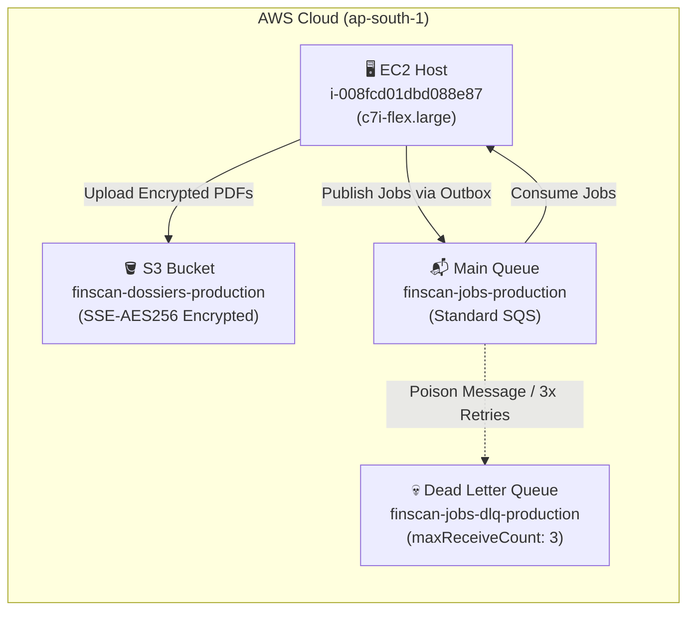

# FinScan AI — Complete Architecture & Technical Reference
**GenAI-Enabled Loan Document Processing & Institutional Appraisal Desk**

> **Core Operating Doctrine:**  
> *"Deterministic code decides. AI explains. A human approves. Every number traces back to a document."*

---

## 📋 Table of Contents
1. [System Overview & High-Level Architecture](#1-system-overview--high-level-architecture)
2. [Module Summary Across the 8-Member Team](#2-module-summary-across-the-8-member-team)
3. [Deep Dive: Member 6 (Balaji) — Backend, Database & Cloud Infrastructure](#3-deep-dive-member-6-balaji--backend-database--cloud-infrastructure)
   - [3.1 FastAPI Application Layer (`apps/api/`)](#31-fastapi-application-layer-appsapi)
   - [3.2 PostgreSQL Relational State Machine (`apps/api/db/`)](#32-postgresql-relational-state-machine-appsapidb)
   - [3.3 The Transactional Outbox Pattern (`apps/api/db/outbox.py`)](#33-the-transactional-outbox-pattern-appsapidboutboxpy)
   - [3.4 Redis Middleware: Sliding-Window Rate Limiting & Spend Guard](#34-redis-middleware-sliding-window-rate-limiting--spend-guard)
   - [3.5 Container Topology & Docker Compose (7 Services)](#35-container-topology--docker-compose-7-services)
   - [3.6 Caddy Reverse Proxy & Edge TLS Termination](#36-caddy-reverse-proxy--edge-tls-termination)
   - [3.7 AWS Cloud Architecture (S3, SQS, DLQ, EC2, IAM)](#37-aws-cloud-architecture-s3-sqs-dlq-ec2-iam)
   - [3.8 CI/CD Automation & Zero-Downtime Deployment](#38-cicd-automation--zero-downtime-deployment)
4. [Interview & Architecture Defense Cheat Sheet](#4-interview--architecture-defense-cheat-sheet)

---

## 1. System Overview & High-Level Architecture

FinScan AI automates the analysis of retail loan dossiers (Loan Application, Payslips, Bank Statements, Tax/ITR-V, KYC/PAN) in under **90 seconds** while strictly guaranteeing that AI never makes an autonomous credit decision or computes financial arithmetic.



---

## 2. Module Summary Across the 8-Member Team

| Module / Layer | Owner | Core Responsibilities & Key Files |
|---|---|---|
| **Client UI** | **Member 7** | React 18 SPA, Vite, Tailwind CSS, Swiss Ledger theme, PDF.js canvas viewer, dynamic green evidence bounding box overlays (`apps/ui/`). |
| **State Orchestration** | **Member 1 (Lead)** | LangGraph StateGraph pipeline, state checkpointing, explicit `interrupt()` at human-in-the-loop sign-off (`core/graph/`). |
| **Deterministic Rules** | **Member 1** | Pure Python decimal calculations: Salary reconciliation (`RULE-INC-01`), DTI threshold check (`RULE-BNK-01`), completeness audit (`RULE-COMP-01`) (`core/rules/`). |
| **Base Adapters** | **Member 2** | Abstract ports and basic adapters: Local filesystem storage, PostgreSQL SKIP LOCKED queue (`adapters/`). |
| **OCR & Extractors** | **Members 3 & 4** | 3-tier OCR router: PyMuPDF (native), PaddleOCR (scans), AWS Textract (cloud fallback). Structured fact extractors (`core/extraction/`). |
| **Hybrid RAG** | **Member 5** | Reciprocal Rank Fusion (RRF) combining sparse BM25 and dense embeddings; citation grounding verification gate (`core/rag/`). |
| **Backend & Cloud Infra** | **Member 6 (BALAJI)** | **FastAPI API, PostgreSQL schema, Transactional Outbox, Redis rate limiting, Docker Compose (7 containers), Caddy TLS, AWS (S3, SQS, EC2, IAM), CI/CD** (`apps/api/`, `infra/`). |
| **ML Classifier** | **Member 8** | Document classification cascade: TF-IDF + Logistic Regression baseline; cascades to DistilBERT transformer when confidence < 85% (`ml/`). |

---

## 3. Deep Dive: Member 6 (Balaji) — Backend, Database & Cloud Infrastructure

As Member 6, you built and own the operational backbone that guarantees system reliability, zero data loss, concurrency safety, and production cloud operations.

---

### 3.1 FastAPI Application Layer (`apps/api/`)

The REST API serves as the front door for document ingestion, application querying, and underwriter review.

```
apps/api/
├── main.py          # FastAPI initialization, CORS, lifespan, Redis cleanup, UI mount
├── config.py        # Pydantic BaseSettings, strict environment validation
├── storage.py       # Storage Port dependency injection (Local vs S3)
├── routes/
│   ├── applications.py  # Dossier lifecycle (POST /applications, GET /applications/{id})
│   ├── documents.py     # Multi-part upload, SHA-256 deduplication
│   └── review.py        # Underwriter decision sign-off & workflow un-halting
└── middleware/
    ├── rate_limit.py    # Redis sliding-window IP rate limiter
    └── spend_guard.py   # Redis concurrent active job limiter
```

* **Lifespan Management:** Configured via `@asynccontextmanager` in `main.py`. Opens database connections on startup and gracefully closes Redis pools (`await close_redis_client()`) on shutdown to prevent dangling sockets.
* **Streaming Deduplication:** During document upload in `routes/documents.py`, incoming file streams are hashed with **SHA-256**. If an identical document already exists for the dossier, the existing record is reused, preventing redundant OCR/LLM compute.
* **Storage Injection:** `storage.py` dynamically injects the storage provider (`LocalStorage` for local development, `S3Storage` with `SSE-AES256` in production).

---

### 3.2 PostgreSQL Relational State Machine (`apps/api/db/`)

PostgreSQL 16 is the **authoritative single source of truth** for all system state. Redis and SQS are treated strictly as transient infrastructure.



* **Database Migrations:** Managed using Alembic (`001_initial_schema.py`) to guarantee versioned, reproducible DDL migrations across environments.
* **Application Status Flow:**
  `UPLOADED` ➔ `QUEUED` ➔ `PROCESSING` ➔ `READY_FOR_REVIEW` ➔ (`REVIEWED` | `REJECTED` | `NEEDS_INFORMATION`)

---

### 3.3 The Transactional Outbox Pattern (`apps/api/db/outbox.py`)

#### The Problem: Dual-Write Network Partition
In naive architectures, creating a loan involves two independent calls:
```
Step 1: db.commit()   ---> SUCCESS ✅
Step 2: sqs.publish() ---> NETWORK TIMEOUT / CRASH ❌
Result: Job saved in DB as QUEUED, but message never reached SQS.
        Worker never wakes up. The loan is SILENTLY LOST forever!
```

#### Balaji's Solution: Transactional Outbox
Instead of publishing directly to SQS during the HTTP request, the event is saved **in the same atomic database transaction** as the application:



* **Guaranteed At-Least-Once Delivery:** Even if AWS SQS is temporarily unreachable, the job waits safely in PostgreSQL. When SQS recovers, the dispatcher immediately drains pending events.
* **Multi-Worker Safety:** Uses `FOR UPDATE SKIP LOCKED` so multiple API or dispatcher instances can run concurrently without race conditions or duplicate deliveries.

---

### 3.4 Redis Middleware: Sliding-Window Rate Limiting & Spend Guard

Implemented in `apps/api/middleware/` to protect against DoS attacks and cloud cost overruns:

#### A. Sliding-Window Rate Limiter (`rate_limit.py`)
* Unlike a fixed counter that resets every minute (which is vulnerable to traffic bursts at the boundary), this uses **Redis Sorted Sets (`ZSET`)**:
  1. Record current timestamp: `ZADD rate:<ip> <now> <now>`
  2. Prune records older than 60s: `ZREMRANGEBYSCORE rate:<ip> -inf (<now> - 60)`
  3. Count remaining requests: `ZCARD rate:<ip>`
  4. If count > 5, return **HTTP 429 (Too Many Requests)** with `Retry-After` header.

#### B. Spend Guard Concurrency Limiter (`spend_guard.py`)
* AI pipelines (OCR + LLM) are cost-intensive. The Spend Guard restricts each user to a maximum of **2 concurrent active processing jobs**.
* Acquired leases have a **300-second Redis TTL**. If a worker crashes unexpectedly, the lease expires automatically, preventing permanent account lockouts.

---

### 3.5 Container Topology & Docker Compose (7 Services)

Defined in [`infra/docker-compose.yml`](infra/docker-compose.yml):



#### Deterministic Startup Sequencing
To prevent startup race conditions, services declare explicit health conditions:
```yaml
api:
  depends_on:
    db:
      condition: service_healthy
    redis:
      condition: service_healthy
    migration:
      condition: service_completed_successfully
```

---

### 3.6 Caddy Reverse Proxy & Edge TLS Termination

Configured in [`infra/Caddyfile.production`](infra/Caddyfile.production):
* **Automated TLS:** Obtains and renews free SSL certificates automatically via Let's Encrypt / ACME.
* **Routing:** Directs `/api/*` and `/health` to FastAPI (`api:8000`) and serves pre-built React SPA static assets for root requests.
* **Security Headers:** Enforces `Strict-Transport-Security` (HSTS), `X-Frame-Options: DENY`, `X-Content-Type-Options: nosniff`.

---

### 3.7 AWS Cloud Architecture (S3, SQS, DLQ, EC2, IAM)

Automated via [`infra/aws_setup.sh`](infra/aws_setup.sh) and [`infra/ec2_setup.sh`](infra/ec2_setup.sh):



* **S3 Bucket (`finscan-dossiers-production`):** Private storage bucket with default server-side encryption (`AES256`), Block Public Access enabled, and scoped CORS rules.
* **SQS Main Queue (`finscan-jobs-production`):** Standard message queue with 300-second visibility timeout.
* **Dead Letter Queue (`finscan-jobs-dlq-production`):** Configured via Redrive Policy (`maxReceiveCount: 3`). Poison messages or unrecoverable crashes are isolated to the DLQ to prevent queue head-of-line blocking.
* **Least-Privilege IAM Policy (`infra/iam_policy.json`):** Restricts EC2 credentials to specific ARNs for S3 bucket operations and SQS actions.

---

### 3.8 CI/CD Automation & Zero-Downtime Deployment

Implemented in [`.github/workflows/ci.yml`](.github/workflows/ci.yml) and [`infra/deploy.sh`](infra/deploy.sh):

1. **Lint Gate:** Runs `ruff check .` across all Python code.
2. **Contract Gate:** Validates Pydantic schemas via `pytest tests/unit/test_contracts.py`.
3. **Unit & Smoke Tests:** Executes test suites (`pytest tests/unit tests/smoke`).
4. **OIDC & AWS SSM Deployment:**
   - Authenticates to AWS via GitHub Actions OpenID Connect (OIDC) without static keys.
   - Executes `infra/deploy.sh` on the EC2 instance via **AWS Systems Manager (SSM)**.
   - Rebuilds containers, verifies the `/health` endpoint over 30 retry attempts, and automatically triggers [`infra/rollback.sh`](infra/rollback.sh) if health verification fails.

---

## 4. Interview & Architecture Defense Cheat Sheet

When explaining your contribution as **Member 6**:

1. **What was your core role?**
   > *"I was the Cloud Architect, DevOps, and Backend Engineer. While my teammates worked on OCR extraction models and LangGraph workflows, I built the entire operational foundation: the FastAPI REST API, PostgreSQL database models, Redis rate limiting, Docker Compose container stack, Caddy TLS proxy, AWS cloud resources, and the CI/CD pipeline."*

2. **What was the hardest technical challenge you solved?**
   > *"The dual-write consistency problem between PostgreSQL and AWS SQS. If a server commits an application to the database but crashes before publishing to SQS, the loan is lost forever. I engineered the Transactional Outbox pattern, which atomically commits the job and outbox record in a single database transaction, backed by a background dispatcher with `FOR UPDATE SKIP LOCKED` that guarantees at-least-once delivery."*

3. **How do you protect the system from abuse and cost overruns?**
   > *"I implemented two Redis-backed layers in FastAPI middleware: a sliding-window rate limiter using Redis Sorted Sets to restrict submissions to 5 per minute per IP, and a Spend Guard that enforces a concurrency cap of 2 active processing jobs per user with auto-expiring leases."*

4. **How is high availability and disaster recovery managed?**
   > *"We use a 7-service Docker Compose architecture orchestrated behind a Caddy reverse proxy with automatic TLS certificate renewals. In AWS, unrecoverable crashes or poison messages are isolated to a Dead Letter Queue (DLQ) after 3 retries, and deployments feature automated rollback scripts if the post-deployment health check fails."*
