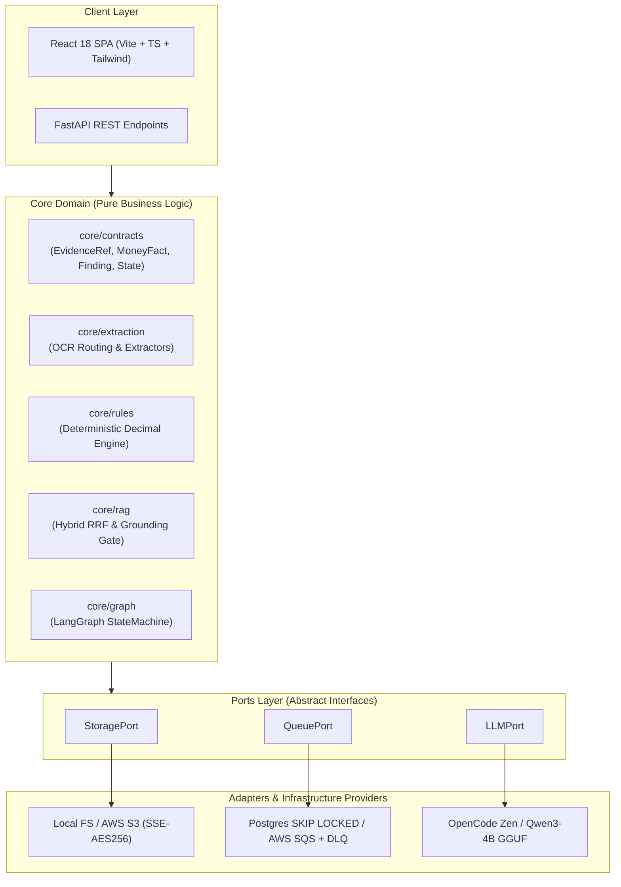
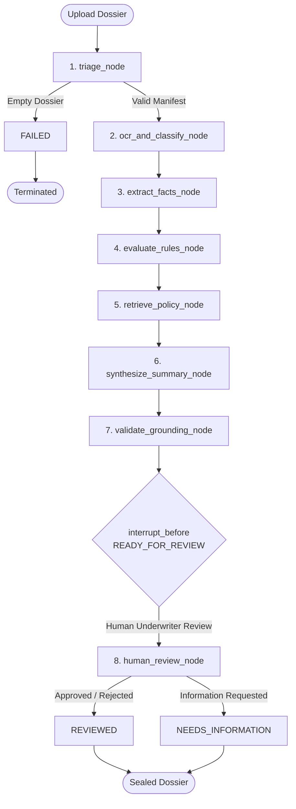

# 🏦 FinScan AI

**Provenance-Grounded Loan Document Processing & Verification Agent**

[](https://www.python.org/downloads/)
[](https://fastapi.tiangolo.com/)
[](https://langchain-ai.github.io/langgraph/)
[](https://react.dev/)
[](https://tailwindcss.com/)
[](https://www.postgresql.org/)
[](tests/)
[](LICENSE)

`#agentic-ai` `#langgraph` `#fintech` `#document-processing` `#hitl` `#hybrid-rag` `#explainable-ai`

---

## ⚡ Overview

**FinScan AI** automates retail loan document verification and underwriting cross-checks while eliminating GenAI hallucination risks. 

Traditional loan origination requires underwriters to manually cross-reference unstructured and semi-structured documents—including loan application forms, 3 months of salary payslips, 6 months of bank account statements, ITR-V tax acknowledgements, and KYC identity proofs. This manual process takes 24 to 72 hours per dossier and is prone to human oversight.

Standard LLM solutions fail in financial underwriting because they hallucinate calculations, fail strict arithmetic checks, and cannot provide legally binding, page-level audit trails. 

FinScan AI resolves this through **Provenance-Grounded Deterministic Verification**:

> ### 🌟 The Prime Invariant
> **Deterministic code decides. AI explains. A human approves. Every number traces back to a page in a document.**
>
> 1. **Zero Hallucinated Decisions:** No total, net salary, debt-to-income (DTI) ratio, disposition, pass/flag verdict, or monetary value originates from an LLM. Pure deterministic Python computes them; the LLM only narrates and explains them.
> 2. **Mandatory Provenance:** Every extracted fact requires an `EvidenceRef` containing document ID, page number, and bounding-box coordinates (`x0, y0, x1, y1`). If evidence is missing or unreadable, the value is strictly marked `UNKNOWN`, never a guess.
> 3. **No Autonomous Underwriting:** The system halts at an explicit LangGraph `interrupt()` checkpoint. A human underwriter must sign off before any loan disposition is committed.

---

## 🚀 Key Capabilities

- **Intelligent Perception & OCR Routing:** Native text layer parsing via PyMuPDF (`fitz`) with automatic CPU fallback to PaddleOCR for scanned pages.
- **Provenance-Bound Entity Extraction:** Domain-specific extractors for Payslips, Bank Statements, Tax Filings (ITR-V), and KYC identity cards with pixel-level coordinate mapping.
- **Deterministic Rules Engine (HUMAN-ONLY ZONE):**
  - `RULE-COMP-01`: Dossier completeness verification (mandatory presence of all 5 dossier documents).
  - `RULE-INC-01`: Payslip net salary reconciliation against bank payroll deposits within $5\%$ tolerance.
  - `RULE-TAX-01`: ITR gross total income vs. annualized payslip gross income ($12 \times \text{monthly}$) within $10\%$ tolerance.
  - `RULE-ID-01`: RapidFuzz fuzzy token-sort identity matching ($\ge 85\%$) and cross-document PAN verification.
  - `RULE-BANK-01`: Bank statement balance arithmetic equation validation ($Opening + Credits - Debits = Closing$).
- **Hybrid RAG with Citation Gate:** BM25 lexical search fused with `BAAI/bge-small-en-v1.5` dense embeddings via Reciprocal Rank Fusion (RRF). Enforces a citation validation gate that purges ungrounded claims and defends against prompt injection.
- **Stateful Human-in-the-Loop Orchestration:** LangGraph `StateGraph` backed by durable checkpointing (`SqliteSaver` / PostgreSQL) that unconditionally pauses at `interrupt()` for human underwriter review.
- **Archival Swiss Reviewer SPA:** React 18 + Vite + Tailwind CSS three-pane dashboard featuring `pdf.js` canvas rendering with visual bounding-box highlights, interactive Q&A, and a 3-tier dual-sign confirmation friction gate.

---

## 🏛️ System Architecture

FinScan AI follows a **Hexagonal Ports & Adapters** architecture. The core domain code (`core/`) contains pure business logic and remains completely decoupled from external cloud SDKs or infrastructure providers.



### LangGraph Execution Pipeline

The loan dossier flows through an 8-node stateful workflow:



---

## 🛠️ Technology Stack

| Layer | Component | Selection | Rationale & Invariants |
| :--- | :--- | :--- | :--- |
| **API & Persistence** | REST Framework | FastAPI + Pydantic v2 | Strict schema enforcement, async I/O, auto OpenAPI freeze |
| | Datastore | PostgreSQL 16 + SQLAlchemy 2.0 | Transactional outbox commits, `SKIP LOCKED` worker leases |
| | Cache & Rate Limiting| Redis 7 | Disposable rate-limiting token buckets and ephemeral session cache |
| **Orchestration** | Agent State Machine | LangGraph + Checkpointers | Stateful pipeline, transactional resume, explicit `interrupt()` |
| | Worker Consumer | Python Async Worker | At-least-once delivery, `LeaseHeartbeat`, 3-attempt DLQ ceiling |
| **Perception & ML** | OCR Routing | PyMuPDF + PaddleOCR | Native PDF word bounds; CPU fallback for scanned pages |
| | Page Classifier | TF-IDF + Logistic Regression | $\ge 0.90$ Macro-F1, CPU execution, $<50$ MB RAM footprint |
| **Domain Logic** | Financial Rules | Pure Python (Decimal) | Floating-point immune, zero LLM reliance, deterministic tolerances |
| | Hybrid RAG | BM25 + BGE Dense + RRF | Strict tenant index isolation, citation grounding verification |
| **Frontend UI** | Reviewer SPA | React 18 + TypeScript + Vite | Swiss private-banking theme, zero Node in production |
| | Document Viewer | `pdf.js` Canvas | Hardware-accelerated canvas with dynamic `EvidenceRef` bounding boxes |

---

## ⚡ Quick Start

### Prerequisites
- **Python 3.11+**
- **Node.js 18+**
- **Docker Desktop** (for PostgreSQL and Redis containers)

### 1. Clone & Setup

```bash
git clone https://github.com/maczeo11/loan-doc-processing-agent.git
cd loan-doc-processing-agent

# Create and activate Python virtual environment
python -m venv venv
venv\Scripts\activate          # Windows
# source venv/bin/activate     # macOS / Linux

# Install dependencies and editable package
make install
cp .env.example .env
```

### 2. Launch Local Stack

On Windows PowerShell:
```powershell
# Automated 1-command startup (Docker infra, migrations, API, worker, UI)
make demo-all
```

Or run individual services across terminals:
```bash
make demo-infra       # 1. Start PostgreSQL & Redis in Docker
make demo-migrate     # 2. Apply Alembic database migrations
make demo-api         # 3. Start FastAPI server (http://localhost:8000)
make demo-outbox      # 4. Start Outbox Dispatcher
make demo-worker      # 5. Start LangGraph Worker Consumer
make demo-ui          # 6. Start Vite Reviewer Dashboard (http://localhost:3000)
```

Open **http://localhost:3000** to access the Reviewer Dashboard.  
FastAPI Swagger documentation is accessible at **http://localhost:8000/docs**.

---

## 🧪 Verification & Test Suite

The repository maintains an automated test suite across unit, integration, and smoke layers:

```bash
# Run complete test suite
pytest

# Run tests by module
pytest tests/unit/test_rules.py        # Deterministic financial rules
pytest tests/unit/test_reporting.py    # CAM narrative & PDF exporter
pytest tests/unit/test_rag.py          # Hybrid RAG & citation gate
pytest tests/integration/              # Database outbox & API lifecycle

# Typecheck and build frontend SPA
cd apps/ui && npm run build
```

**Baseline Status:** `355 passed, 0 failures` (100% test coverage pass rate).

---

## 📂 Repository Layout

```txt
loan-doc-processing-agent/
├── AGENTS.md               # System constitution, team rules & non-negotiable invariants
├── README.md               # System overview, architecture & quick start
├── Makefile                # make install, test, demo-all, lint
├── pyproject.toml          # Editable package configuration
│
├── core/                   # Pure business logic (Zero external vendor SDK imports)
│   ├── contracts/          # Strict Pydantic models: EvidenceRef, MoneyFact, Finding, State
│   ├── extraction/         # OCR routing & typed extractors (Payslip, Bank, Tax, ID)
│   ├── graph/              # LangGraph nodes, checkpointing & state machine
│   ├── rag/                # BM25 + BGE retriever, RRF combiner, grounding validation gate
│   ├── reporting/          # Credit Appraisal Memo (CAM) builder & PDF/JSON exporters
│   └── rules/              # Deterministic financial arithmetic engine (HUMAN-ONLY ZONE)
│
├── adapters/               # Hexagonal Ports & Adapters (Interchangeable local/cloud)
│   ├── queue/              # PostgreSQL SKIP LOCKED (local) & AWS SQS + DLQ (cloud)
│   ├── storage/            # Local FileSystem (local) & AWS S3 with SSE-AES256 (cloud)
│   └── llm/                # OpenCode Zen (cloud) & local Qwen GGUF (offline)
│
├── apps/
│   ├── api/                # FastAPI application, SQLAlchemy outbox, auth & routes
│   └── ui/                 # React 18 + Vite + Tailwind + pdf.js Reviewer Dashboard
│
├── worker/                 # Consumer loop driving LangGraph with atomic leases & ack-last
│   ├── consumer.py         # LeaseHeartbeat, error handling, idempotent job commits
│   └── main.py             # Worker process entrypoint
│
├── ml/                     # Document classification models & evaluation
│   ├── artifacts/          # Serialized models (.joblib)
│   └── classifier/         # Baseline TF-IDF + Logistic Regression vs. DistilBERT
│
├── data/                   # Synthetic dossiers (50 dossiers, 4 splits) & Kaggle seeds
├── policies/               # Authoritative underwriting guidelines for RAG
├── infra/                  # Docker Compose, Caddyfile & cloud deployment configs
├── scripts/                # Synthetic dossier generators & local demo automation
└── tests/                  # 355 unit, integration, and smoke test suites
```

---

## 📖 Documentation Index

| Specification | Description |
| :--- | :--- |
| [`AGENTS.md`](AGENTS.md) | **System Constitution**: Mandatory invariants, module boundaries, and team contracts |
| [`docs/architecture.md`](docs/architecture.md) | High-level system architecture, Ports & Adapters design, and component isolation |
| [`docs/langgraph_workflow.md`](docs/langgraph_workflow.md) | Detailed node-by-node LangGraph execution and `interrupt()` checkpoint specifications |
| [`docs/worker_queue_architecture.md`](docs/worker_queue_architecture.md) | Queue leasing, ack-last guarantees, transactional outbox, and DLQ protocols |
| [`docs/frontend_architecture.md`](docs/frontend_architecture.md) | Reviewer SPA layout, `pdf.js` canvas coordinate transformations, and dual-sign protocol |
| [`docs/security_architecture.md`](docs/security_architecture.md) | Encryption at rest, tenant isolation, PII masking, and prompt injection firewalls |
| [`docs/deployment_guide.md`](docs/deployment_guide.md) | Local development setup, Docker Compose specifications, and cloud deployment |
| [`docs/implementation_status.md`](docs/implementation_status.md) | Comprehensive implementation and verification matrix across all modules |

---

## 📄 License

This project is licensed under the MIT License — see the [LICENSE](LICENSE) file for details.
