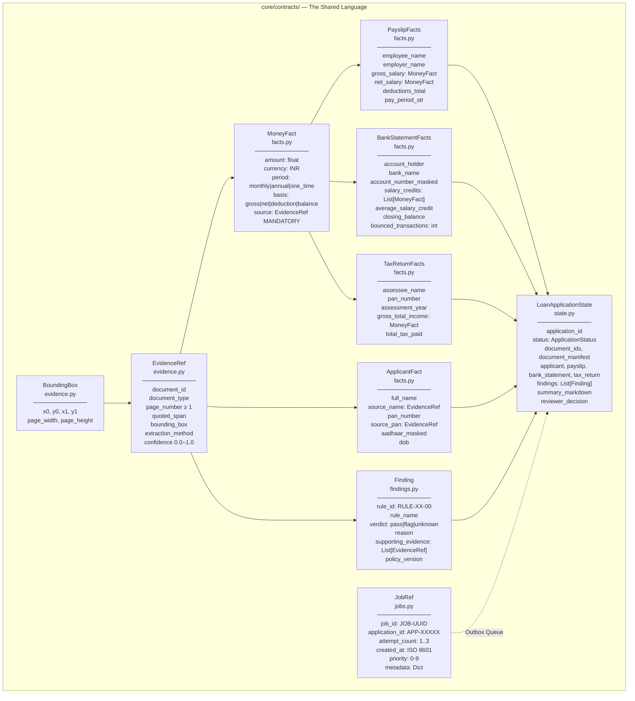
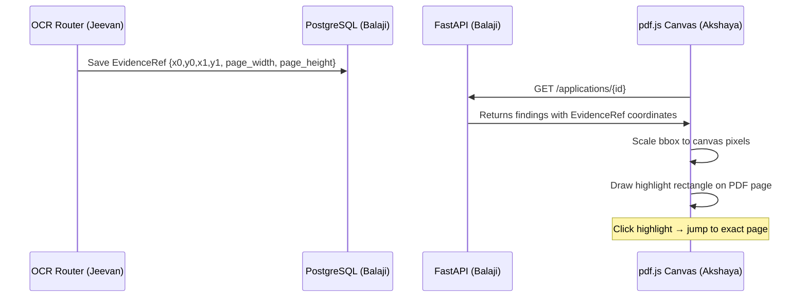
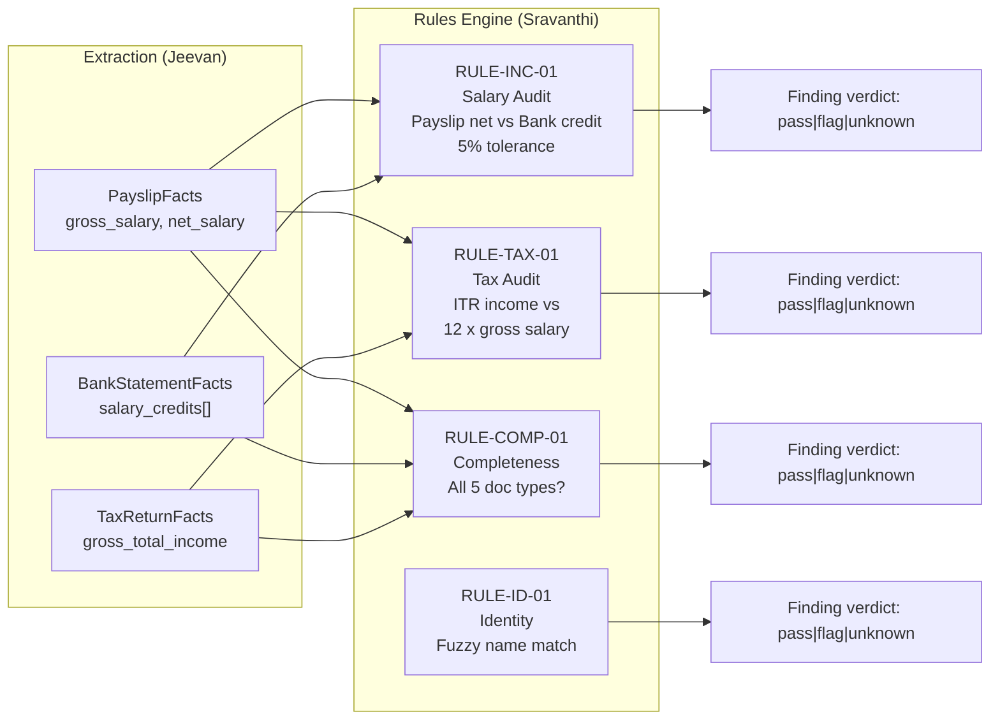
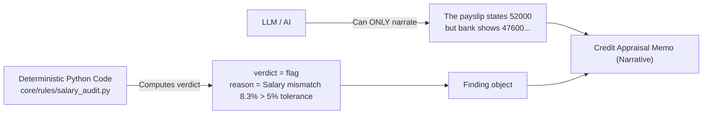
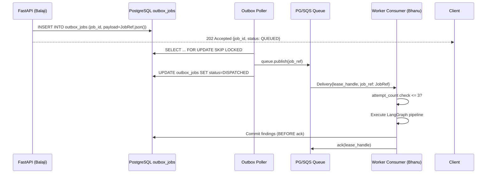
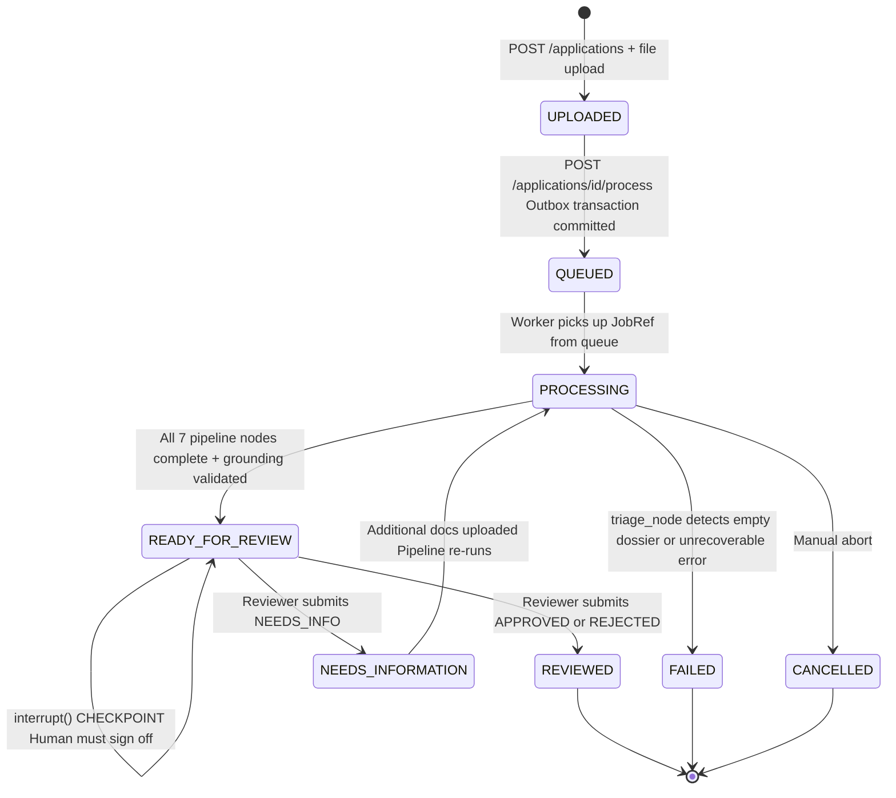
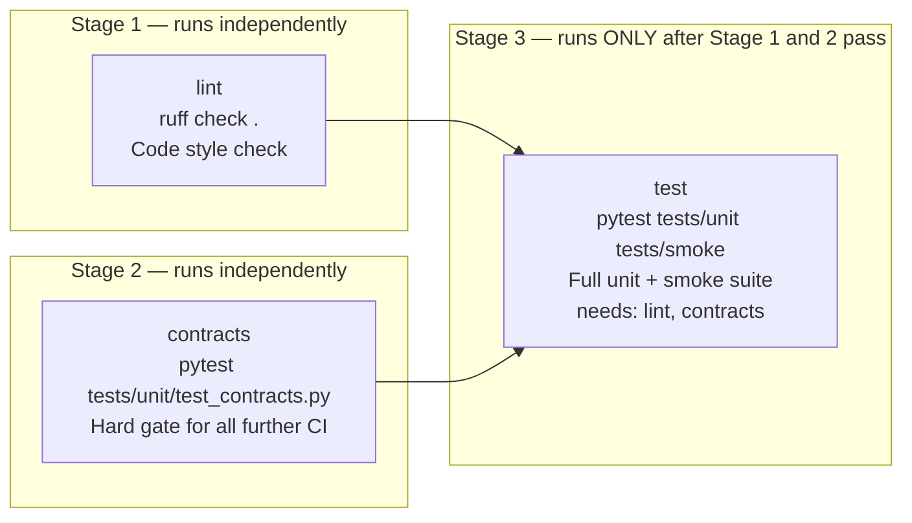
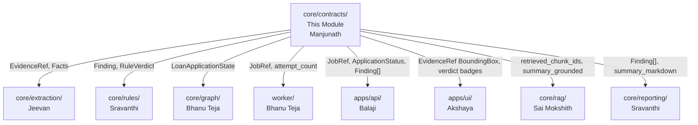

# 📚 Module 1 Study Guide — API Contracts, CI & Integration
**Owner:** Manjunath (Member 1)  
**Folder:** `core/contracts/`  
**Branch Prefix:** `feat/contracts-*`, `feat/ci-*`, `feat/integration-*`

---

## 📖 Before You Start — Docs to Read First

Read these from the `docs/` folder **in this exact order** before studying the code:

| # | Doc File | What You Will Learn |
|---|----------|---------------------|
| 1 | [`docs/system_overview.md`](../../docs/system_overview.md) | The Prime Invariant. Every number must trace to a document page — which is exactly what contracts enforce. |
| 2 | [`docs/architecture.md`](../../docs/architecture.md) | How `core/` is a **pure domain zone** — no boto3, no external SDKs. Contracts are the wall that enforces this. |
| 3 | [`docs/data_flow_diagrams.md`](../../docs/data_flow_diagrams.md) | Level 2 flow — how `EvidenceRef` travels from OCR extractor → Rules Engine → RAG grounding → Frontend bounding-box overlay. |

> **Estimated reading time:** 30–40 minutes before touching any code.

---

## 🧠 What Is This Module? (The Big Picture)

`core/contracts/` is the **single source of truth** shared by all 8 team members.

Every module in the project — OCR extraction, deterministic rules, worker queue, frontend API calls — speaks in the language defined here. If a contract changes, **every module must update simultaneously**.

Think of it like a bank's legal contract: no one can unilaterally change a clause. Any change must be coordinated, reviewed, and landed in one PR.

---

## 🏗️ Module Architecture



---

## 📂 File-by-File Breakdown

### File 1: `evidence.py` — The Atomic Unit of Truth

Every single fact in the system **must carry an EvidenceRef**. No evidence = fact is rejected as `UNKNOWN`.

```python
class BoundingBox(BaseModel):
    x0: float   # Left edge of text in PDF points
    y0: float   # Top edge
    x1: float   # Right edge
    y1: float   # Bottom edge
    page_width: Optional[float]   # Used to scale to canvas pixels in pdf.js
    page_height: Optional[float]
```

```python
class EvidenceRef(BaseModel):
    document_id: str              # e.g. "DOC-abc123"
    document_type: str            # e.g. "payslip", "bank_statement"
    page_number: int              # ge=1 (1-indexed, never 0)
    quoted_span: str              # Exact text lifted from the PDF page
    bounding_box: Optional[BoundingBox]
    extraction_method: str        # "pymupdf_native" | "paddleocr_cpu" | "textract_managed"
    confidence: float             # 0.0 to 1.0
```

**How bounding boxes connect to the Frontend:**



---

### File 2: `facts.py` — Structured Financial Entities

Four domain fact models. All monetary values must carry an `EvidenceRef`.

#### `MoneyFact` — The Verified Money Container
```python
class MoneyFact(BaseModel):
    amount: float                              # The raw number
    currency: str = "INR"
    period: Literal["monthly","annual","one_time"] = "monthly"
    basis: Literal["gross","net","deduction","balance"] = "gross"
    source: EvidenceRef                        # MANDATORY. Cannot be None.
```
> **Inviolable Rule:** You CANNOT create a `MoneyFact` without `source`. The test `test_money_fact_requires_evidence()` verifies this with `pytest.raises(ValidationError)`.

---

#### `ApplicantFact` — The Loan Applicant's Identity
```python
class ApplicantFact(BaseModel):
    full_name: str
    source_name: EvidenceRef        # Where was the name found? Which page?
    dob: Optional[str]
    source_dob: Optional[EvidenceRef]
    pan_number: Optional[str]       # XXXXXX1234 masked format in UI
    source_pan: Optional[EvidenceRef]
    aadhaar_masked: Optional[str]   # XXXX-XXXX-9012
    source_aadhaar: Optional[EvidenceRef]
```

---

#### `PayslipFacts` — Salary Extracted from Payslip PDF
```python
class PayslipFacts(BaseModel):
    employee_name: str
    employer_name: str
    gross_salary: MoneyFact          # Each carries its own EvidenceRef
    net_salary: MoneyFact
    deductions_total: Optional[MoneyFact]
    pay_period_str: Optional[str]    # e.g. "July 2026"
```

---

#### `BankStatementFacts` — Bank Account Deposits
```python
class BankStatementFacts(BaseModel):
    account_holder: str
    bank_name: str
    account_number_masked: str       # XXXXXX6789
    salary_credits: List[MoneyFact]  # Every monthly credit deposit
    average_salary_credit: Optional[MoneyFact]
    opening_balance: Optional[MoneyFact]
    closing_balance: Optional[MoneyFact]
    total_credits: Optional[MoneyFact]
    total_debits: Optional[MoneyFact]
    bounced_transactions: int = 0    # Flags financial risk
```

---

#### `TaxReturnFacts` — ITR Data
```python
class TaxReturnFacts(BaseModel):
    assessee_name: str
    pan_number: str
    assessment_year: str             # e.g. "2025-26"
    gross_total_income: MoneyFact    # Full year income
    total_tax_paid: Optional[MoneyFact]
```

---

### How Facts Flow Into the Rules Engine



---

### File 3: `findings.py` — Output of Deterministic Rules

```python
RuleVerdict = Literal["pass", "flag", "unknown"]

class Finding(BaseModel):
    rule_id: str                             # e.g. "RULE-INC-01"
    rule_name: str                           # e.g. "Salary Reconciliation Audit"
    verdict: RuleVerdict                     # ONLY: "pass" | "flag" | "unknown"
    reason: str                              # Human-readable explanation
    supporting_evidence: List[EvidenceRef]   # Citations from actual document pages
    policy_version: str = "v1.0"
```

**Key Rule: Verdicts are NEVER generated by an LLM.**



**Three Possible Verdicts:**

| Verdict | Meaning | When Used |
|---------|---------|-----------|
| `pass` | Rule check passed within tolerance | Values found and match within threshold |
| `flag` | Discrepancy detected | Values found but diverge beyond tolerance |
| `unknown` | Cannot evaluate | A required value is UNKNOWN / missing |

> **NEVER guess `pass` when evidence is missing. Always return `unknown`.**

---

### File 4: `jobs.py` — The Queue Message Contract

```python
class JobRef(BaseModel):
    job_id: str          # "JOB-550e8400-e29b-41d4-a716-446655440000"
    application_id: str  # "APP-25195"
    attempt_count: int   # Starts at 1; max 3 before DLQ routing
    created_at: str      # ISO 8601 UTC: "2026-09-08T12:00:00Z"
    priority: int        # 0 = normal, 9 = urgent
    metadata: Dict       # trace_id, user_id, document_ids list
```

**How JobRef travels through the system:**



---

### File 5: `state.py` — The LangGraph Pipeline State

This is the **single object** passed between every LangGraph node.

```python
ApplicationStatus = Literal[
    "UPLOADED",           # File received, not yet queued
    "QUEUED",             # Job inserted into outbox
    "PROCESSING",         # Worker actively running pipeline
    "READY_FOR_REVIEW",   # AI summary done, waiting for human
    "NEEDS_INFORMATION",  # Reviewer requested more docs
    "REVIEWED",           # Final decision made
    "FAILED",             # Pipeline crashed
    "CANCELLED"           # Manually aborted
]
```

**Application Status Lifecycle State Machine:**



**Full State Fields Summary:**

| Section | Fields | Populated By |
|---------|--------|--------------|
| Identity | `application_id`, `status`, `status_history` | API (Balaji) |
| Storage | `document_ids`, `document_manifest`, `document_bytes` | API (Balaji) + Worker (Bhanu) |
| Perception | `classified_types`, `document_pages`, `ocr_routes` | OCR (Jeevan) |
| Extracted Facts | `applicant`, `payslip`, `bank_statement`, `tax_return` | Extractors (Jeevan) |
| Rule Results | `findings`, `missing_documents` | Rules Engine (Sravanthi) |
| RAG/AI Summary | `retrieved_chunk_ids`, `summary_markdown`, `summary_grounded` | RAG (Sai Mokshith) |
| Human Review | `review_paused`, `reviewer_decision`, `reviewer_notes`, `corrections_applied` | Frontend (Akshaya) + API (Balaji) |

---

### File 6: `__init__.py` — Public API of the Package

```python
# Everything other modules import from here — single import point
from core.contracts import (
    EvidenceRef, BoundingBox,
    MoneyFact, ApplicantFact, PayslipFacts, BankStatementFacts, TaxReturnFacts,
    Finding, RuleVerdict,
    LoanApplicationState, ApplicationStatus,
    JobRef,
)
```

---

## 🧪 Tests for This Module

### `tests/unit/test_contracts.py`

| Test Name | What It Proves |
|-----------|----------------|
| `test_job_ref_and_delivery()` | `JobRef` builds correctly; `Delivery` wrapper preserves lease handle and job |
| `test_evidence_ref_valid()` | `EvidenceRef` with full `BoundingBox` constructs without error |
| `test_money_fact_requires_evidence()` | `MoneyFact` raises `ValidationError` if `source` is missing — hallucination guard |
| `test_finding_verdict_values()` | Only `"pass"`, `"flag"`, `"unknown"` accepted; `"invalid_status"` raises `ValidationError` |
| `test_storage_key_convention()` | Sanitize filenames for S3 path traversal attacks (`../../malicious` becomes `malicious`) |

**Run the tests yourself:**
```bash
# Run from repo root
pytest tests/unit/test_contracts.py -v
```

---

## ⚙️ CI Pipeline — `.github/workflows/ci.yml`



**Key CI Rules:**
- CI **never** calls paid cloud APIs. Uses in-memory fake adapters.
- `contracts` job is a **hard gate** — if contracts break, `test` job never runs.
- Any PR on `feat/*` or `main` branch triggers the full 3-stage pipeline.

---

## 🔗 How This Module Connects to All Other Modules



---

## ⚠️ Inviolable Rules

| # | Rule | Why It Exists |
|---|------|---------------|
| 1 | Never make a required field `Optional` to pass a test | Defeats type safety; lets callers skip evidence |
| 2 | Never redefine a contract locally in another module | Creates two sources of truth → data corruption |
| 3 | Any contract change = one single PR updating ALL consumers | Keeps all 8 members synchronized |
| 4 | CI must never call paid cloud APIs | Avoids $25/week budget blowout in automated runs |
| 5 | `Finding.verdict` only accepts `"pass"`, `"flag"`, `"unknown"` | `"approved"` raises `ValidationError` |
| 6 | `MoneyFact.source` is mandatory | A financial amount with no provenance is a hallucination |

---

## 💡 Key Concepts to Understand

### Why Does Everything Carry `EvidenceRef`?
In a banking audit, every number must be verifiable. An `EvidenceRef` is like a footnote in a legal document — without it, you cannot say "this salary amount came from page 3 of the payslip."

### Why Are Verdict Values Restricted to `pass | flag | unknown`?
- `pass` = everything checks out within tolerance
- `flag` = discrepancy found; human must review
- `unknown` = not enough data to decide (safer than guessing)

There is no `"approved"` or `"rejected"` in verdicts — **only humans make final decisions.**

### Why `attempt_count ≤ 3` in `JobRef`?
Poison messages (corrupted dossiers, malformed PDFs) that crash the worker must be isolated. After 3 failures, the job is routed to the Dead Letter Queue (DLQ) for manual inspection.

---

## ✅ Module 1 Study Checklist

- [ ] Read `docs/system_overview.md` — understand the Prime Invariant
- [ ] Read `docs/architecture.md` — understand why `core/` has no external imports
- [ ] Read `docs/data_flow_diagrams.md` — trace `EvidenceRef` across the full pipeline
- [ ] Read `evidence.py` — understand `BoundingBox` and `EvidenceRef` fields
- [ ] Read `facts.py` — understand all 4 fact models (Applicant, Payslip, Bank, Tax)
- [ ] Read `findings.py` — understand the 3 possible verdicts and why LLMs don't set them
- [ ] Read `jobs.py` — understand `JobRef` fields and `attempt_count` ceiling
- [ ] Read `state.py` — draw the 8-state lifecycle diagram from memory
- [ ] Read `__init__.py` — understand who imports what
- [ ] Run `pytest tests/unit/test_contracts.py -v` and read each test assertion
- [ ] Read `.github/workflows/ci.yml` — trace the 3-stage pipeline

---

## 🚀 Next Module

After completing Module 1, proceed to:

> **Module 2 — API Gateway, Database & Outbox**  
> Folder: `apps/api/`, `infra/`  
> Owner: Member 6 (Balaji — Your module)
