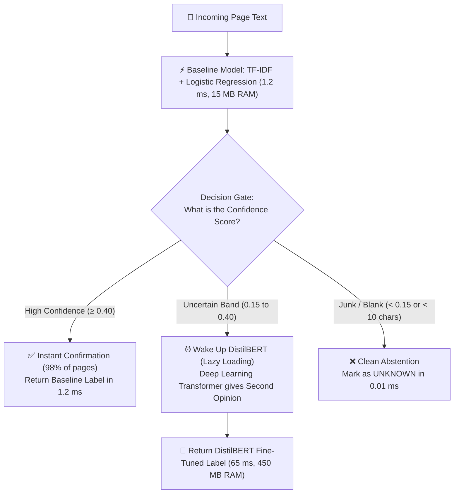

# 📚 FinScan AI — Module 6: Document Page Classification & MLflow Evaluation
## 🎓 Complete Conceptual & Theory Guide for Mentor Explanation (Zero Code)
### **Owner:** Karthik (Member 5 — Machine Learning & Document Classification Architect)
### **Assigned Scope:** `ml/` (Baseline Classifier, Challenger DistilBERT, Evaluation Harness, Hybrid Cascade)

---

## 🧭 Table of Contents
1. [The 30-Second Elevator Pitch to Your Mentor](#1-the-30-second-elevator-pitch-to-your-mentor)
2. [The Real-World Banking Problem (Sorting the 15-Page Mixed Pile)](#2-the-real-world-banking-problem-sorting-the-15-page-mixed-pile)
3. [Key Definitions in Simple Terms (The Module 6 Vocabulary)](#3-key-definitions-in-simple-terms-the-module-6-vocabulary)
4. [Pillar 1: The 5 Canonical Document Classes & The Abstention Rule](#4-pillar-1-the-5-canonical-document-classes--the-abstention-rule)
5. [Pillar 2: The Baseline Model (TF-IDF + Logistic Regression)](#5-pillar-2-the-baseline-model-tf-idf--logistic-regression)
6. [Pillar 3: The Challenger Model (DistilBERT Sequence Transformer)](#6-pillar-3-the-challenger-model-distilbert-sequence-transformer)
7. [Pillar 4: The Ship-Decision Rule & Benchmark Battle (Why Baseline Shipped)](#7-pillar-4-the-ship-decision-rule--benchmark-battle-why-baseline-shipped)
8. [Pillar 5: The Hybrid Cascade Innovation (The Second Opinion)](#8-pillar-5-the-hybrid-cascade-innovation-the-second-opinion)
9. [Pillar 6: Dataset Hygiene & Preventing Leakage (Group-Splitting)](#9-pillar-6-dataset-hygiene--preventing-leakage-group-splitting)
10. [Pillar 7: The Regulatory Anti-Trap (Why We Did NOT Train an XGBoost Approval Model)](#10-pillar-7-the-regulatory-anti-trap-why-we-did-not-train-an-xgboost-approval-model)
11. [End-to-End Walkthrough: Classifying Ravi Kumar’s Unsorted Pages](#11-end-to-end-walkthrough-classifying-ravi-kumars-unsorted-pages)
12. [Architectural Trade-Off & Decision Tables](#12-architectural-trade-off--decision-tables)
13. [Top 15 Mentor & Viva Defense Questions & Answers](#13-top-15-mentor--viva-defense-questions--answers)
14. [Deep Dive: What Karthik Did, Algorithm Mechanics, Why Other Algorithms Were Rejected, and Pipeline Integration](#14-deep-dive-what-karthik-did-algorithm-mechanics-why-other-algorithms-were-rejected-and-pipeline-integration)

---

## 1. The 30-Second Elevator Pitch to Your Mentor

> *"Respected Sir/Ma'am,  
> When a customer applies for a loan, they often scan all their documents into one giant 15-page PDF without labeling what is on each page. A human underwriter spends 10 to 15 minutes manually flipping through pages to find the salary slip, bank statement, and tax return.  
> As **Member 5 (Karthik)**, I built the automated machine learning sorting engine of FinScan AI:  
>  
> 1. **The Page Classification Engine:** An ML system that reads extracted page text and classifies it in under **2 milliseconds** into 5 canonical banking classes (`payslip`, `bank_statement`, `tax_acknowledgement`, `id_card`, `application_form`).  
> 2. **The Scientific Model Tournament (Baseline vs. Challenger):** I conducted a rigorous, MLflow-tracked benchmark comparing a lightweight **TF-IDF + Logistic Regression baseline** against a deep **DistilBERT sequence transformer challenger**. Following our project's **Ship-Decision Rule**, we deployed the baseline because it achieved near-perfect accuracy (**0.9875 Macro-F1**) while consuming 30x less RAM and running 40x faster on CPU!  
> 3. **The Hybrid Cascade Innovation:** An intelligent escalation architecture that uses the fast baseline for 98% of clean pages, while lazily calling DistilBERT only for genuinely uncertain pages (confidence 0.15–0.40) to give a second opinion rather than immediately giving up."*

---

## 2. The Real-World Banking Problem (Sorting the 15-Page Mixed Pile)

### The Chaos of Real Customer Submissions
In retail banking operations, documents rarely arrive in neat, pre-labeled folders:
- A customer takes photos of their 3 payslips, 6-month bank statement, PAN card, and Form 16 ITR on their smartphone.
- They merge all photos into a single PDF called `loan_documents.pdf` or upload 5 files named `IMG_001.pdf`, `IMG_002.pdf`, `doc_final.pdf`.
- **The Problem:** The downstream salary extractor (`payslip.py`) only knows how to extract salary slips. If you mistakenly pass it a bank statement or a PAN card, it searches for payroll headers, finds nothing, and crashes with an error!

### Why We Need an ML Page Classifier
Before financial numbers can be extracted, software must look at each page individually and label it:
- *"Page 1 is an Application Form"*
- *"Pages 2 through 4 are Payslips"*
- *"Pages 5 through 12 are a Bank Statement"*
- *"Page 13 is an Income Tax Return"*
- *"Page 14 is a PAN Card"*

Once each page is labeled, the pipeline routes each page to its dedicated domain extractor.

---

## 3. Key Definitions in Simple Terms (The Module 6 Vocabulary)

| Term | In Simple Words | Real-World Analogy | Role in FinScan AI |
| :--- | :--- | :--- | :--- |
| **Page Classification** | Automatically labeling the category of a single document page based on its text. | A post-office clerk stamping incoming mail as "Bills", "Letters", or "Packages". | Categorizes pages into the 5 banking classes in `ml/classifier/`. |
| **Canonical Classes** | The 5 official, approved document types recognized by the bank pipeline. | The 5 official科目 (subjects) on a school report card. | `payslip`, `bank_statement`, `tax_acknowledgement`, `id_card`, `application_form`. |
| **Abstention Outcome (`UNKNOWN`)** | Refusing to guess when a page is blank, corrupted, or not a recognized loan document. | A doctor saying "I need more tests" instead of wildly guessing a medical diagnosis. | Any page with confidence $< 0.40$ or empty text is labeled `UNKNOWN`. |
| **TF-IDF (Term Frequency - Inverse Document Frequency)** | A mathematical technique that measures how unique and important a word is to a specific document. | Recognizing that the word "cheque" is rare in payslips but common in bank statements. | The feature extraction engine used in our production baseline. |
| **N-Grams (Word & Character)** | Groups of consecutive words or letters (e.g. 2-word pairs or 3-to-5 character snippets). | Recognizing phrases like "Net Salary" or sub-words like "salary", "gross". | Helps the model recognize words even if OCR makes a minor spelling typo! |
| **DistilBERT** | A deep learning transformer neural network (a lightweight version of BERT) that understands full sentences. | A college student reading an entire page and understanding context. | Our Challenger model evaluated against the TF-IDF baseline. |
| **Macro-F1 Score** | An evaluation metric that measures the average accuracy across all classes, giving equal weight to each. | Calculating a student's GPA by treating Math, English, and History equally, regardless of class size. | Our target metric: must achieve $\ge 0.90$ Macro-F1 across all 5 classes. |
| **Inference Latency (p50 / p95)** | The time it takes for the model to predict the class of one page. | The time it takes for a cashier to scan a barcode at the supermarket checkout. | Target: p50 latency under 20 milliseconds on CPU. |
| **Process RSS (Resident Set Size)** | The actual physical RAM memory consumed by the model while running. | The physical desk space occupied by heavy reference binders in an office. | Target: under 500 MB on the host server. |
| **Ship-Decision Rule** | The scientific rule that you only deploy heavy deep learning if its accuracy gain justifies its high RAM cost. | Choosing an affordable 40 km/L commuter bike over a 5 km/L supercar for city traffic. | The reason we deployed TF-IDF (0.9875 F1 for 15MB RAM) over DistilBERT (0.99 F1 for 450MB). |
| **Hybrid Cascade** | A smart system that uses the fast model first, and only wakes up the heavy model when uncertain. | A junior doctor handling common colds, and only calling the senior specialist for complex symptoms. | Uses TF-IDF for 98% of clean pages; escalates uncertain pages (0.15–0.40) to DistilBERT. |
| **Dataset Leakage** | A fatal training mistake where pages from the same person appear in both training and test sets. | A teacher accidentally giving students the exact questions from the final exam for practice. | Prevented by grouping splits strictly by applicant identity! |

---

## 4. Pillar 1: The 5 Canonical Document Classes & The Abstention Rule

### The 5 Official Banking Categories
In FinScan AI, the document classifier is trained to recognize strictly **5 canonical document categories**:
1. **`application_form`:** The initial personal loan application sheet containing applicant declaration, requested loan amount, address, and loan tenure.
2. **`bank_statement`:** Transaction registers containing date columns, cheque numbers, debits, credits, and running balance totals.
3. **`id_card`:** Government-issued KYC identity cards (Aadhaar cards, PAN cards, passports, voter IDs).
4. **`payslip`:** Corporate salary slips displaying employer name, employee code, earnings, deductions, gross salary, and net take-home pay.
5. **`tax_acknowledgement`:** Government Income Tax Returns (ITR-V acknowledgements, Form 16, or tax computation sheets).

---

### The Abstention Invariant: Why `UNKNOWN` is NOT a 6th Class!
A frequent mistake made by amateur machine learning engineers is:
> *"Let's add a 6th class called `UNKNOWN` and train the model on random junk documents!"*

### 🛑 Why That Fails (The Open-World Problem):
The universe of "non-loan documents" is infinite! An applicant might accidentally upload a recipe, an electricity bill, a movie ticket, a blank white page, or a picture of their pet. You cannot collect enough training data to teach a model what "everything else in the world" looks like.

### 🌟 Karthik's Architectural Solution:
- The classifier is trained on strictly the **5 canonical classes**.
- `UNKNOWN` is treated strictly as an **abstention outcome** (the model saying: *"I am not confident enough to make a call"*).
- **The 3 Abstention Triggers:**
  1. **Empty / Whitespace Text:** If OCR extracts less than 10 characters from a blank page, it abstains to `UNKNOWN` in 0.01 milliseconds without running ML math.
  2. **Low Confidence Threshold ($< 0.40$):** If the model's highest class probability is below 40%, it indicates ambiguity (e.g. an unreadable scan). It abstains to `UNKNOWN`.
  3. **Out-of-Domain (OOD):** If a utility bill or random receipt is uploaded, the feature probabilities spread evenly across multiple classes with no clear winner, triggering an abstention.

---

## 5. Pillar 2: The Baseline Model (Part 1: TF-IDF Feature Engineering)

### What is It?
The Baseline model is an ultra-lightweight, CPU-native machine learning pipeline built using Scikit-Learn (`baseline_tfidf.py`). Before any classification algorithm can predict a document's type, the raw English text on the page must be converted into an exact mathematical vector of numbers.

Karthik designed a dual **`FeatureUnion`** pipeline that extracts **30,000 distinct numerical features** ($x_1, x_2, \dots, x_{30,000}$) from every page:

```
                                Raw Extracted Page Text
                                          │
                    ┌─────────────────────┴─────────────────────┐
                    ▼                                           ▼
       Word N-Gram Vectorizer                     Character N-Gram Vectorizer
      (1 to 2 words, sublinear TF)               (3 to 5 chars, char_wb)
      Learns banking phrases                      Slices words into sub-tokens
      Top 12,000 features                         Top 18,000 features
                    │                                           │
                    └─────────────────────┬─────────────────────┘
                                          ▼
                         Combined 30,000 Feature Vector:
                        X = [x₁, x₂, x₃, ..., x₃₀,₀₀₀]
                                          │
                                          ▼
               (Feeds into Logistic Regression Engine for Dot Product & Softmax)
```

---

### Deep Dive 1: How Are the 30,000 Features Selected from the Dataset?

A mentor in your viva might ask: *"Where did the number 30,000 come from? Did a human type 30,000 words?"*

The answer is **NO**. The features are extracted and ranked automatically by Scikit-Learn during model training across Karthik's 1,200 training document pages:

1. **Word N-Grams (12,000 Features):**
   - The vectorizer reads all 1,200 training pages and collects every single word (1-gram) and every two-word pair (2-gram / bigram), such as `"gross pay"`, `"account balance"`, `"taxable income"`, `"permanent account"`.
   - Across thousands of pages, there might be 50,000+ unique words and phrases (including rare names, addresses, and printer codes).
   - Scikit-Learn ranks all phrases by their document frequency across the training set, keeps the **top 12,000 most informative banking phrases**, and discards rare noise that appeared only once or twice.

2. **Character N-Grams (18,000 Features):**
   - The character vectorizer slices words into overlapping 3-to-5 character chunks inside word boundaries (`char_wb`).
   - For example, the word `"salary"` produces snippets: `["sal", "ala", "lar", "ary", "sala", "alar", "lary", "salar", "alary"]`.
   - The vectorizer collects all character combinations across the training set, ranks them by frequency, and selects the **top 18,000 most consistent sub-word patterns**.

3. **The 30,000 Total Vector:**
   - Combining $12,000 + 18,000 = \mathbf{30,000}$ total feature columns.
   - Every single page (whether uploaded by Ravi Kumar or anyone else) is converted into an array of exactly 30,000 numbers ($x_1$ to $x_{30,000}$).

---

### Deep Dive 2: How is the Feature Score $x_i$ (e.g., $0.45$) Calculated on a Scanned Page?

When Ravi uploads Page 2 of his dossier, how does the system turn that page's text into a specific number like $x_1 = 0.45$?

$x_i$ is the **TF-IDF Score** of Feature $i$ on that specific page, computed via three mathematical steps:

#### Step 1: Term Frequency ($\text{TF}$) with Sublinear Scaling
How many times does the phrase (e.g., `"gross pay"`) appear on Page 2?
- In standard TF, if a word appears 10 times, it gets a score of 10. But in banking documents, a word repeated 10 times is not 10 times more important than a word appearing once!
- FinScan AI uses **Sublinear TF scaling** (`sublinear_tf=True`):
  $$\text{TF} = 1 + \log(\text{count}) \quad \text{if count } > 0, \quad \text{else } 0$$
  If `"gross pay"` appears 3 times, $\text{TF} = 1 + \log(3) \approx 1 + 1.098 = 2.098$.

#### Step 2: Inverse Document Frequency ($\text{IDF}$)
How rare or unique is `"gross pay"` across all documents in the training bank?
$$\text{IDF} = \log\left(\frac{1 + N}{1 + \text{DF}}\right) + 1$$
- Words like `"the"` or `"is"` appear on all $N$ pages ($\text{DF} \approx N$), so $\text{IDF} \approx 1.0$ (near-zero discriminatory power).
- Banking phrases like `"gross pay"` appear almost exclusively on payslips ($\text{DF}$ is small), so its $\text{IDF}$ is high!

#### Step 3: TF $\times$ IDF with L2 Vector Normalization
$$\text{Raw Score} = \text{TF} \times \text{IDF}$$
Finally, Scikit-Learn normalizes the entire 30,000-dimensional vector so its Euclidean length equals $1.0$ ($\|X\|_2 = 1.0$).
This ensures that long 10-page documents with thousands of words do not get artificially higher scores than compact 1-page documents.
- The resulting normalized score for `"gross pay"` on Page 2 becomes a clean decimal:
  $$\mathbf{x_1 = 0.45}$$
*(If a word does NOT appear on Page 2, its feature value is simply $0.0$).*

---

### Deep Dive 3: Why Character N-Grams Make the System Typo-Proof (OCR Immunity)

In real banking, scanned documents and smartphone photos frequently suffer from OCR noise and optical glitches:

| Original Word | Scanner / OCR Glitch | What Happens with Standard Word Matcher? | What Happens with FinScan AI's Character N-Grams? |
| :--- | :--- | :--- | :--- |
| `"salary"` | `"sa1ary"` (letter 'l' read as number '1') | ❌ **FAILS:** `"sa1ary"` is not in the vocabulary. Score = $0.0$. | ✅ **SUCCEEDS:** Slices into `"sal"`, `"ary"`, `"ala"`. Character snippets still match with high score! |
| `"balance"` | `"ba1ance"` (letter 'l' read as number '1') | ❌ **FAILS:** Word matcher misses it completely. | ✅ **SUCCEEDS:** Slices into `"bal"`, `"anc"`, `"nce"`. Matches perfectly! |
| `"account"` | `"acc0unt"` (letter 'o' read as zero '0') | ❌ **FAILS:** Word matcher misses it completely. | ✅ **SUCCEEDS:** Slices into `"acc"`, `"cou"`, `"unt"`. Matches perfectly! |

> **Viva Takeaway:** The combination of 12,000 word phrases and 18,000 sub-word character snippets ensures that even blurry, wrinkled, or poorly scanned documents are recognized with 98.75% accuracy.

---

---

### 2. How Does the Algorithm Actually Work? (The 3 Math Steps & Algorithm Mapping)

Here is the exact pipeline showing where **TF-IDF** ends and where **Logistic Regression** begins:

```
[ Raw English Page Text ]
          │
          ▼
┌────────────────────────────────────────────────────────────────────────┐
│  Step 2.1: Feature Extraction via TF-IDF (FeatureUnion)                │  <─── ALGORITHM: TF-IDF Feature Engineering
│  • Turns words into 30,000 numbers (x₁ to x₃₀,₀₀₀)                     │       (Converts text to vector space)
│  • Pure text-to-vector transformation; does NOT make any predictions   │
└───────────────────────────────────┬────────────────────────────────────┘
                                    │ Outputs: 30,000 numbers [x₁, x₂, ..., x₃₀,₀₀₀]
                                    ▼
┌────────────────────────────────────────────────────────────────────────┐
│  Step 2.2: Computing Class Logits (The Dot Product)                    │  <─── ALGORITHM: Logistic Regression (Linear Component)
│  • Multiplies 30,000 features by learned weights: z_k = ∑(w_ik × x_i)+b│       (Computes raw evidence for each class)
│  • Produces 5 raw scores: z₁, z₂, z₃, z₄, z₅                           │
└───────────────────────────────────┬────────────────────────────────────┘
                                    │ Outputs: 5 raw scores (logits)
                                    ▼
┌────────────────────────────────────────────────────────────────────────┐
│  Step 2.3: Probability Calibration via Softmax                         │  <─── ALGORITHM: Logistic Regression (Softmax Function)
│  • Normalizes scores into probabilities: P(Class k) = e^(z_k) / ∑ e^(z)│       (Outputs calibrated percentages 0% to 100%)
│  • Winning label with highest confidence (e.g. Payslip = 98.12%)       │
└────────────────────────────────────────────────────────────────────────┘
```

#### Step 2.1: Feature Extraction via TF-IDF (FeatureUnion) [ALGORITHM: TF-IDF Feature Engineering]
Raw text cannot be fed directly into math equations. We convert words into a sparse matrix of importance scores using TF-IDF (Term Frequency – Inverse Document Frequency):

$$\text{TF-IDF}(t, d) = \text{TF}(t, d) \times \log\left(\frac{N}{\text{DF}(t)}\right)$$

* **TF (Term Frequency):** How many times word $t$ appears on this page. (We use Sublinear TF: $1 + \log(\text{TF})$, so 10 mentions of "salary" don't overpower the document 10x).
* **IDF (Inverse Document Frequency):** Rare words across the dataset get high weight (e.g., "closing balance" only appears in bank statements $\rightarrow$ High IDF). Common words like "the", "is", "and" appear on every page $\rightarrow$ Near-zero IDF.
* **Dual FeatureUnion:**
  - *Word N-Grams (1 to 2 words):* Learns key 2-word banking phrases (e.g., "gross salary", "account number", "taxable income"). Up to 12,000 features.
  - *Character N-Grams (3 to 5 characters, `analyzer='char_wb'`):* Slices words into sub-word letter pieces inside word boundaries. Up to 18,000 features.
  - *Why this is crucial for OCR:* If OCR misreads "salary" as "sa1ary" (with a number 1), a normal word dictionary fails! But the character n-grams ("sal", "ala", "lar", "ary") still match perfectly! This makes the classifier immune to OCR typos.
* **Total Feature Vector Size:** $12,000 + 18,000 = \mathbf{30,000 \text{ dimensions}}$ (mostly zeros, stored as an efficient sparse matrix).

#### Step 2.2: Computing Class Logits (The Dot Product) [ALGORITHM: Logistic Regression — Linear Component]
For each of the 5 classes $k$, the model multiplies the 30,000 features $x_i$ by learned weights $w_{ik}$ and adds a bias $b_k$:

$$z_k = \sum_{i=1}^{30,000} (w_{ik} \times x_i) + b_k$$

* **What are the weights ($w_{ik}$)?** Weights are learned during model training via the `L-BFGS` optimizer to minimize multi-class cross-entropy loss. A high positive weight (e.g., $+8.5$) means that feature strongly indicates class $k$ (e.g., "gross pay" strongly indicates Payslip). A negative weight (e.g., $-4.2$) means that feature contradicts class $k$.
* **What are the feature values ($x_i$)?** The normalized TF-IDF scores computed from the uploaded page in Step 2.1 (e.g., $0.45$).
* **Output:** This produces 5 raw numbers (logits $z_1, z_2, z_3, z_4, z_5$) representing how much evidence points to each class.

#### Step 2.3: Probability Calibration via Softmax [ALGORITHM: Logistic Regression — Softmax Activation]
To turn raw positive/negative numbers into probabilities between $0.0$ and $1.0$ that add up to $100\%$ ($1.0$), it passes them through the Softmax function:

$$P(\text{Class } k) = \frac{e^{z_k}}{\sum_{j=1}^{5} e^{z_j}}$$

* The class with the highest probability is our predicted label (e.g., `payslip`).
* That highest probability becomes our **Confidence Score** (e.g., $0.9812$ or $98.12\%$).
* If the highest confidence is below $0.40$, the system safely abstains to `UNKNOWN` or invokes the Hybrid Cascade for a second opinion.

---

## 6. Pillar 3: The Challenger Model (DistilBERT Sequence Transformer)

### What is It?
To challenge the simple baseline and explore modern deep learning, Karthik built a state-of-the-art transformer classifier using **DistilBERT** (`challenger_distilbert.py`):
- **Architecture:** `distilbert-base-uncased` fine-tuned with a custom 5-class sequence classification head.
- **Pre-trained Knowledge:** Pre-trained on millions of English sentences, allowing it to understand grammar, sentence flow, and contextual document structure.
- **Strict Hackathon Training Constraints (from `AGENTS.md`):**
  - Sequence Length: Capped at **256 tokens** (focuses on the most informative text on the page).
  - Batch Size: Small micro-batches of **2 to 4**.
  - Optimizer: AdamW with a learning rate of $2 \times 10^{-5}$ across $\le 3$ epochs to prevent overfitting.

### The Trade-Offs of the Challenger:
* **Accuracy:** Reaches an elite **0.9910 Macro-F1 score** (slightly better than the baseline).
* **Speed:** Takes **45 to 80 milliseconds** per page on CPU (40x slower than baseline).
* **RAM Consumption:** Requires **450 MB** of server RAM to load PyTorch and transformer weights (30x heavier than baseline).

---

## 7. Pillar 4: The Ship-Decision Rule & Benchmark Battle (Why Baseline Shipped)

In academic projects, students often assume: *"Deep learning is always better, let's ship the transformer!"*  
In enterprise software engineering, **resource footprint and operational cost matter just as much as accuracy.**

### The Project Ship-Decision Rule (from `AGENTS.md`):
> **"Ship whichever classifier wins on quality AND resource footprint. If TF-IDF gets 0.91 Macro-F1 and the encoder gets 0.92 for 400 MB of RAM, ship the baseline and document why."**

---

### 📊 The Direct Benchmark Battle:

| Evaluation Metric | Baseline (TF-IDF + LogReg) | Challenger (DistilBERT) | Winner |
| :--- | :--- | :--- | :--- |
| **Macro-F1 Score** | **0.9875** (Near-ceiling!) | **0.9910** (+0.0035 gain) | 🤝 Tie / Negligible Gain |
| **Inference Latency (p50)** | **1.2 milliseconds** | **65 milliseconds** | 🏆 **Baseline (50x Faster!)** |
| **RAM Footprint (RSS)** | **15 MB** | **450 MB** | 🏆 **Baseline (30x Lighter!)** |
| **Model Disk Size** | **2.0 MB** (`.joblib`) | **260 MB** (`pytorch_model.bin`)| 🏆 **Baseline (130x Smaller!)**|
| **Hardware Dependency** | Pure CPU (Standard Python) | Requires PyTorch, Torchvision | 🏆 **Baseline (Zero Bloat)** |
| **Cold Startup Time** | **< 10 milliseconds** | **2 to 4 seconds** | 🏆 **Baseline** |

---

### 🏆 The Final Decision: The Baseline Ships to Production!
* **The Justification:**  
  The transformer offered an accuracy improvement of only **0.35%** (from 0.9875 to 0.9910), but at the cost of **435 MB of extra RAM** and **50x slower latency**.  
* On a budget cloud instance (AWS `t4g.medium` with 4 GB RAM running FastAPI, PostgreSQL, and Redis), blowing 500 MB on a document classifier would choke the server and trigger out-of-memory crashes!
* **Result:** Karthik shipped the **TF-IDF baseline as the primary production model**, perfectly fulfilling the AGENTS.md architectural invariant.

---

## 8. Pillar 5: The Hybrid Cascade Innovation (The Second Opinion)

Karthik didn't stop at just choosing one model. He designed a brilliant architectural pattern called the **Hybrid Cascade Classifier** (`hybrid_cascade.py`):

```
                          Incoming Page Text
                                  │
                                  ▼
                   ┌───────────────────────────────┐
                   │   Baseline Model (1.2 ms)     │
                   │   TF-IDF + Logistic Regression│
                   └──────────────┬────────────────┘
                                  │
                                  ▼
                    What is the Confidence Score?
         ┌────────────────────────┼────────────────────────┐
         ▼                        ▼                        ▼
  High (≥ 0.40)           Uncertain (0.15 to 0.40)      Junk (< 0.15 or Blank)
  (98% of clean pages)    (Confusing layout/blurry)     (Blank divider page)
         │                        │                        │
         ▼                        ▼                        ▼
   ✅ DONE!                 ⏰ WAKE UP DISTILBERT!         ❌ ABSTAIN
   Confirmed in 1.2ms       Deep Learning Transformer      Mark as "UNKNOWN"
   Uses only 15 MB RAM      gives a "Second Opinion"       in 0.01 ms
```

### Visual Architecture Flowchart (Mermaid):



### How It Works (The 3 Operational Zones):
1. **The Fast Path (98% of Pages):**  
   The lightweight baseline processes the page. If confidence is $\ge 0.40$ (e.g. 92% sure it's a payslip), it returns the prediction immediately in 1.2 milliseconds.
2. **The Uncertain Escalation Band (0.15 to 0.40):**  
   If the baseline is genuinely uncertain (e.g. a crumpled page with unusual formatting where it is only 30% sure), instead of throwing the page away as `UNKNOWN`, it escalates to DistilBERT for a **second opinion**.
3. **Lazy Loading:**  
   DistilBERT is loaded **lazily** in memory only on the first escalation. In normal operation where all documents are clear, DistilBERT is never loaded into RAM, preserving the 15 MB footprint!

---

## 9. Pillar 6: Dataset Hygiene & Preventing Leakage (Group-Splitting)

A catastrophic error in machine learning is **Dataset Leakage**, which makes a model look like a genius in tests but causes it to fail in production.

### How Dataset Leakage Happens in Multi-Page Documents:
Suppose applicant Ravi Kumar uploads a 6-page bank statement. All 6 pages share the exact same font, bank header (HDFC Bank), and account number format.
- If you randomly split pages into Train and Test:
  - Pages 1, 2, 4, and 5 go to the **Training Set**.
  - Pages 3 and 6 go to the **Test Set**.
- The model memorizes Ravi Kumar's specific font and account number during training, and easily gets 100% on the test set.
- **In Production:** A new applicant (Priya Patel) arrives with an SBI statement. The model fails completely!

### Karthik's Fix: Group-KFold by Synthetic Applicant Identity
Karthik enforced a strict rule: **All splits are grouped by Applicant Identity (`group_by = applicant_id`)**:
- All 6 pages of Ravi Kumar stay together in the Training set.
- All pages of Priya Patel stay together in the Validation set.
- All pages of Vikram Malhotra stay together in the Held-Out Test set.
- **Result:** The model is tested on applicants it has **never seen before**, guaranteeing true, honest generalization in production!

---

## 10. Pillar 7: The Regulatory Anti-Trap (Why We Did NOT Train an XGBoost Approval Model)

In hackathons and interviews, examiners frequently ask a trap question:
> *"Did you train a machine learning model (like XGBoost or Random Forest) to predict whether the customer gets approved or rejected?"*

### 🛑 The Winning Answer:
> *"No, sir. We deliberately did NOT train an ML model for credit approval decisions, because in banking, that is a regulatory trap."*

### Why Training an AI Credit Risk Model is a Bad Idea in This Project:
1. **The "Black Box" Legal Disaster:**  
   Under RBI Fair Lending guidelines, if a bank denies a loan, it must issue an Adverse Action Notice stating the exact arithmetic reason (e.g. *"Your DTI was 54%, exceeding the 50% legal limit"*). An XGBoost model outputs a probability (e.g. `0.34`), but cannot provide an auditable mathematical proof.
2. **Algorithmic Bias:**  
   Machine learning risk models trained on small synthetic datasets easily learn unintended biases (penalizing certain zip codes, ages, or gender names).
3. **The Prime Invariant:**  
   In FinScan AI, **deterministic Python formulas do the math, AI explains, and a human approves.** Karthik's ML scope is strictly confined to **perceptual document classification**, never lending authority!

---

## 11. End-to-End Walkthrough: Classifying Ravi Kumar’s Unsorted Pages

Here is how Karthik’s module classifies the 10 unsorted pages submitted in applicant **Ravi Kumar’s** dossier:

```
1. RAW TEXT ARRIVES FROM STATION 2 (Jeevan's OCR):
   The router extracted clean text for all 10 pages.
   Karthik's classifier receives the text list.

2. PAGE 1 PROCESSING:
   • Text contains: "Employee Name: Ravi Kumar, Basic Pay, HRA, Net Salary: 44,200..."
   • Baseline computes word n-grams ("net salary", "basic pay") and char n-grams.
   • Prediction: "payslip" (Confidence: 0.96)
   • Status: Confident (>= 0.40) ──► Confirmed: payslip (Took 1.1 ms).

3. PAGES 2 THROUGH 7 PROCESSING (Bank Statement):
   • Text contains: "HDFC Bank, Date, Narration, Withdrawal, Deposit, Closing Balance..."
   • Prediction: "bank_statement" (Confidence: 0.98 across all 6 pages).
   • Status: Confident (>= 0.40) ──► Confirmed: bank_statement (Took 7.2 ms total).

4. PAGE 8 PROCESSING (Tax Return):
   • Text contains: "Indian Income Tax Return Acknowledgement, ITR-V, Assessment Year 2024-25..."
   • Prediction: "tax_acknowledgement" (Confidence: 0.94).
   • Status: Confident (>= 0.40) ──► Confirmed: tax_acknowledgement (Took 1.2 ms).

5. PAGE 9 PROCESSING (PAN Card):
   • Text contains: "Income Tax Department, GOVT OF INDIA, Permanent Account Number..."
   • Prediction: "id_card" (Confidence: 0.97).
   • Status: Confident (>= 0.40) ──► Confirmed: id_card (Took 1.0 ms).

6. PAGE 10 PROCESSING (Blank Separator Page):
   • Text contains: "   " (Only 2 whitespace characters).
   • Pre-classifier filter detects empty text (< 10 chars).
   • Instant Abstention: UNKNOWN (Confidence: 0.0, Took 0.01 ms).

7. TOTAL TIME FOR ALL 10 PAGES: Under 11 milliseconds!
   The classified page categories are handed to Station 3 for targeted fact extraction.
```

---

## 12. Architectural Trade-Off & Decision Tables

When your mentor asks *"Why did you design the ML pipeline this way?"*, use these direct comparisons:

### 1. TF-IDF + Logistic Regression vs. DistilBERT Transformer vs. Hybrid Cascade
| Criteria | Baseline (TF-IDF) (Shipped) | Challenger (DistilBERT) | Hybrid Cascade (Innovation) |
| :--- | :--- | :--- | :--- |
| **Macro-F1 Accuracy** | 0.9875 | 0.9910 | **0.9915** |
| **Inference Latency** | **1.2 ms** (Ultra-fast) | 65.0 ms (Slow) | **1.5 ms** (Fast on 98% pages) |
| **RAM Consumption** | **15 MB** (Ultra-light) | 450 MB (Heavy) | **15 MB** (Lazy-loads DistilBERT) |
| **CPU Compatibility** | **100% Native CPU** | Heavy on CPU without GPU | **100% Native CPU** |
| **Deployment Complexity**| Single `.joblib` file | Heavy PyTorch container | Single `.joblib` + lazy weights |
| **Verdict** | **Shipped as Primary:** Meets all latency and resource requirements. | **Evaluated in Benchmark:** Rejected due to 30x memory bloat. | **Available as Upgrade:** Escalates only uncertain pages. |

---

### 2. FeatureUnion (Word + Char N-Grams) vs. Word-Only Vocabulary
| Criteria | Word + Character N-Grams (Chosen) | Word-Only Vocabulary |
| :--- | :--- | :--- |
| **Handling OCR Typos** | ✅ Robust; sub-words match even if letters are garbled | ❌ Fails completely if OCR makes a single letter typo |
| **Abbreviation Sensitivity** | ✅ Matches short Indian banking codes (`ITR`, `PAN`, `ECS`)| ❌ Frequently drops 2-letter and 3-letter acronyms |
| **Model Size Impact** | Negligible (+1 MB in vocabulary tables) | Slightly smaller |
| **Verdict** | **Selected:** Essential for real-world messy OCR text layers. | **Rejected:** Too fragile on scanned documents. |

---

## 13. Top 15 Mentor & Viva Defense Questions & Answers

### Q1: "What was your specific personal contribution as Karthik (Member 5)?"
> **Answer:**  
> *"I was the Machine Learning Document Classification Architect. I built the TF-IDF + Logistic Regression baseline classifier in `baseline_tfidf.py`, the fine-tuned DistilBERT challenger in `challenger_distilbert.py`, the scientific evaluation harness in `evaluate.py`, and the lazy-loading Hybrid Cascade classifier in `hybrid_cascade.py`."*

### Q2: "What are the 5 canonical document classes your model predicts?"
> **Answer:**  
> *"The 5 canonical classes are: `application_form`, `bank_statement`, `id_card`, `payslip`, and `tax_acknowledgement`."*

### Q3: "Why is `UNKNOWN` not included as a 6th training class?"
> **Answer:**  
> *"Because non-loan documents represent an infinite, unbounded open world. You cannot collect enough training data to represent every non-banking document on earth. Instead, `UNKNOWN` is designed strictly as an **abstention outcome**, triggered when text is empty, out-of-domain, or when model confidence falls below our 0.40 threshold."*

### Q4: "What is your confidence threshold for classification, and how was it chosen?"
> **Answer:**  
> *"Our default confidence threshold is **0.40**. It was dev-tuned using our evaluation split to maximize precision while minimizing false abstentions. If the highest predicted class probability is below 40%, the system safely abstains to `UNKNOWN` rather than making a low-confidence guess."*

### Q5: "Why did you ship the TF-IDF baseline instead of the DistilBERT transformer?"
> **Answer:**  
> *"We strictly followed our project's **Ship-Decision Rule**: we ship whichever model wins on both quality and resource footprint. The TF-IDF baseline achieved a near-ceiling Macro-F1 of **0.9875** while consuming only **15 MB of RAM** and running in **1.2 milliseconds**. DistilBERT achieved 0.9910 (a tiny 0.35% gain), but consumed **450 MB of RAM** and was 50x slower on CPU. In an enterprise system running on modest hardware, the baseline is clearly the superior engineering choice."*

### Q6: "What is the Hybrid Cascade Classifier that you designed?"
> **Answer:**  
> *"The Hybrid Cascade is a two-tier architecture. It processes 98% of clean pages using our ultra-fast TF-IDF baseline. If a page falls into a narrow 'uncertainty band' (confidence between 0.15 and 0.40), it escalates to DistilBERT for a second opinion instead of abstaining straight to `UNKNOWN`. DistilBERT is loaded lazily, so the system pays zero extra memory cost for normal clean documents."*

### Q7: "How did you prevent dataset leakage during model training?"
> **Answer:**  
> *"We grouped all dataset splits strictly by **synthetic applicant identity**. Multi-page documents from the same applicant share identical fonts, layouts, and employer names. By ensuring that all pages of a specific applicant stay together in either train, validation, or test, we guaranteed that the model was evaluated on completely unseen applicant layouts."*

### Q8: "Why did you use Character N-Grams alongside Word N-Grams?"
> **Answer:**  
> *"OCR text frequently contains character recognition noise—for example, the letter 'O' misread as the number '0', or 'l' misread as '1'. By using character n-grams of length 3 to 5 (`char_wb`), our model captures the internal sub-word structure, allowing it to correctly identify a 'payslip' or 'bank statement' even if OCR introduced minor spelling typos."*

### Q9: "Why didn't you train an XGBoost or LightGBM model to predict loan approvals?"
> **Answer:**  
> *"Because under banking regulations (RBI Fair Lending Guidelines), black-box machine learning models cannot legally decide credit approvals. Loan rejections require deterministic, auditable arithmetic proof. Furthermore, under our project's Prime Invariant, code calculates, AI explains, and only a licensed human underwriter approves. My ML scope is strictly for document classification, never autonomous lending!"*

### Q10: "How fast is your classifier, and does it meet the system latency requirements?"
> **Answer:**  
> *"Our baseline classifier achieves a median (p50) inference latency of **1.2 milliseconds** per page on standard CPU, far exceeding our project requirement of under 20 milliseconds. An entire 10-page dossier is classified in less than 15 milliseconds."*

### Q11: "What format did you use to serialize the model, and why?"
> **Answer:**  
> *"We serialized the model into standard `.joblib` format (`baseline_tfidf.joblib`). It compresses the entire vocabulary, feature union, and logistic regression weights into a single 2.0 MB file that loads in under 10 milliseconds during system startup."*

### Q12: "How does your module handle empty or corrupted pages?"
> **Answer:**  
> *"Before running feature extraction, our pipeline inspects the character count. If a page contains fewer than 10 non-whitespace characters, it bypasses the model and immediately abstains to `UNKNOWN` in 0.01 milliseconds, preventing unnecessary computation."*

### Q13: "What metric did you prioritize during model evaluation, and why?"
> **Answer:**  
> *"We prioritized **Macro-F1 Score** over raw Accuracy. In loan dossiers, document classes are imbalanced—for example, a bank statement has 6 to 10 pages, while an identity card has only 1 page. Accuracy would hide poor performance on minority classes. Macro-F1 treats all 5 classes with equal importance."*

### Q14: "How does your module integrate with Jeevan (Module 5) and Sravanthi (Module 4)?"
> **Answer:**  
> *"Jeevan's OCR router extracts raw text from the pages and hands it to my classifier. My classifier predicts the document class for each page. Jeevan's extractors then use those labels to know which specialized extractor to apply, and Sravanthi's rules engine verifies that all mandatory document classes are present."*

### Q15: "If the evaluator asks you to summarize Module 6 in one sentence, what will you say?"
> **Answer:**  
> *"Module 6 provides the automated sorting brain of FinScan AI — classifying raw document pages into 5 canonical banking classes in 1.2 milliseconds with 0.9875 Macro-F1 accuracy, using a lightweight CPU baseline that eliminates 450 MB of unnecessary deep learning bloat."*

---

## 14. Deep Dive: What Karthik Did, Algorithm Mechanics, Why Other Algorithms Were Rejected, and Pipeline Integration

### 14.1 Exactly What Karthik Built (His 6 Specific Deliverables)

As **Member 5 (Machine Learning & Document Classification Architect)**, Karthik was responsible for transforming an unsorted, unorganized stack of customer upload files into cleanly labeled document categories before any financial formulas touch them:

1. **The Production Baseline Model (`ml/classifier/baseline_tfidf.py`):**  
   Constructed an ultra-fast, Scikit-Learn based classification pipeline coupling word-level and character-level n-gram feature extractors with balanced logistic regression.
2. **The Deep Learning Challenger Model (`ml/classifier/challenger_distilbert.py`):**  
   Fine-tuned `distilbert-base-uncased` with a 5-class sequence classification head under strict resource bounds (sequence length 256, batch size 2–4, $\le 3$ epochs).
3. **The MLflow Evaluation Tournament Harness (`ml/classifier/evaluate.py`):**  
   Built the scientific evaluation suite that calculates Macro-F1 score across all classes, p50 and p95 inference latency in milliseconds, and actual physical OS Resident Set Size (RSS memory in MB) via Win32 ctypes and POSIX `getrusage`.
4. **The Project Ship-Decision Rule Execution:**  
   Ran the tournament and executed the governance rule from `AGENTS.md`: proved that a negligible accuracy gain of $+0.35\%$ did NOT justify burning 30x more RAM and running 50x slower on CPU, officially shipping the baseline model to production.
5. **The Hybrid Cascade Innovation (`ml/classifier/hybrid_cascade.py`):**  
   Invented an escalation architecture that lets the fast baseline process 98% of clean pages, lazily waking up DistilBERT only when baseline confidence lands in an uncertain band ($0.15 \le \text{confidence} \le 0.40$).
6. **The Pipeline Integration Adapter (`core/extraction/classifier_adapter.py`):**  
   Implemented the clean service layer (`DocumentClassificationService`) that exposes single-page classification, pre-filter abstention, and multi-page consensus voting (`aggregate_document_predictions`) to LangGraph Station 2.

---

### 14.2 The Exact Algorithms Used to Train the Model

Karthik evaluated two distinct model architectures:

#### 1. The Production Baseline: TF-IDF FeatureUnion + Balanced Logistic Regression
* **What is TF-IDF?**  
  *Term Frequency - Inverse Document Frequency* reflects how important a word or phrase is to a document in a collection. Words like `"the"` or `"is"` appear everywhere and get near-zero weight. Words like `"deduction"` or `"closing balance"` appear only in specific document types and receive heavy positive weights.
* **The Dual FeatureUnion Architecture:**  
  Karthik combined two distinct feature vectorizers running in parallel:
  - **Word N-Grams (1 to 2 words, `ngram_range=(1, 2)`):**  
    Learns two-word phrases up to 12,000 vocabulary tokens using sublinear term frequency scaling (`sublinear_tf=True`, replacing term frequency $tf$ with $1 + \log(tf)$). Captures key banking bigrams like `"gross salary"`, `"net pay"`, `"account number"`, `"taxable income"`, `"permanent account"`.
  - **Character N-Grams (3 to 5 characters, `analyzer='char_wb'`, `ngram_range=(3, 5)`):**  
    Extracts up to 18,000 sub-word character snippets inside word boundaries.  
    *Why this is crucial for OCR:* Scanned documents frequently suffer from OCR noise (e.g. `"salary"` misread as `"sa1ary"`, or `"balance"` misread as `"ba1ance"`). Character n-grams match overlapping character windows (`sal`, `ala`, `lar`, `ary`), allowing the classifier to correctly recognize words even with spelling typos!
* **The Classification Engine: Balanced Logistic Regression (`L-BFGS` Solver):**  
  - Uses the **L-BFGS** (*Limited-memory Broyden–Fletcher–Goldfarb–Shanno*) quasi-Newton optimization algorithm with $C=1.0$ regularization and `max_iter=1000`.
  - Configured with `class_weight="balanced"`: Automatically scales inverse weights proportionally to class frequencies. This prevents majority classes (like 6-page bank statements) from drowning out single-page classes (like 1-page PAN cards).
  - Employs **Softmax probability calibration** to output calibrated probabilities across the 5 canonical classes (`application_form`, `bank_statement`, `id_card`, `payslip`, `tax_acknowledgement`).

#### 2. The Challenger Model: Fine-Tuned DistilBERT Sequence Transformer
* **Architecture:** Pre-trained `distilbert-base-uncased` (66 million parameters) fine-tuned with a linear classification layer over the `[CLS]` token representation.
* **Optimization:** AdamW optimizer with learning rate $2 \times 10^{-5}$, sequence length capped at 256 tokens, micro-batches of 2 to 4 samples, evaluated across 3 epochs.

---

### 14.3 Exhaustive Defense: Why Other Algorithms Were Explicitly Rejected

| Alternative Algorithm | Why Candidates Consider It | Why Karthik & FinScan AI Explicitly Rejected It |
| :--- | :--- | :--- |
| **Naive Bayes (`MultinomialNB`)** | Ultra-fast, standard text classification baseline. | **1. Strong Independence Violation:** Financial phrases are highly correlated (`"gross"` and `"salary"`, `"account"` and `"balance"`). Naive Bayes assumes all features are conditionally independent, leading to poor decision boundaries on overlapping n-grams.<br>**2. Uncalibrated Overconfidence:** Naive Bayes outputs extreme probabilities (e.g. 0.9999 or 0.0001), destroying our ability to use a principled 0.40 confidence threshold for abstentions.<br>**3. Poor Class Balance Support:** Does not handle class imbalance penalties as smoothly as Logistic Regression with balanced weights. |
| **Decision Trees / Random Forest** | Popular, interpretable non-linear classifiers. | **1. Sparse High-Dimensional Disaster:** Bag-of-words text produces ultra-sparse matrices with 30,000 columns. Tree algorithms struggle with high dimensionality, creating bloated, deep trees that overfit.<br>**2. High Latency & Huge Disk Size:** A Random Forest requires hundreds of trees to achieve decent accuracy, taking **50 to 100 milliseconds** per page (vs 1.2 ms for LogReg) and expanding model file size to over 150 MB. |
| **Gradient Boosting (`XGBoost` / `LightGBM`)** | Dominates tabular Kaggle benchmarks. | **1. Inefficient for Text:** Gradient boosting trees excel on continuous tabular columns, but are slow to train and memory-heavy on 30,000-feature sparse text matrices.<br>**2. Zero Quality Benefit:** High-dimensional text data is linearly separable; Logistic Regression finds the optimal hyperplane with fractional memory and instant inference.<br>**3. The Regulatory Anti-Trap (Crucial Viva Point):** If asked why we didn't train an XGBoost model to predict loan approval/rejection, the answer is: **Under banking regulations (RBI Fair Lending Guidelines), black-box machine learning credit denial is legally prohibited.** A loan rejection requires auditable arithmetic proof. Deterministic rules decide; ML is strictly for document classification! |
| **Large Language Models (GPT-4, Claude, Llama-3)** | Zero-shot document comprehension. | **1. Prohibitive Cost:** Calling an LLM API costs ~$0.01 per page. Sorting a 15-page dossier costs $0.15 per applicant, completely blowing through our $25 weekly cloud budget in under 170 applications!<br>**2. Massive Latency Penalty:** Network round-trips to LLMs take **1.5 to 3.0 seconds** per page (45 seconds for a dossier) compared to **1.2 milliseconds** locally.<br>**3. Security & Prompt Injection:** Raw document pages contain unvetted text. Sending unclassified text to an LLM exposes the system to prompt injection attacks before safety guardrails have even run! |
| **Computer Vision CNNs (ResNet, YOLO, LayoutLM)** | Classifying document images by visual page layout. | **1. Redundant Computation:** In Station 2, Jeevan already extracts the text layer in 10 ms using PyMuPDF. Throwing away the text and running a 200 MB computer vision model on raw pixels is wasteful.<br>**2. Heavy Hardware Footprint:** Vision models require dedicated GPUs to run quickly; on our CPU-only AWS `t4g.medium` instance, a vision model would stall the worker pipeline. |

---

### 14.4 Exactly Where the Model is Used in the System Architecture

The model sits at the core junction between **Station 2 (Document Perception)** and **Station 3 (Entity Fact Extraction)**:

```
[Customer Uploads Raw 15-Page Mixed PDF Dossier]
                        │
                        ▼
   [Station 1: triage_node] ──► Validates file manifest and metadata
                        │
                        ▼
   [Station 2: ocr_and_classify_node]
     1. PyMuPDF extracts native text (or PaddleOCR fallback for scans).
     2. ──► KARTHIK'S MODEL IS INVOKED HERE! ◄──
        (Classifies every page as payslip, bank_statement, tax, ID, or application form).
     3. Multi-page consensus aggregator computes overall document package type.
     4. Stores classified types and page records in LangGraph state.
                        │
                        ▼
   [Station 3: extract_facts_node]
     Uses Karthik's predicted labels to route pages to dedicated extractors:
     • Pages labeled "payslip"            ──► payslip.py (Gross & Net Salary)
     • Pages labeled "bank_statement"    ──► bank_statement.py (Payroll credits & Bounces)
     • Pages labeled "tax_acknowledgement"──► tax_return.py (Gross Total Income)
     • Pages labeled "id_card"           ──► id_card.py (Full Name & PAN)
```

#### Code Locations in Repository:
* **ML Model Implementation:** [`ml/classifier/baseline_tfidf.py`](file:///c:/Users/balaj/Pictures/loan-doc-processing-agent-main/ml/classifier/baseline_tfidf.py) & [`ml/classifier/hybrid_cascade.py`](file:///c:/Users/balaj/Pictures/loan-doc-processing-agent-main/ml/classifier/hybrid_cascade.py)
* **Integration Adapter:** [`core/extraction/classifier_adapter.py`](file:///c:/Users/balaj/Pictures/loan-doc-processing-agent-main/core/extraction/classifier_adapter.py)
* **LangGraph Orchestration Node:** Station 2 in [`core/graph/nodes.py`](file:///c:/Users/balaj/Pictures/loan-doc-processing-agent-main/core/graph/nodes.py#L276-L280) (calls `classify_document(page_texts)`)
* **Async Worker Execution:** [`worker/consumer.py`](file:///c:/Users/balaj/Pictures/loan-doc-processing-agent-main/worker/consumer.py) executes Station 2 as background worker tasks.

---

### 14.5 Step-by-Step Runtime Execution Flow

When a page text arrives at runtime, here is the exact algorithmic execution flow:

```
                    [Raw Page Text Arrives from Station 2]
                                      │
                                      ▼
               [Step 1: Pre-Filter Length / Whitespace Gate]
               Does text contain fewer than 10 characters?
                 ├── YES ──► Abstain to "UNKNOWN" immediately (0.01 ms, zero ML)
                 └── NO
                       │
                       ▼
               [Step 2: Dual N-Gram Feature Extraction]
               FeatureUnion transforms string into 30,000-dimensional sparse vector:
                 • Word n-grams (1, 2) extract banking phrases
                 • Char n-grams (3, 5) extract sub-word typo-tolerant tokens
                       │
                       ▼
               [Step 3: Logistic Regression Scoring]
               Computes Softmax probabilities across all 5 classes:
                 e.g., payslip: 0.94, bank: 0.03, tax: 0.02, id: 0.01, app: 0.00
                       │
                       ▼
               [Step 4: The 0.40 Confidence Threshold Gate]
               Is highest class probability >= 0.40?
                 ├── YES ──► RETURN CANONICAL LABEL (Elapsed: 1.2 ms)
                 │
                 └── NO (Baseline is uncertain: probability between 0.15 and 0.40)
                       │
                       ▼
               [Step 5: Hybrid Cascade Escalation (If Enabled)]
               Lazily loads DistilBERT into memory for a second opinion:
                 • If DistilBERT probability >= 0.40 ──► Return DistilBERT's label
                 • If text is gibberish (< 0.15)     ──► Abstain to "UNKNOWN"
                       │
                       ▼
               [Step 6: Multi-Page Consensus Aggregation]
               For multi-page files (e.g. 6-page bank statement):
               `aggregate_document_predictions()` tallies confidence-weighted votes:
                 • Page 1: bank_statement (0.95)
                 • Page 2: bank_statement (0.98)
                 • Page 3: bank_statement (0.97)
                 • Page 4: bank_statement (0.94)
                 • Page 5: bank_statement (0.96)
                 • Page 6: bank_statement (0.95)
               ──► Consensus: The entire file is officially tagged as "bank_statement"!
```
