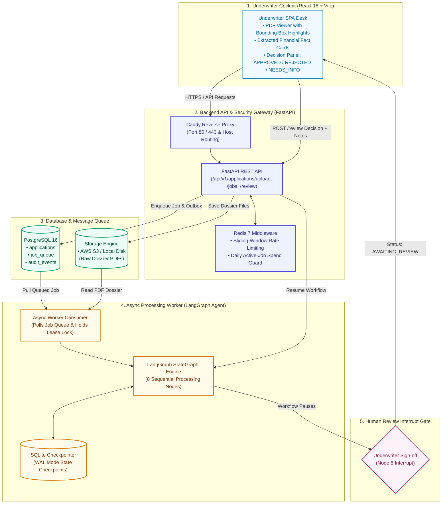
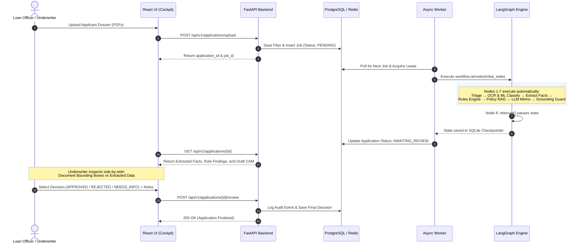

# FinScan AI — System Architecture & Workflow Blueprint
*Presentation-Ready Architecture & Core Data Pipeline*

---

## 1. High-Level System Architecture (Presentation View)

This architecture reflects the **actual code implemented** across the 8 team modules. It shows how the frontend, API, security middleware, storage, async worker, and human reviewer connect together.

---

## 2. LangGraph 8-Node Agent Processing Pipeline

This diagram shows the exact 8-step lifecycle of an application as defined in `core/graph/workflow.py`, from initial file triage to human sign-off.

```mermaid
flowchart LR
    %% Sequential pipeline nodes
    N1["Node 1: Triage<br/><b>File & MIME Check</b>"] 
    --> N2["Node 2: Perception<br/><b>OCR & TF-IDF Classifier</b>"]
    --> N3["Node 3: Extraction<br/><b>Structured Facts</b>"]
    --> N4["Node 4: Rules Engine<br/><b>Deterministic Audits</b>"]
    --> N5["Node 5: Policy RAG<br/><b>BM25 + BGE Search</b>"]
    --> N6["Node 6: Synthesis<br/><b>LLM Credit Memo (CAM)</b>"]
    --> N7["Node 7: Guard<br/><b>Grounding Verification</b>"]
    --> N8["Node 8: Checkpoint<br/><b>Human Review Interrupt</b>"]

    %% Node Details
    classDef nodeStyle fill:#ffffff,stroke:#334155,stroke-width:2px,color:#0f172a;
    class N1,N2,N3,N4,N5,N6,N7,N8 nodeStyle;
```

### Detailed Node Breakdown (What is Actually Running)

```mermaid
flowchart TD
    %% Node 1
    subgraph Step1["Step 1: Ingestion & Triage"]
        S1["triage_node"]
        D1["• Validates file size (< 10MB)<br/>• Validates PDF magic bytes (application/pdf)<br/>• Rejects corrupted or malformed files"]
        S1 --- D1
    end

    %% Node 2
    subgraph Step2["Step 2: Document Perception & ML Classification"]
        S2["ocr_and_classify_node"]
        D2["• PyMuPDF text extraction with layout awareness<br/>• Scikit-learn TF-IDF Vectorizer + Logistic Regression<br/>• Classifies each page: payslip, bank_statement, tax_acknowledgement, id_card"]
        S2 --- D2
    end

    %% Node 3
    subgraph Step3["Step 3: Structured Fact Extraction"]
        S3["extract_facts_node"]
        D3["• Regex + Pydantic schema validation:<br/>  - Payslip: Gross Salary, Net Salary, Deductions<br/>  - Bank Statement: Opening/Closing Balances, Salary Credits<br/>  - Tax Return (ITR): Gross Total Income, PAN<br/>  - ID Card: Name, Date of Birth, ID Number<br/>• Attaches page coordinates (bbox) to every number"]
        S3 --- D3
    end

    %% Node 4
    subgraph Step4["Step 4: Deterministic Rules Engine (Pre-RAG)"]
        S4["evaluate_rules_node"]
        D4["• RULE-COMP-01: Document completeness check<br/>• RULE-INC-01: Payslip Net Salary vs Bank Salary Credit (5% tolerance)<br/>• RULE-TAX-01: Tax Return Gross vs Annualized Stated Earnings<br/>• RULE-ID-01: Cross-document identity & PAN consistency<br/>• RULE-BANK-01: Opening + Total In - Total Out = Closing Balance"]
        S4 --- D4
    end

    %% Node 5
    subgraph Step5["Step 5: Hybrid Policy Retrieval (RAG)"]
        S5["retrieve_policy_node"]
        D5["• Uses Rule Flags to query bank policy handbook<br/>• BM25 Sparse Keyword Search + BGE Dense Embeddings<br/>• Reciprocal Rank Fusion (RRF) combines rankings<br/>• Fetches exact underwriting policy clauses (e.g. variance exceptions)"]
        S5 --- D5
    end

    %% Node 6
    subgraph Step6["Step 6: Credit Assessment Memo (CAM) Synthesis"]
        S6["synthesize_summary_node"]
        D6["• LLM (Claude 3.5 Sonnet / Gemini 1.5 Pro)<br/>• Generates comprehensive Credit Assessment Memo<br/>• Formulates risk narrative referencing retrieved policy sections<br/>• Proposes preliminary recommendation"]
        S6 --- D6
    end

    %% Node 7
    subgraph Step7["Step 7: Grounding & Anti-Hallucination Guard"]
        S7["validate_grounding_node"]
        D7["• Cross-checks all numbers in the CAM memo against extracted facts<br/>• Verifies every cited figure has an EvidenceRef (document + page + bbox)<br/>• Flags ungrounded / hallucinated numbers"]
        S7 --- D7
    end

    %% Node 8
    subgraph Step8["Step 8: Human-in-the-Loop Review Gate"]
        S8["human_review_node"]
        D8["• LangGraph interrupt() halts execution<br/>• Saves state snapshot to SQLite WAL database<br/>• Exposes application to Underwriter UI<br/>• Awaits reviewer decision: APPROVED / REJECTED / NEEDS_INFO"]
        S8 --- D8
    end

    Step1 --> Step2 --> Step3 --> Step4 --> Step5 --> Step6 --> Step7 --> Step8
```

---

## 3. Real End-to-End Data & Decision Flow

---

## 4. Module & Team Ownership (Exact Codebase Mapping)

| Module # | Owner | Component | Real Path in Codebase |
| :---: | :--- | :--- | :--- |
| **1** | Manjunath | Data Contracts & CI/CD | `core/contracts/` (`facts.py`, `findings.py`, `state.py`), `.github/workflows/ci.yml` |
| **2** | Bhanu Teja | Orchestration & Worker | `core/graph/` (`workflow.py`, `checkpoint.py`), `worker/consumer.py` |
| **3** | Jeevan | Document OCR & Extraction | `core/extraction/` (`extractors/`, `native_parser.py`) |
| **4** | Sravanthi | Deterministic Rules Engine | `core/rules/` (`financial.py`, `reconciliation.py`, `consistency.py`) |
| **5** | Karthik | ML Document Classifier | `ml/classifier/` (TF-IDF + Logistic Regression model & vectorizer) |
| **6** | **Balaji (You)** | **FastAPI, Cloud & Infra** | **`apps/api/` (routes, middleware, config), `infra/docker-compose.yml`, AWS EC2/S3/SQS** |
| **7** | Akshaya | Underwriter Cockpit UI | `apps/ui/` (React 18 SPA, PDF visualizer, Swiss Ledger design) |
| **8** | Sai Mokshith | Policy RAG & Grounding Guard | `core/rag/` (`retrieval.py`, `bge.py`, `bm25.py`), `core/graph/nodes.py` (Node 7) |
