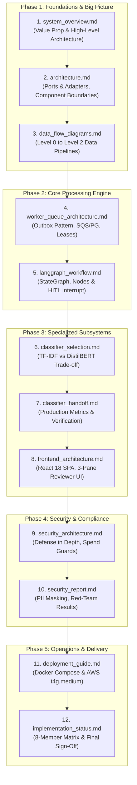

# FinScan AI — Documentation Study Guide & Reading Roadmap

This study guide arranges all 12 documents in `docs/` in a logical, step-by-step learning progression.

Whether you are preparing for code review, internal architectural defense, or the Cognizant Buildathon evaluation, follow this 5-phase roadmap.

---

## 🗺️ Recommended 5-Phase Study Path

---

## Detailed Reading Order & Syllabus

### Phase 1: Foundations & Big Picture (System Context)
*Objective: Build the 30,000-foot mental model of what FinScan AI is, who uses it, the prime invariants, and the overall system topology.*

#### 1. [system_overview.md](file:///c:/Users/balaj/Pictures/loan-doc-processing-agent-main/docs/system_overview.md)
- **What it covers:**
  - Executive summary & value proposition: 90-second turnaround vs traditional 24–72 hours.
  - The Prime Invariant: *"Deterministic code decides. AI explains. A human approves."*
  - End-to-end component layers: Client $\rightarrow$ API Gateway $\rightarrow$ Queue/Worker $\rightarrow$ Core Logic $\rightarrow$ DB/Storage.
- **Why read it 1st:** Establishes the purpose of the project, user personas (Bank Underwriter), and the fundamental philosophy of zero hallucinated lending decisions.

#### 2. [architecture.md](file:///c:/Users/balaj/Pictures/loan-doc-processing-agent-main/docs/architecture.md)
- **What it covers:**
  - Strict Ports & Adapters (Hexagonal) architectural design.
  - Pluggable adapters: `StoragePort` (Local vs S3), `QueuePort` (PostgreSQL `SKIP LOCKED` vs AWS SQS), and `LLMPort` (OpenCode Zen vs local Qwen3-4B GGUF).
  - Module ownership boundaries across all 8 team members.
- **Why read it 2nd:** Connects the business vision to the code structure and explains why `core/` never imports external SDKs like `boto3`.

#### 3. [data_flow_diagrams.md](file:///c:/Users/balaj/Pictures/loan-doc-processing-agent-main/docs/data_flow_diagrams.md)
- **What it covers:**
  - Level 0 (System Context Diagram): Underwriter, Policy DB, S3 Storage interactions.
  - Level 1 (Major Data Flows): Upload $\rightarrow$ Outbox $\rightarrow$ Worker $\rightarrow$ LangGraph $\rightarrow$ Review.
  - Level 2 (Detailed Sequences): Document ingestion, OCR routing, deterministic cross-checks, hybrid RAG retrieval, and the underwriter decision flow.
- **Why read it 3rd:** Gives you a visual trace of every data packet and state transition before diving into low-level backend code.

---

### Phase 2: Core Processing Engine (Backend & Workflow)
*Objective: Understand how asynchronous background processing, queue reliability, and LangGraph stateful execution work.*

#### 4. [worker_queue_architecture.md](file:///c:/Users/balaj/Pictures/loan-doc-processing-agent-main/docs/worker_queue_architecture.md)
- **What it covers:**
  - Transactional Outbox pattern: Atomic database commit of application record + job reference.
  - Dual queue engine: Local PostgreSQL (`SELECT ... FOR UPDATE SKIP LOCKED`) and Cloud AWS SQS + DLQ.
  - Consumer loop: `LeaseHeartbeat` (every 10s extends lease by 30s), acknowledge-last guarantee, bounded retries ($\le 3$ attempts), and poison message isolation.
- **Why read it 4th:** Core responsibility of Member 6 (Balaji) and Member 2 (Bhanu Teja). Explains how the system achieves reliable asynchronous execution without Kafka or Celery.

#### 5. [langgraph_workflow.md](file:///c:/Users/balaj/Pictures/loan-doc-processing-agent-main/docs/langgraph_workflow.md)
- **What it covers:**
  - 8 lifecycle states: `UPLOADED` $\rightarrow$ `QUEUED` $\rightarrow$ `PROCESSING` $\rightarrow$ `READY_FOR_REVIEW` $\rightarrow$ `NEEDS_INFORMATION` $\rightarrow$ `REVIEWED` $\rightarrow$ `FAILED` $\rightarrow$ `CANCELLED`.
  - Sequential pipeline nodes: `triage_node` $\rightarrow$ `ocr_and_classify_node` $\rightarrow$ `extract_facts_node` $\rightarrow$ `evaluate_rules_node` $\rightarrow$ `retrieve_policy_node` $\rightarrow$ `synthesize_summary_node` $\rightarrow$ `validate_grounding_node`.
  - The Human-in-the-Loop `interrupt()` checkpoint prior to final underwriting review.
- **Why read it 5th:** Shows how the background worker triggers and orchestrates the AI and deterministic business rules.

---

### Phase 3: Specialized Subsystems (ML Perception & Frontend UI)
*Objective: Learn how document perception, classification trade-offs, and human interaction work.*

#### 6. [classifier_selection.md](file:///c:/Users/balaj/Pictures/loan-doc-processing-agent-main/docs/classifier_selection.md)
- **What it covers:**
  - Rigorous engineering trade-off between Baseline (Word+Char TF-IDF + Logistic Regression) and Challenger (DistilBERT sequence encoder).
  - Target environment constraints: AWS `t4g.medium` (2 vCPU, 4 GB RAM, ARM64 CPU-only, no GPU).
  - Empirical results: TF-IDF achieved **0.9823 Macro-F1**, 5.97ms latency, and 155 MB RSS, winning over DistilBERT.
- **Why read it 6th:** Perfect case study on production ML engineering — choosing the lighter, faster, reliable model that meets all SLA constraints.

#### 7. [classifier_handoff.md](file:///c:/Users/balaj/Pictures/loan-doc-processing-agent-main/docs/classifier_handoff.md)
- **What it covers:**
  - Detailed verification metrics for the 5 canonical classes (`application_form`, `bank_statement`, `id_card`, `payslip`, `tax_acknowledgement`).
  - Confidence rejection threshold ($T^* = 0.40$) for out-of-domain documents.
  - Data provenance using Kaggle loan approval seeds and `SYNTHETIC DEMO — NOT VALID` watermarking.
- **Why read it 7th:** Deepens your understanding of document classification quality gates and compliance audits.

#### 8. [frontend_architecture.md](file:///c:/Users/balaj/Pictures/loan-doc-processing-agent-main/docs/frontend_architecture.md)
- **What it covers:**
  - React 18 + Vite + TypeScript + Tailwind CSS single-page application.
  - Three-pane reviewer layout: Dossier navigation, `pdf.js` canvas viewer with visual bounding-box highlights, and findings panel.
  - Dual-sign confirmation challenge: Typing `APP-XXXXX` and providing mandatory rationale before final sign-off.
- **Why read it 8th:** Shows how the reviewer consumes the facts, rules, and grounding citations generated by the backend.

---

### Phase 4: Security, Privacy & Compliance
*Objective: Master the banking-grade security mechanisms, spend controls, and anti-hallucination guardrails.*

#### 9. [security_architecture.md](file:///c:/Users/balaj/Pictures/loan-doc-processing-agent-main/docs/security_architecture.md)
- **What it covers:**
  - Multi-layer defense: Perimeter security, Redis token-bucket rate limiting (5 uploads/min, 30 polls/min).
  - Spend guard: Hard $25 weekly ceiling ($8–$15 target), Textract hard-capped at 100 pages.
  - Prompt injection defense: Untrusted PDF text isolated as quoted data; citation grounding verification in `core/rag/grounding.py`.
- **Why read it 9th:** Essential for answering evaluator questions regarding cloud cost management and adversarial prompt injection safety.

#### 10. [security_report.md](file:///c:/Users/balaj/Pictures/loan-doc-processing-agent-main/docs/security_report.md)
- **What it covers:**
  - PII masking implementations: PAN (`XXXXXX1234`), Aadhaar, Bank account numbers.
  - S3 Server-Side Encryption (AES256) and blocked public access.
  - Immutable audit logs: Every underwriter action recorded with actor, timestamp, previous status, and rationale.
- **Why read it 10th:** Provides concrete code snippets and verifiable audits of privacy and compliance rules.

---

### Phase 5: Operations, Deployment & Project Delivery
*Objective: Understand how to run the system locally, deploy to AWS, and review team delivery matrix.*

#### 11. [deployment_guide.md](file:///c:/Users/balaj/Pictures/loan-doc-processing-agent-main/docs/deployment_guide.md)
- **What it covers:**
  - Local setup: Docker Compose with 7 containers (FastAPI, Worker, Vite UI, PostgreSQL 16, Redis 7, LocalStack, Caddy).
  - Cloud production setup: Single AWS EC2 `t4g.medium` instance, Caddy reverse proxy with automatic HTTPS, S3 bucket provisioning, and teardown scripts.
- **Why read it 11th:** Directly touches Member 6 (Balaji) and Member 2 (Bhanu) infrastructure deliverables.

#### 12. [implementation_status.md](file:///c:/Users/balaj/Pictures/loan-doc-processing-agent-main/docs/implementation_status.md)
- **What it covers:**
  - 100% completion scorecard across all 8 team members (Manjunath, Bhanu, Jeevan, Sravanthi, Karthik, Balaji, Akshaya, Sai Mokshith).
  - Deliverable verification tables and test coverage metrics.
  - Final viva defense checklist.
- **Why read it 12th:** Summarizes who built what and acts as the final revision checklist before demos and evaluations.

---

## 🎯 Quick Matrix: Which Doc to Read for Your Role

| Role / Focus Area | Must-Read Documents | Secondary Reading |
|---|---|---|
| **Member 6: FastAPI, DB, Cloud (Balaji)** | [4. worker_queue_architecture.md](file:///c:/Users/balaj/Pictures/loan-doc-processing-agent-main/docs/worker_queue_architecture.md), [9. security_architecture.md](file:///c:/Users/balaj/Pictures/loan-doc-processing-agent-main/docs/security_architecture.md), [11. deployment_guide.md](file:///c:/Users/balaj/Pictures/loan-doc-processing-agent-main/docs/deployment_guide.md) | [1. system_overview.md](file:///c:/Users/balaj/Pictures/loan-doc-processing-agent-main/docs/system_overview.md), [2. architecture.md](file:///c:/Users/balaj/Pictures/loan-doc-processing-agent-main/docs/architecture.md), [3. data_flow_diagrams.md](file:///c:/Users/balaj/Pictures/loan-doc-processing-agent-main/docs/data_flow_diagrams.md) |
| **Member 2: LangGraph & Orchestration (Bhanu)** | [4. worker_queue_architecture.md](file:///c:/Users/balaj/Pictures/loan-doc-processing-agent-main/docs/worker_queue_architecture.md), [5. langgraph_workflow.md](file:///c:/Users/balaj/Pictures/loan-doc-processing-agent-main/docs/langgraph_workflow.md) | [2. architecture.md](file:///c:/Users/balaj/Pictures/loan-doc-processing-agent-main/docs/architecture.md), [3. data_flow_diagrams.md](file:///c:/Users/balaj/Pictures/loan-doc-processing-agent-main/docs/data_flow_diagrams.md) |
| **Member 5: Machine Learning (Karthik)** | [6. classifier_selection.md](file:///c:/Users/balaj/Pictures/loan-doc-processing-agent-main/docs/classifier_selection.md), [7. classifier_handoff.md](file:///c:/Users/balaj/Pictures/loan-doc-processing-agent-main/docs/classifier_handoff.md) | [1. system_overview.md](file:///c:/Users/balaj/Pictures/loan-doc-processing-agent-main/docs/system_overview.md) |
| **Member 7: Frontend UI (Akshaya)** | [8. frontend_architecture.md](file:///c:/Users/balaj/Pictures/loan-doc-processing-agent-main/docs/frontend_architecture.md) | [3. data_flow_diagrams.md](file:///c:/Users/balaj/Pictures/loan-doc-processing-agent-main/docs/data_flow_diagrams.md), [10. security_report.md](file:///c:/Users/balaj/Pictures/loan-doc-processing-agent-main/docs/security_report.md) |
| **Overall Viva / Hackathon Evaluator Prep** | [1. system_overview.md](file:///c:/Users/balaj/Pictures/loan-doc-processing-agent-main/docs/system_overview.md), [3. data_flow_diagrams.md](file:///c:/Users/balaj/Pictures/loan-doc-processing-agent-main/docs/data_flow_diagrams.md), [9. security_architecture.md](file:///c:/Users/balaj/Pictures/loan-doc-processing-agent-main/docs/security_architecture.md), [12. implementation_status.md](file:///c:/Users/balaj/Pictures/loan-doc-processing-agent-main/docs/implementation_status.md) | All remaining documents |
