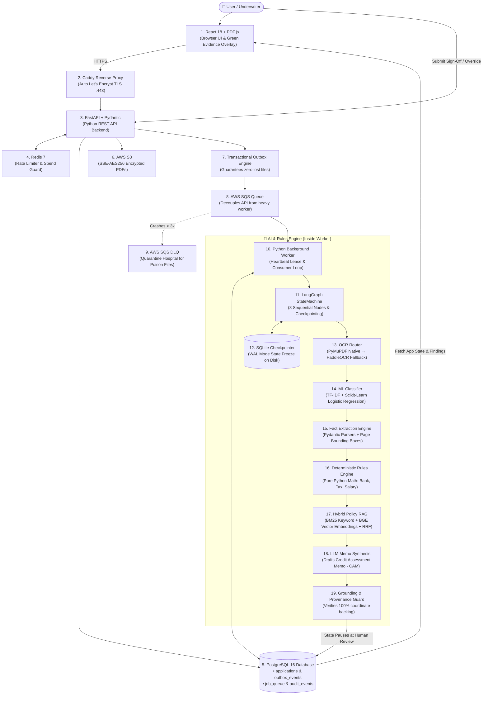

# FinScan AI — Complete Architectural Blueprint & Tool Guide

> **Core Operating Doctrine:**  
> *"Deterministic code decides. AI explains. A human approves. Every number traces back to a document."*

---

## 🗺️ 1. End-to-End System Architecture

---

## 🛠️ 2. The 6 Architectural Layers & Tools

### Layer 1: Client & User Experience (Frontend)
| Tool | Primary Purpose | How It Is Used in FinScan AI |
|---|---|---|
| **React 18** | Frontend SPA Framework | Powers the reactive institutional review dashboard. |
| **Vite** | Build Tool & Dev Server | Fast bundling and instant hot module replacement. |
| **Tailwind CSS** | Styling Engine | Powers the Swiss Ledger heritage banking theme. |
| **PDF.js (`pdfjs-dist`)** | In-Browser PDF Canvas | Renders original loan PDFs in the central viewer pane. |
| **Lucide React** | UI Iconography | Provides audit status icons, provenance tags, and badges. |

---

### Layer 2: Edge & API Gateway
| Tool | Primary Purpose | How It Is Used in FinScan AI |
|---|---|---|
| **Caddy** | Reverse Proxy & Web Server | Automatic zero-configuration HTTPS via Let's Encrypt; proxies `/api/*` to FastAPI. |
| **FastAPI** | Async REST API Backend | High-performance Python backend handling dossier creation, uploads, and review. |
| **Uvicorn / Gunicorn** | ASGI Server | Runs FastAPI across multiple worker processes (`API_WORKERS=4`). |
| **Pydantic (v2)** | Data Validation | Strictly type-checks and validates all request/response schemas. |

---

### Layer 3: Persistent Storage, Caching & Queues (PostgreSQL Core)
| Tool | Primary Purpose | How It Is Used in FinScan AI |
|---|---|---|
| **PostgreSQL 16** | Authoritative Database | Stores applications, documents, jobs, and immutable audit logs. Connected to both FastAPI and Worker. |
| **PgBouncer** | Connection Pooler | Multiplexes hundreds of API requests onto 15–20 Postgres sockets. |
| **SQLAlchemy 2.0** | Async ORM | Executes non-blocking async queries between FastAPI and PostgreSQL. |
| **Alembic** | Schema Migrations | Automatically applies versioned DDL migrations (`001_initial_schema.py`). |
| **Redis 7** | In-Memory Cache | Powers sliding-window rate limiting (5 req/min) and Spend Guard quotas (2 active jobs). |
| **AWS S3** | Cloud Object Storage | Secure bucket (`finscan-dossiers-production`) storing PDFs with `SSE-AES256`. |
| **AWS SQS** | Distributed Job Queue | Decouples fast HTTP uploads from heavy downstream OCR and AI processing. |
| **AWS SQS DLQ** | Dead Letter Queue | Isolates poison messages and corrupted files after 3 failed delivery attempts. |

---

### Layer 4: Pipeline Orchestration & Checkpointing
| Tool | Primary Purpose | How It Is Used in FinScan AI |
|---|---|---|
| **LangGraph** | Finite State Machine | Orchestrates the 8-node document analysis pipeline with `interrupt()` points. |
| **SQLite (`checkpoints.sqlite3`)** | Embedded State Store | Freezes the state to disk in WAL mode while waiting for human underwriter review. |
| **Transactional Outbox** | Reliability Pattern | Saves DB records and queue events in 1 atomic SQL transaction to prevent lost jobs. |

---

### Layer 5: Computer Vision, OCR, Classification & Fact Extraction
| Tool | Primary Purpose | How It Is Used in FinScan AI |
|---|---|---|
| **PyMuPDF (`fitz`)** | Native PDF Parser | Extracts digital text and word bounding box coordinates in < 50ms for free. |
| **PaddleOCR** | Deep Learning OCR | CPU-based optical character recognition for scanned or photographed documents. |
| **Scikit-Learn (TF-IDF)** | Document Classifier | Classifies document types (payslip, bank statement, ITR-V, ID) in under 5ms. |
| **Fact Extraction Engine** | Pydantic Parsers | Extracts structured facts (`PayslipFacts`, `BankStatementFacts`, `TaxReturnFacts`) with exact page coordinates (`EvidenceRef`). |
| **MLflow** | ML Lifecycle Tracking | Logs classifier training parameters, F1 metrics (0.9823), and model artifacts. |

---

### Layer 6: Underwriting Intelligence & Generative AI (RAG)
| Tool | Primary Purpose | How It Is Used in FinScan AI |
|---|---|---|
| **Deterministic Rules Engine** | Pure Python Math | Computes salary credit match (`RULE-INC-01`) and DTI (`RULE-BNK-01`) with exact decimals. |
| **Rank-BM25** | Lexical Search | Finds exact credit policy codes, section titles, and acronyms. |
| **BGE (`bge-small-en-v1.5`)** | Neural Embeddings | 384-dimensional dense vectors from `sentence-transformers` for semantic search. |
| **Reciprocal Rank Fusion (RRF)** | Ranking Merger | Merges BM25 keyword results with BGE vector results (`Score = 1 / (60 + rank)`). |
| **LLM (Claude / Gemini / Qwen)** | Narrative Copywriter | Generates the Credit Appraisal Memo (CAM), strictly citing document page coordinates. |
| **Grounding Gate** | Safety Validator | Scans the generated memo to ensure every single claim is grounded in extracted facts. |

---

## 🔒 3. The Underwriter Sign-Off Flow

To guarantee that AI never autonomously approves a loan, the review endpoint enforces an explicit human review:

1. Underwriter inspects extracted facts side-by-side with original document bounding boxes.
2. Underwriter selects verdict (`APPROVED`, `REJECTED`, or `NEEDS_INFO`).
3. Underwriter enters mandatory justification notes and any field corrections.
4. FastAPI validates the decision, updates `applications.status = 'REVIEWED'`, and appends an immutable record to `audit_events` in PostgreSQL.
