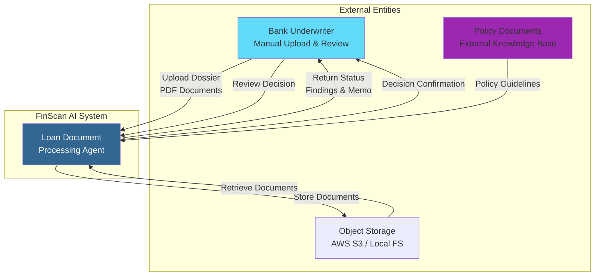
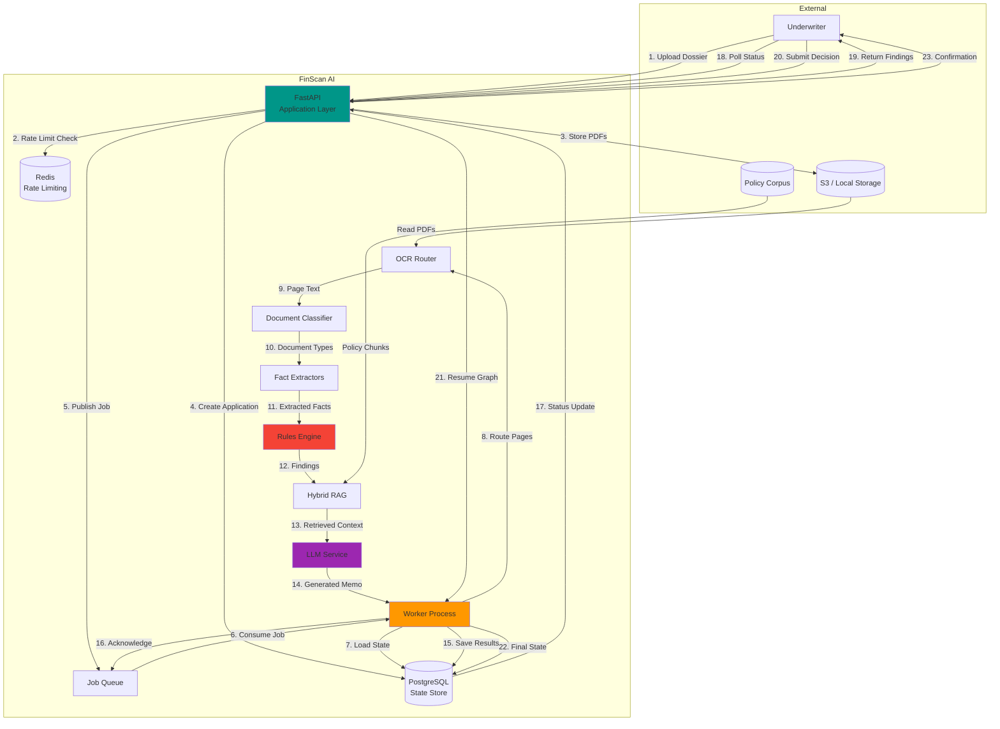
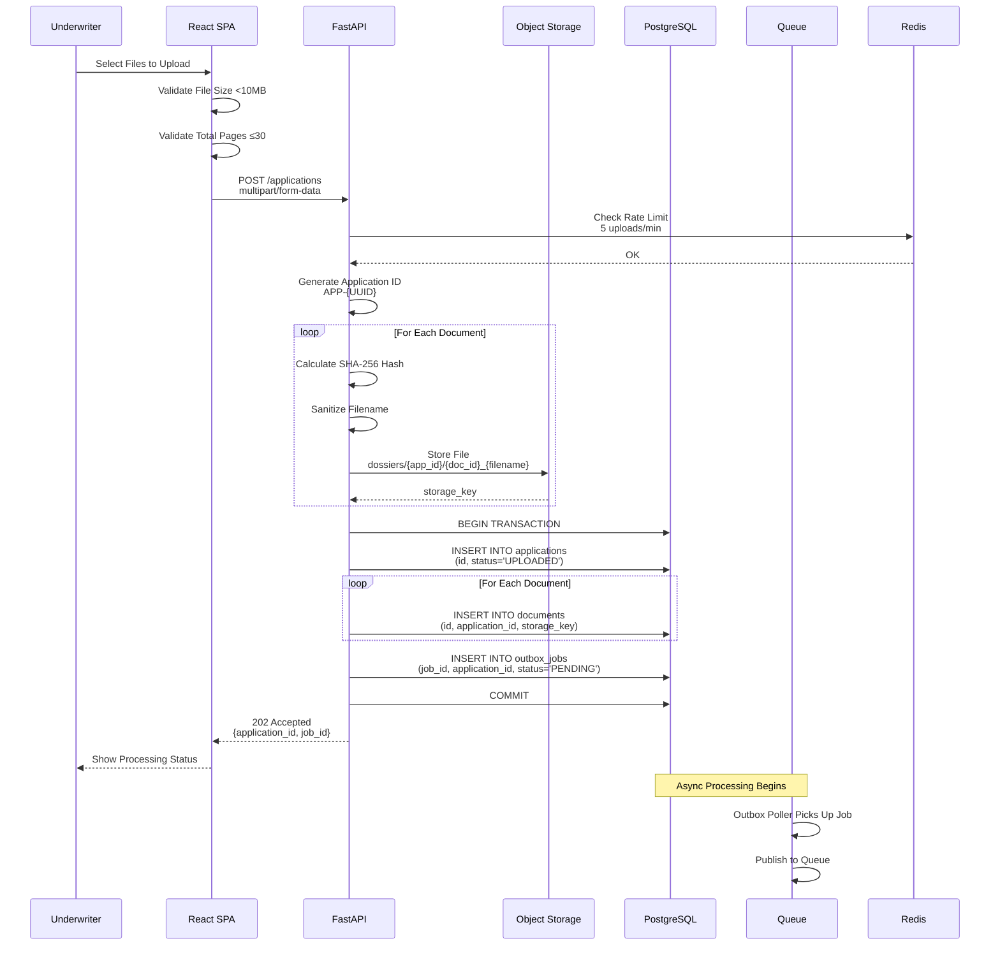
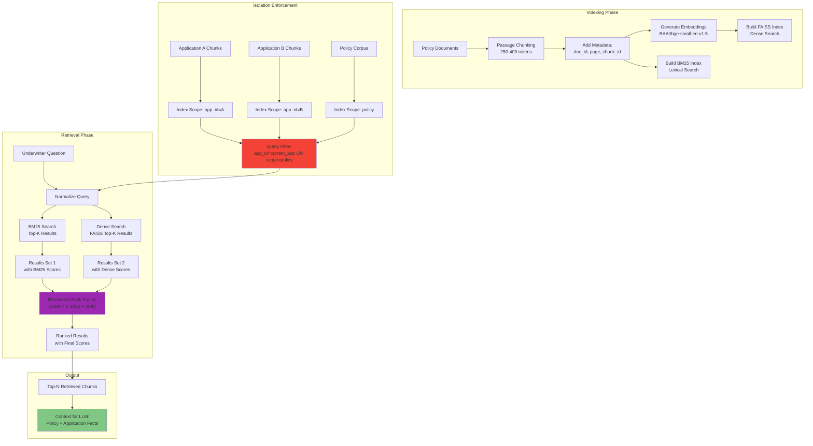
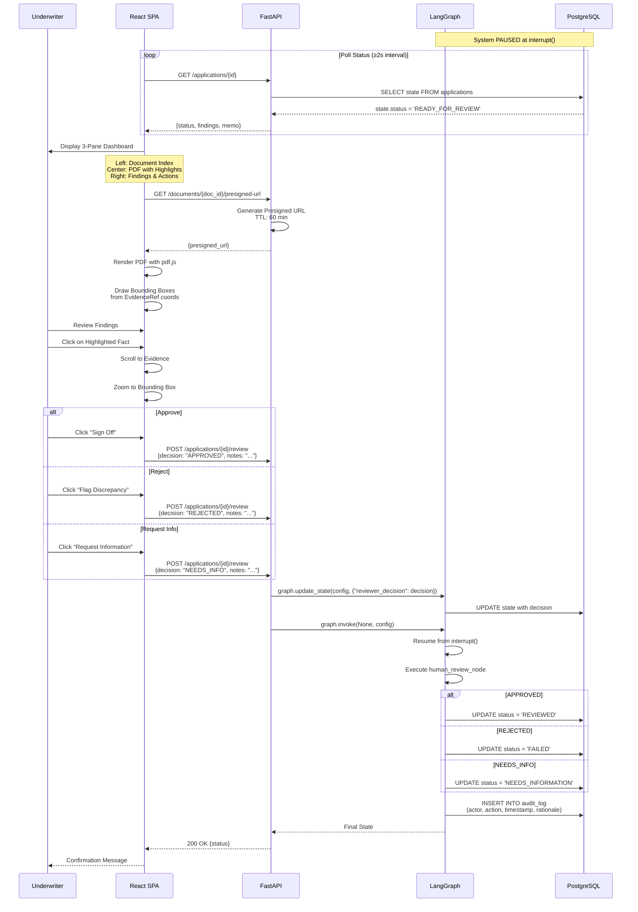

# Data Flow Diagrams

**End-to-End Data Movement Through FinScan AI**

---

## 📊 Level 0: System Context Diagram



---

## 📊 Level 1: Major Data Flows



---

## 📊 Level 2: Document Upload Flow



---

## 📊 Level 3: OCR & Classification Flow

```mermaid
graph TB
    subgraph "Input"
        A[PDF Document<br/>Multiple Pages]
    end
    
    subgraph "OCR Router"
        B[Page 1] --> Check1{Has Native Text?}
        B --> Check2{Has Native Text?}
        B --> Check3{Has Native Text?}
        
        Check1 -->|Yes| N1[Native Text Extraction<br/>PyMuPDF]
        Check1 -->|No| O1[OCR Route Selection]
        
        O1 --> Decision{Page Quality + Budget?}
        Decision -->|Good / Uncapped| Paddle[PaddleOCR CPU]
        Decision -->|Poor / Capped| Textract[AWS Textract]
        
        N1 --> Out1[Page Text 1<br/>+ Word Boxes]
        Paddle --> Out2[Page Text 2<br/>+ Coordinates]
        Textract --> Out3[Page Text 3<br/>+ Coordinates]
    end
    
    subgraph "Classification"
        Out1 --> C1[TF-IDF Vectorization]
        Out2 --> C1
        Out3 --> C1
        
        C1 --> Model[Trained Classifier<br/>.joblib Model]
        Model --> Pred[Prediction + Confidence]
        
        Pred --> Threshold{"Confidence > T?"}
        Threshold -->|Yes| Label[Document Type:<br/>payslip, bank_statement, etc.]
        Threshold -->|No| Unknown[Label: UNKNOWN]
    end
    
    subgraph "Output"
        Label --> D1[Classified Page 1]
        Unknown --> D2[Flagged Page 2]
        Label --> D3[Classified Page 3]
        
        D1 --> Output[Document Manifest:<br/>page → type mapping]
        D2 --> Output
        D3 --> Output
    end
    
    style Decision fill:#FFF9C4
    style Threshold fill:#FFF9C4
    style Output fill:#81C784
```

---

## 📊 Level 4: Fact Extraction Flow

```mermaid
graph TB
    subgraph "Input: Classified Pages"
        P1[Page: Payslip]
        P2[Page: Bank Statement]
        P3[Page: Tax Return]
        P4[Page: ID Card]
    end
    
    subgraph "Extractors"
        P1 --> E1[PayslipExtractor]
        P2 --> E2[BankStatementExtractor]
        P3 --> E3[TaxReturnExtractor]
        P4 --> E4[IDCardExtractor]
        
        E1 --> Parse1[Parse Fields<br/>with Regex Patterns]
        E2 --> Parse2[Parse Tables<br/>with Layout Analysis]
        E3 --> Parse3[Parse Key-Value Pairs]
        E4 --> Parse4[Parse Text Regions]
        
        Parse1 --> Loc1[Locate Bounding Boxes]
        Parse2 --> Loc2[Locate Table Cells]
        Parse3 --> Loc3[Locate Field Positions]
        Parse4 --> Loc4[Locate ID Fields]
    end
    
    subgraph "Evidence Binding"
        Loc1 --> Bind1[Create EvidenceRef]
        Loc2 --> Bind2[Create EvidenceRef]
        Loc3 --> Bind3[Create EvidenceRef]
        Loc4 --> Bind4[Create EvidenceRef]
        
        Bind1 --> Facts1[PayslipFacts:<br/>gross_salary: MoneyFact<br/>net_salary: MoneyFact<br/>source: EvidenceRef]
        
        Bind2 --> Facts2[BankStatementFacts:<br/>salary_credits: List[MoneyFact]<br/>account_holder: str<br/>source: EvidenceRef]
        
        Bind3 --> Facts3[TaxReturnFacts:<br/>gross_total_income: MoneyFact<br/>pan_number: str<br/>source: EvidenceRef]
        
        Bind4 --> Facts4[ApplicantFact:<br/>full_name: str<br/>pan_number: str<br/>source_name: EvidenceRef<br/>source_pan: EvidenceRef]
    end
    
    subgraph "Output: Structured Facts"
        Facts1 --> Aggregate[ExtractedFacts Dict]
        Facts2 --> Aggregate
        Facts3 --> Aggregate
        Facts4 --> Aggregate
        
        Aggregate --> Save[Save to Application State]
    end
    
    style Aggregate fill:#81C784
    style Save fill:#64B5F6
```

---

## 📊 Level 5: Rules Evaluation Flow

```mermaid
graph TB
    subgraph "Input: Extracted Facts"
        Facts[ExtractedFacts Dict]
    end
    
    subgraph "Rule Chain"
        Facts --> R1[RULE-COMP-01<br/>Completeness Check]
        
        R1 --> C1{All Required Docs Present?}
        C1 -->|Yes| C2[Finding: verdict=pass]
        C1 -->|No| C3[Finding: verdict=flag<br/>reason=Missing documents]
        
        C2 --> R2[RULE-INC-01<br/>Salary Audit]
        C3 --> R2
        
        R2 --> S1[Extract Payslip Net Salary]
        S1 --> S2[Extract Bank Salary Credits]
        S2 --> S3[Calculate Average Bank Credit]
        S3 --> S4[Compare: |payslip - bank| / payslip]
        S4 --> S5{"Delta <= 5%?"}
        
        S5 -->|Yes| S6[Finding: verdict=pass]
        S5 -->|No| S7[Finding: verdict=flag<br/>reason=Salary mismatch]
        S5 -->|UNKNOWN| S8[Finding: verdict=unknown<br/>reason=Missing data]
        
        S6 --> R3[RULE-TAX-01<br/>Tax Audit]
        S7 --> R3
        S8 --> R3
        
        R3 --> T1[Extract ITR Gross Income]
        T1 --> T2[Annualize Payslip Gross<br/>monthly_gross × 12]
        T2 --> T3[Compare Values]
        T3 --> T4{Match Within Tolerance?}
        
        T4 -->|Yes| T5[Finding: verdict=pass]
        T4 -->|No| T6[Finding: verdict=flag<br/>reason=Income mismatch]
        
        T5 --> R4[RULE-ID-01<br/>Identity Check]
        T6 --> R4
        
        R4 --> I1[Extract Name from ID]
        I1 --> I2[Extract Name from Payslip]
        I2 --> I3[Extract PAN from ID]
        I3 --> I4[Extract PAN from Tax Return]
        I4 --> I5[Fuzzy Match Names]
        I5 --> I6[Compare PANs]
        I6 --> I7{All Match?}
        
        I7 -->|Yes| I8[Finding: verdict=pass]
        I7 -->|No| I9[Finding: verdict=flag<br/>reason=Identity mismatch]
    end
    
    subgraph "Output: Aggregated Findings"
        C2 --> Results[Findings List]
        C3 --> Results
        S6 --> Results
        S7 --> Results
        S8 --> Results
        T5 --> Results
        T6 --> Results
        I8 --> Results
        I9 --> Results
        
        Results --> Output[Pass Count: X<br/>Flag Count: Y<br/>Unknown Count: Z]
    end
    
    style S5 fill:#FFF9C4
    style T4 fill:#FFF9C4
    style I7 fill:#FFF9C4
    style Output fill:#81C784
```

---

## 📊 Level 6: Hybrid RAG Flow



---

## 📊 Level 7: Human Review Flow



---

## 📊 Data Transformation Summary

```mermaid
graph LR
    subgraph "Input Transformations"
        A1[PDF Binary] -->|OCR| A2[Page Text + Coordinates]
        A2 -->|Classification| A3[Document Type Labels]
        A3 -->|Extraction| A4[Raw Field Values]
    end
    
    subgraph "Evidence Binding"
        A4 -->|Locate in Source| B1[Bounding Box x0,y0,x1,y1]
        B1 -->|Create Reference| B2[EvidenceRef with Provenance]
        B2 -->|Bind to Fact| B3[MoneyFact with Source]
    end
    
    subgraph "Rule Processing"
        B3 -->|Compare Values| C1[Numeric Comparison<br/>with Tolerance]
        C1 -->|Determine Verdict| C2[Finding: pass/flag/unknown]
        C2 -->|Aggregate| C3[Findings List]
    end
    
    subgraph "RAG Retrieval"
        C3 -->|Query Generation| D1[Natural Language Query]
        D1 -->|Hybrid Search| D2[Retrieved Policy Chunks]
        D2 -->|Context Assembly| D3[Context for LLM]
    end
    
    subgraph "LLM Synthesis"
        D3 -->|Prompt Engineering| E1[LLM Generation]
        E1 -->|Grounding Check| E2[Validated Claims]
        E2 -->|Format| E3[Credit Appraisal Memo]
    end
    
    subgraph "Human Decision"
        E3 -->|Review & Sign-off| F1[Human Verdict]
        F1 -->|State Transition| F2[Final Application State]
    end
    
    style B2 fill:#FF9800
    style C2 fill:#F44336
    style E2 fill:#9C27B0
    style F1 fill:#4CAF50
```



---

## 📚 Related Documentation

- [System Overview](system_overview.md) - Component architecture
- [LangGraph Workflow](langgraph_workflow.md) - Pipeline execution
- [Worker Architecture](worker_queue_architecture.md) - Queue processing
- **API reference** - live OpenAPI at `http://localhost:8000/docs` once `make demo-api` is running; routes in [`apps/api/routes/`](../apps/api/routes/)
