# Deployment Guide

**Local Development & Cloud Production Deployment**

---

## 📋 Overview

FinScan AI supports two deployment modes:
1. **Local Development**: Zero-cost, all services in Docker containers
2. **Cloud Production**: AWS EC2 with managed services, budget-controlled

---

## 🐳 Local Development Setup

### Architecture

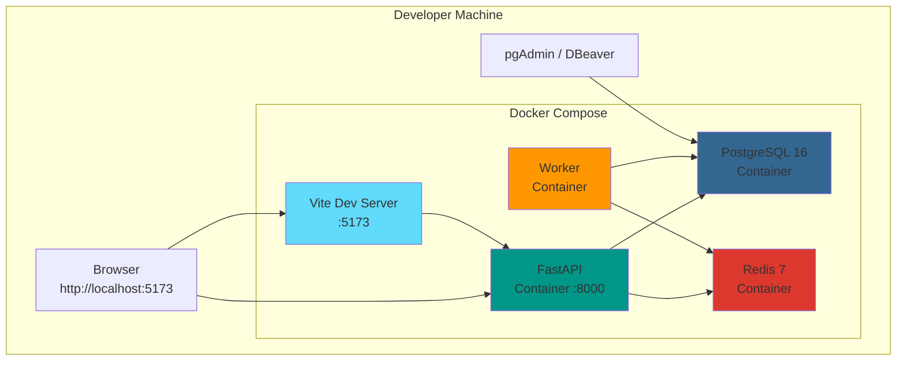

### Prerequisites

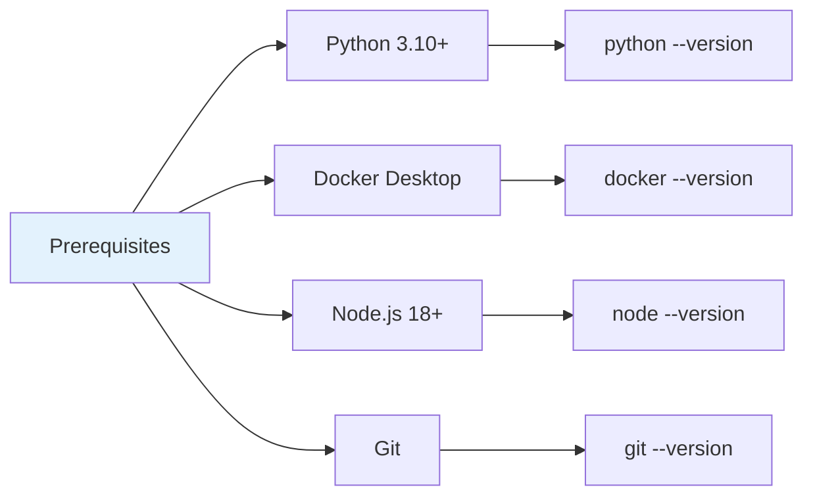

### Step-by-Step Setup

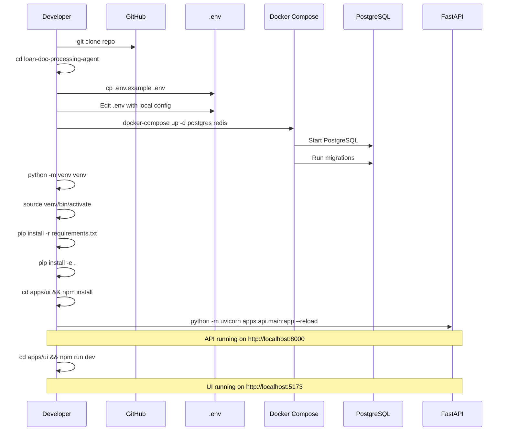

---

## ☁️ Cloud Production Deployment

### Architecture

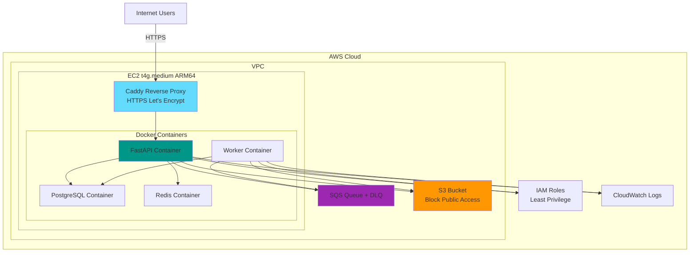

### Cost Breakdown

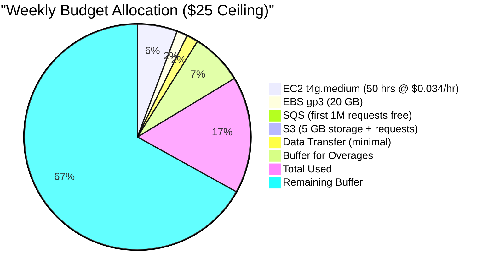

### Provisioning Steps

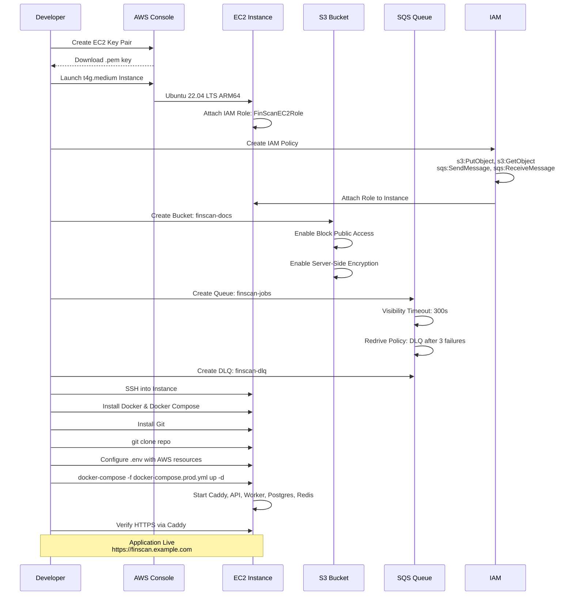

### Security Configuration

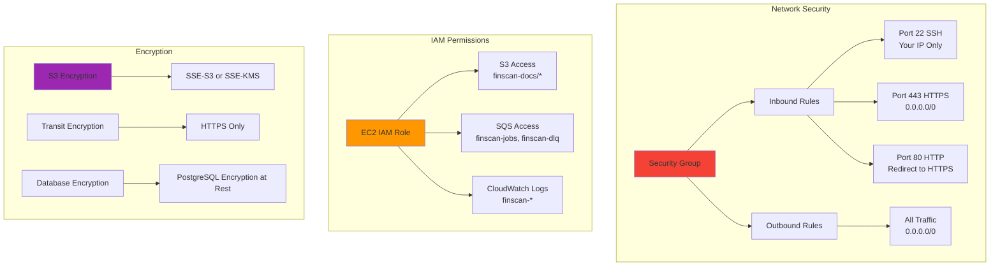

---

## 🔧 Configuration Management

### Environment Variables

```mermaid
graph LR
    subgraph "Required Variables"
        A[DATABASE_URL] --> A1[PostgreSQL Connection String]
        B[REDIS_URL] --> B1[Redis Connection String]
        C[QUEUE_TYPE] --> C1["local" or "sqs"]
        D[STORAGE_TYPE] --> D1["local" or "s3"]
        E[LLM_PROVIDER] --> E1["local" or "opencode"]
    end
    
    subgraph "Cloud-Specific"
        F[AWS_REGION] --> F1["us-east-1"]
        G[SQS_QUEUE_URL] --> G1["https://sqs..."]
        H[S3_BUCKET] --> H1["finscan-docs"]
    end
    
    subgraph "Optional"
        I[TEXTRACT_ENABLED] --> I1["false" (default)]
        J[TEXTRACT_MAX_PAGES] --> J1["100" (cap)]
        K[BUDGET_CEILING] --> K1["25" (dollars)]
    end
    
    style A fill:#E57373
    style C fill:#FFF9C4
    style I fill:#C8E6C9
```

---

## 🚀 Deployment Workflow

### Local Development

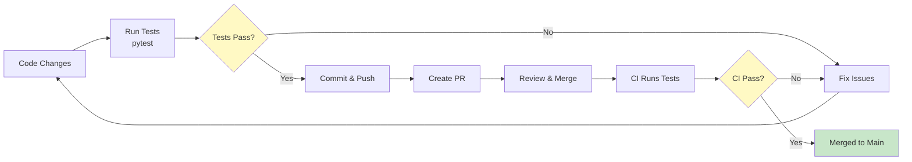

### Production Deployment

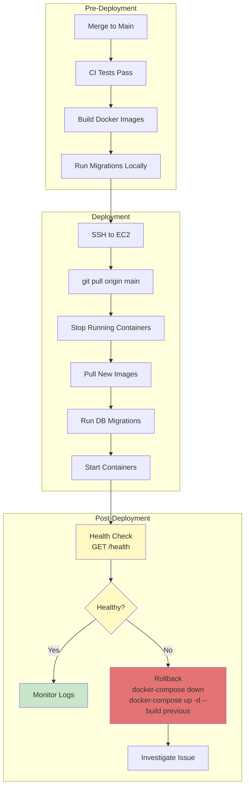

---

## 📊 Monitoring & Logging

### Log Aggregation

```mermaid
graph TB
    subgraph "Application Logs"
        API[FastAPI Logs] --> CW[CloudWatch Logs]
        Worker[Worker Logs] --> CW
        Caddy[Caddy Logs] --> CW
    end
    
    subgraph "Log Streams"
        CW --> Stream1[/finscan/api]
        CW --> Stream2[/finscan/worker]
        CW --> Stream3[/finscan/caddy]
    end
    
    subgraph "Log Insights Queries"
        Stream1 --> Query1[Error Rate by Endpoint]
        Stream2 --> Query2[Job Processing Duration]
        Stream3 --> Query3[HTTPS Request Latency]
    end
    
    subgraph "Alerting"
        Query1 --> Alert1[Error Rate > 5%]
        Query2 --> Alert2[Processing > 120s]
        Query3 --> Alert3[p95 Latency > 1s]
    end
    
    style CW fill:#FF9800
    style Alert1 fill:#E57373
    style Alert2 fill:#E57373
    style Alert3 fill:#E57373
```

### Health Checks

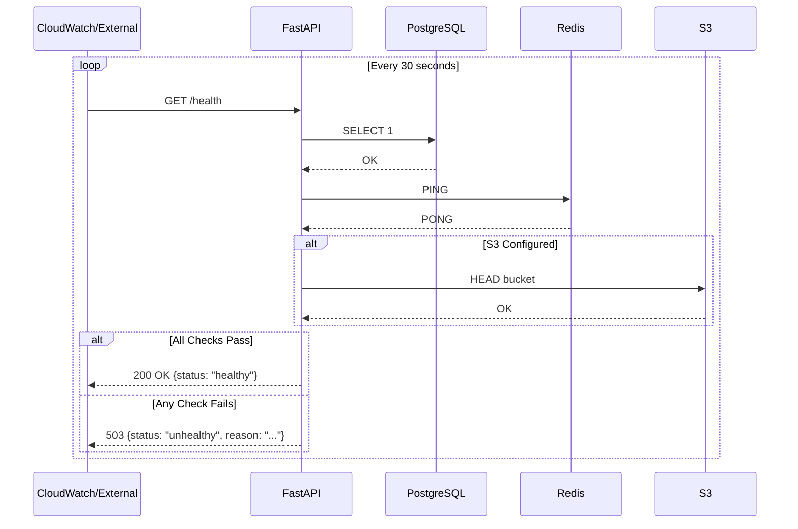

---

## 🔁 Rollback Strategy

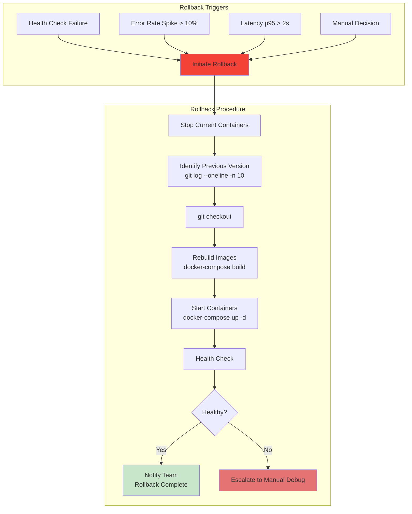

---

## 💰 Cost Optimization

### Instance Scheduling

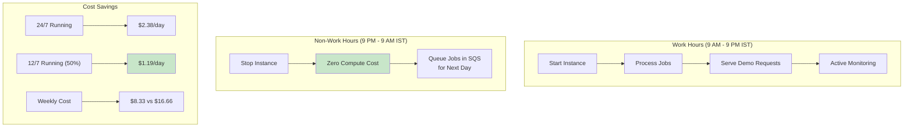

### Resource Right-Sizing

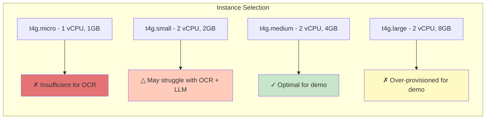

---

## 📚 Related Documentation

- [System Overview](system_overview.md) - Architecture components
- [Worker Architecture](worker_queue_architecture.md) - Queue configuration
- [Security Architecture](security_architecture.md) - IAM and encryption setup
- **Health endpoints** - see [`apps/api/main.py`](../apps/api/main.py); live OpenAPI at `http://localhost:8000/docs`
