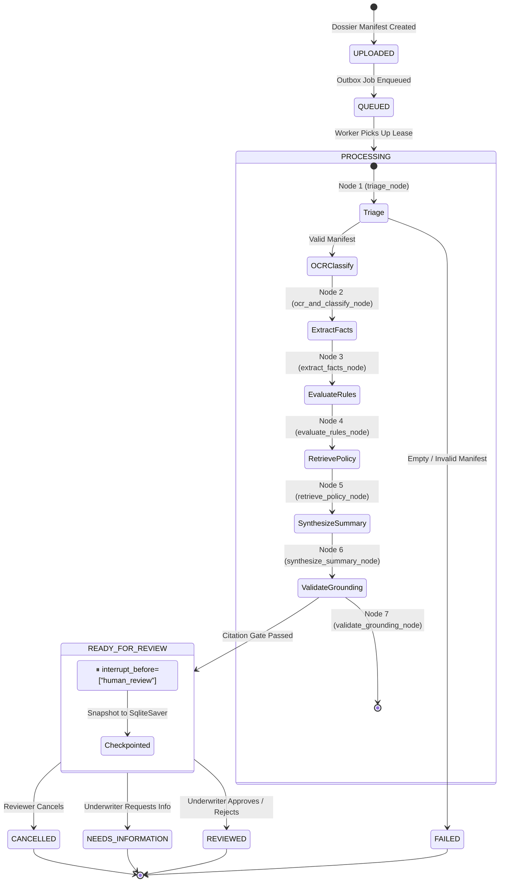
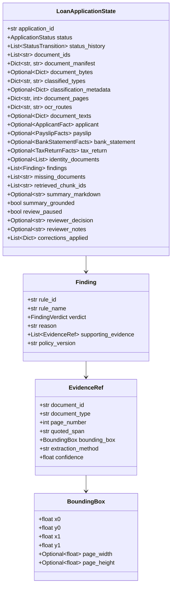
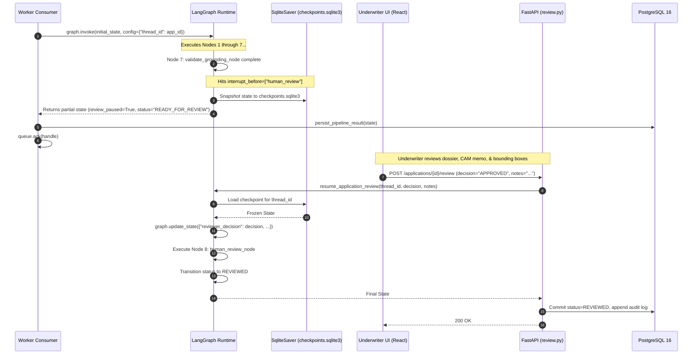
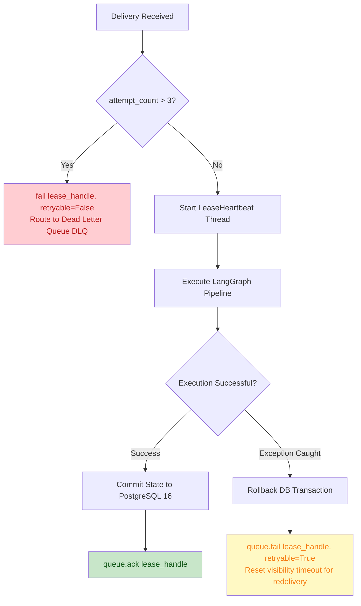
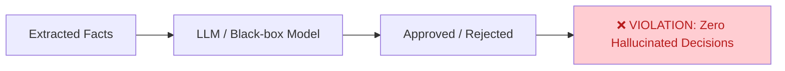
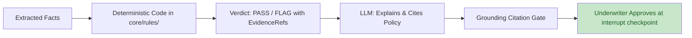

# LangGraph Workflow Documentation

**Authoritative Stateful Orchestration with Human-in-the-Loop Checkpoints**  
*Owned by Member 2 (Bhanu Teja — Team Lead & Orchestration Lead)*

---

## 📋 Overview

FinScan AI utilizes **LangGraph** (`StateGraph`) as its core orchestration engine. The stateful pipeline coordinates document perception, ML classification, fact extraction, deterministic rules, hybrid policy RAG, and auditable narrative synthesis. 

The execution strictly enforces the **Prime Invariant**:
> *"Deterministic code decides. AI explains. A human approves. Every number traces back to a page in a document."*

---

## 🔄 Lifecycle State Transitions

The pipeline moves through 8 lifecycle states defined in [`core/contracts/state.py`](../core/contracts/state.py). Every transition is appended immutably to `status_history`.



---

## 🧩 Detailed Node Execution Pipeline

```mermaid
flowchart TD
    Start([Worker: job_ref received]) --> N1[Node 1: triage_node]

    %% Node 1
    N1 -->|Empty dossier| FailEnd[Status: FAILED<br/>route_after_triage: __end__] --> EndNode([END])
    N1 -->|Valid manifest| N2[Node 2: ocr_and_classify_node]

    %% Node 2
    subgraph Perception_Classification [Perception & Classification]
        N2 --> Router[OCR Router: native PyMuPDF -> CPU Paddle/Tesseract]
        Router --> CacheText[(Cache in document_texts)]
        CacheText --> MLClass[TF-IDF + Logistic Regression Classifier]
        MLClass --> RejectionGate{Confidence >= 0.40?}
        RejectionGate -->|Yes| AssignClass[Assign Canonical Class]
        RejectionGate -->|No / Exception| KeywordFallback[Keyword Heuristic Fallback]
        AssignClass --> RAGIndex[Index Application Dossier]
        KeywordFallback --> RAGIndex
    end

    RAGIndex --> N3[Node 3: extract_facts_node]

    %% Node 3
    subgraph Extraction [Fact Extraction with Provenance]
        N3 --> ReuseCache[Reuse cached document_texts]
        ReuseCache --> PExt[PayslipExtractor]
        ReuseCache --> BExt[BankStatementExtractor]
        ReuseCache --> TExt[TaxReturnExtractor]
        ReuseCache --> IExt[IdCardExtractor]
        PExt --> EvidenceRefs[Bind EvidenceRef: page_number + bbox]
        BExt --> EvidenceRefs
        TExt --> EvidenceRefs
        IExt --> EvidenceRefs
    end

    EvidenceRefs --> N4[Node 4: evaluate_rules_node]

    %% Node 4
    subgraph Deterministic_Rules [Deterministic Rules Engine - HUMAN ONLY]
        N4 --> R_COMP[RULE-COMP-01: Completeness Checklist]
        N4 --> R_INC[RULE-INC-01: Net Salary vs Bank Credits within 5%]
        N4 --> R_TAX[RULE-TAX-01: ITR Gross vs 12x Payslip Gross]
        N4 --> R_ID1[RULE-ID-01: Fuzzy Name & PAN Match]
        N4 --> R_ID2[RULE-ID-02: Cross-ID Consistency]
        N4 --> R_BANK[RULE-BANK-01: Balance Arithmetic open+cr-dr=close]
        R_COMP --> FindingsList[Aggregate Typed Findings: PASS / FLAG / UNKNOWN]
        R_INC --> FindingsList
        R_TAX --> FindingsList
        R_ID1 --> FindingsList
        R_ID2 --> FindingsList
        R_BANK --> FindingsList
    end

    FindingsList --> N5[Node 5: retrieve_policy_node]

    %% Node 5
    subgraph RAG_Retrieval [Finding-Aware Policy RAG]
        N5 --> QueryGen[Generate Queries from Rule Flags]
        QueryGen --> BM25[BM25 Lexical Search]
        QueryGen --> FAISS[FAISS Dense BGE-small Search]
        BM25 --> RRF[Reciprocal Rank Fusion RRF]
        FAISS --> RRF
        RRF --> CanonicalBackstop[Merge Canonical Backstop Clauses]
    end

    CanonicalBackstop --> N6[Node 6: synthesize_summary_node]

    %% Node 6
    subgraph Synthesis [CAM Narrative Synthesis]
        N6 --> MemoBuilder[build_appraisal_memo]
        MemoBuilder --> PromptIsolation[Wrap untrusted data in context_data tags]
        PromptIsolation --> LLMCall[OpenCodeZenLLM: Groq / Zen / Qwen]
        LLMCall --> DraftMemo[CAM Markdown with Bracketed Citations]
    end

    DraftMemo --> N7[Node 7: validate_grounding_node]

    %% Node 7
    subgraph Grounding_Gate [Citation Validation Firewall]
        N7 --> ParseCitations[Parse citation tokens]
        ParseCitations --> MatchAuth{All citations in retrieved_chunk_ids?}
        MatchAuth -->|Unauthorized| StripClaims[Drop Ungrounded Claim Blocks]
        MatchAuth -->|Authorized| RetainClaims[Validate & Sanitize Text]
        StripClaims --> UpdateStatus[Status: READY_FOR_REVIEW<br/>summary_grounded=True]
        RetainClaims --> UpdateStatus
    end

    UpdateStatus --> InterruptHalt{interrupt_before Checkpoint}
    InterruptHalt -->|Durable State Snapshot| SQLiteSave[(SqliteSaver: checkpoints.sqlite3)]
    SQLiteSave --> PausedHalt([⏸ Execution Paused for Underwriter])

    %% Node 8 Resume
    PausedHalt -->|POST /applications/id/review| ResumeCall[resume_application_review]
    ResumeCall --> N8[Node 8: human_review_node]
    N8 --> DecisionSwitch{reviewer_decision}
    DecisionSwitch -->|APPROVED / REJECTED| ReviewedStatus[Status: REVIEWED]
    DecisionSwitch -->|NEEDS_INFO| NeedsInfoStatus[Status: NEEDS_INFORMATION]
    ReviewedStatus --> CommitResult[(Commit to PostgreSQL)]
    NeedsInfoStatus --> CommitResult
    CommitResult --> FinalEnd([END])
```



---

## 📦 The Authoritative State Contract: `LoanApplicationState`

Defined in [`core/contracts/state.py`](../core/contracts/state.py), this `TypedDict` is the single source of truth passed across all nodes:



---

## 💾 Checkpoint Persistence & Interrupt Mechanism

The pipeline is compiled with:
```python
workflow.compile(
    checkpointer=SqliteSaver(db_path="data/storage/checkpoints.sqlite3"),
    interrupt_before=["human_review"],
)
```



---

## 🛡️ Error Handling, DLQ Routing & Poison Messages



---

## 📊 Node Performance & Latency Budgets

```mermaid
gantt
    title FinScan AI Pipeline Node Latency Budget (Target: < 25s CPU)
    dateFormat  X
    axisFormat %s s

    section Ingestion
    Triage (Node 1)                 :0, 1
    section Perception
    OCR & Classification (Node 2)   :1, 10
    section Extraction
    Fact Extraction (Node 3)        :10, 14
    section Deterministic Rules
    Rules Engine (Node 4)           :14, 15
    section Policy RAG
    Hybrid Policy RAG (Node 5)      :15, 17
    section Synthesis
    CAM Memo Builder (Node 6)       :17, 21
    section Safety Firewall
    Grounding Gate (Node 7)         :21, 22
    section HITL Checkpoint
    Interrupt & SQLite Snapshot     :22, 23
```



---

## 🚫 Inviolable Architectural Anti-Patterns

### ❌ Anti-Pattern 1: Autonomous Lending Decisions


### ✅ Correct Pattern: Deterministic Rules + LLM Explanation + Human Sign-off


---

## 📚 Related Source Files

- **Orchestration Definition**: [`core/graph/workflow.py`](../core/graph/workflow.py)
- **Node Functions**: [`core/graph/nodes.py`](../core/graph/nodes.py)
- **State Contracts**: [`core/contracts/state.py`](../core/contracts/state.py)
- **Facts & Evidence Models**: [`core/contracts/facts.py`](../core/contracts/facts.py) and [`core/contracts/evidence.py`](../core/contracts/evidence.py)
- **Durable Checkpointer**: [`core/graph/checkpoint.py`](../core/graph/checkpoint.py)
- **Worker Execution Loop**: [`worker/consumer.py`](../worker/consumer.py)
- **Underwriter Sign-off Route**: [`apps/api/routes/review.py`](../apps/api/routes/review.py)
