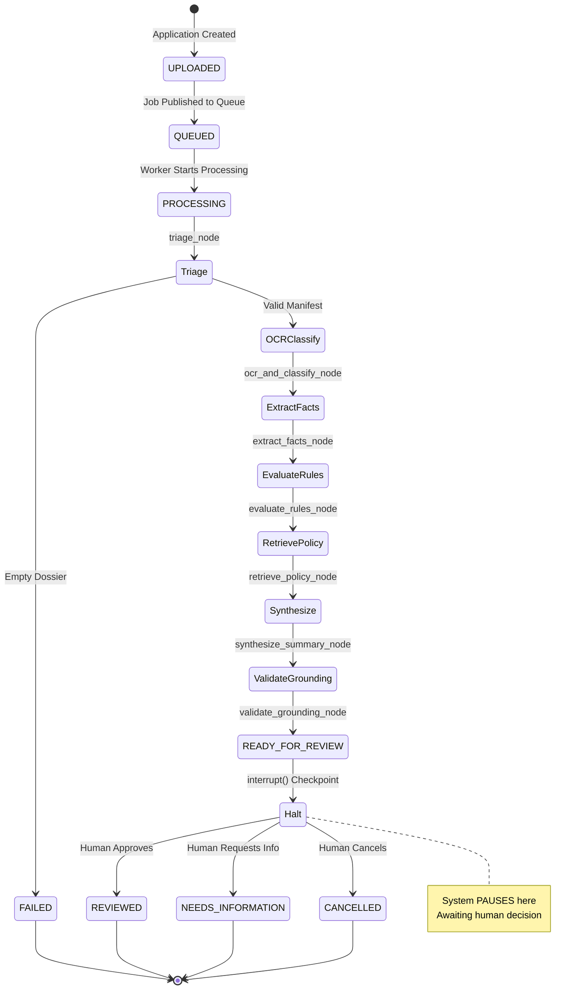
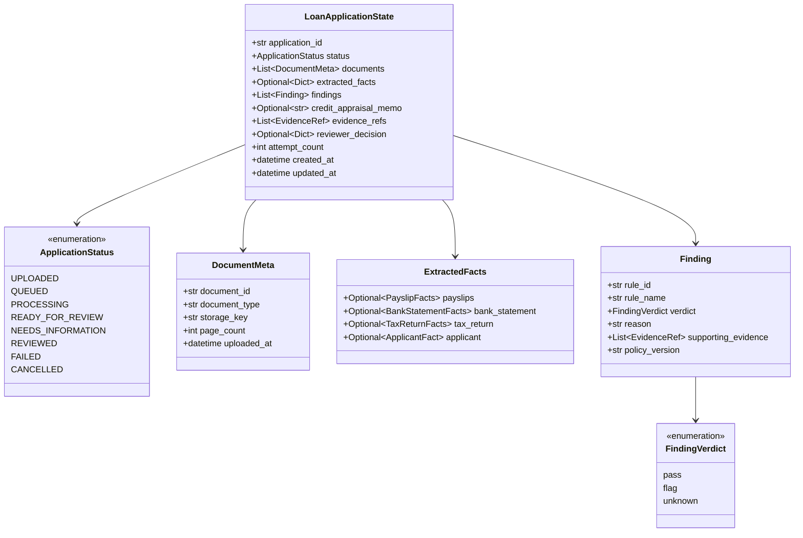
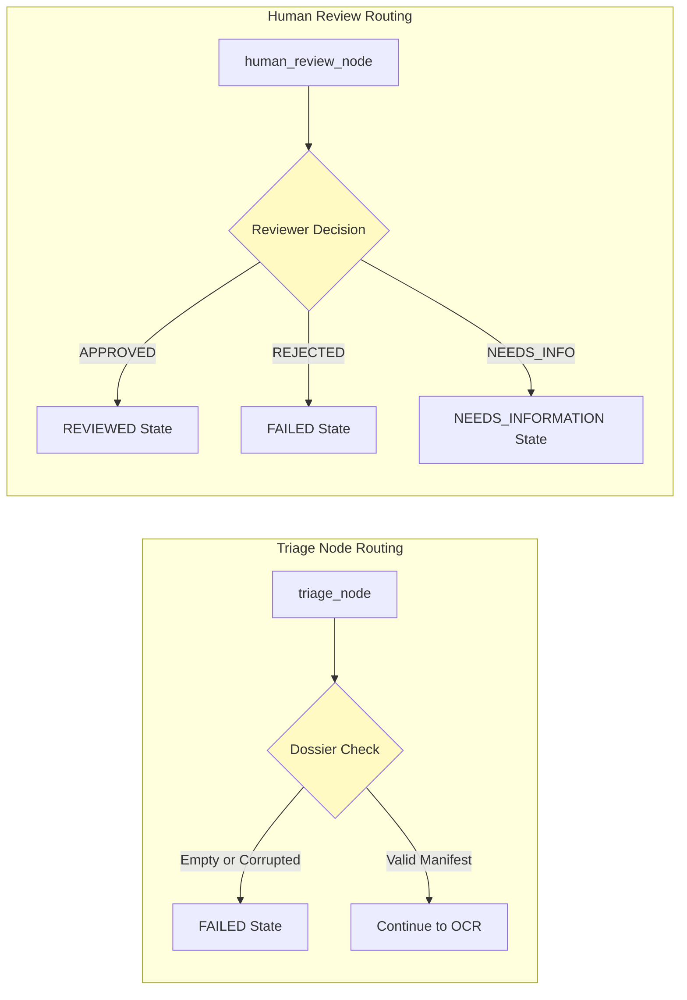
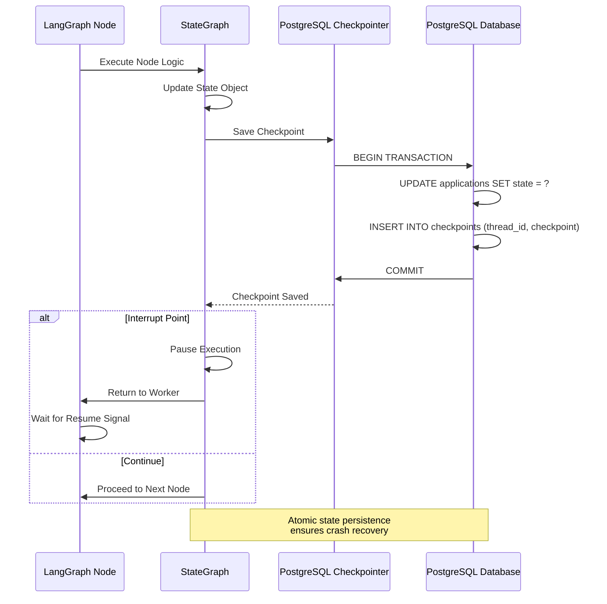
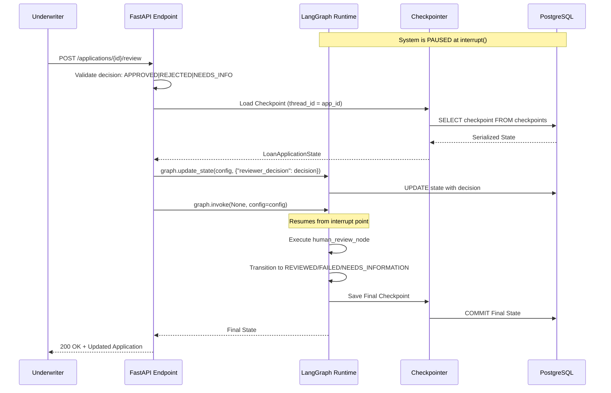
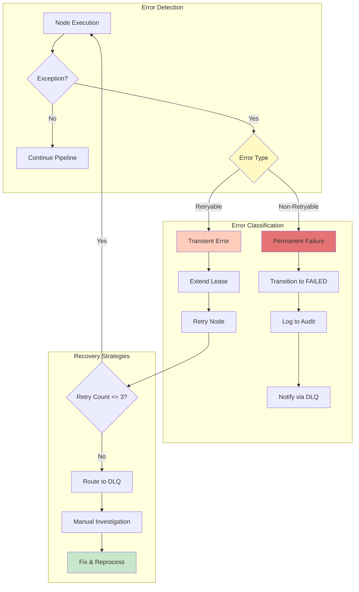
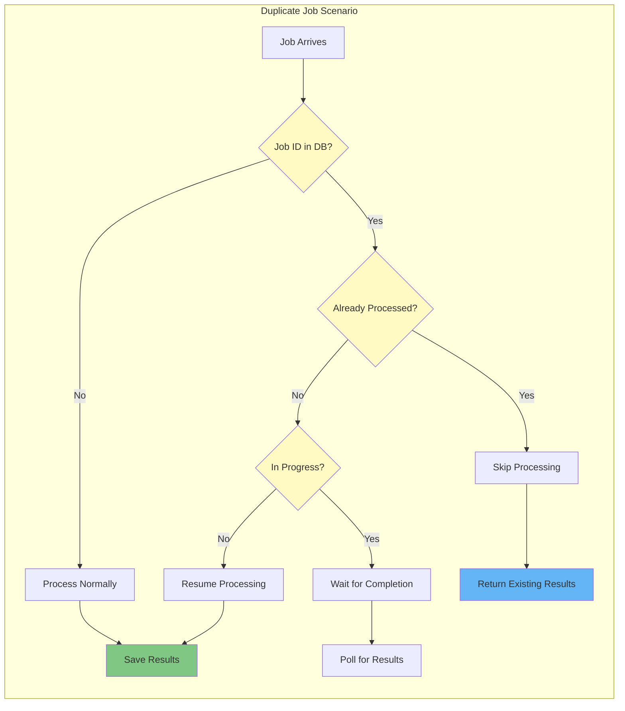
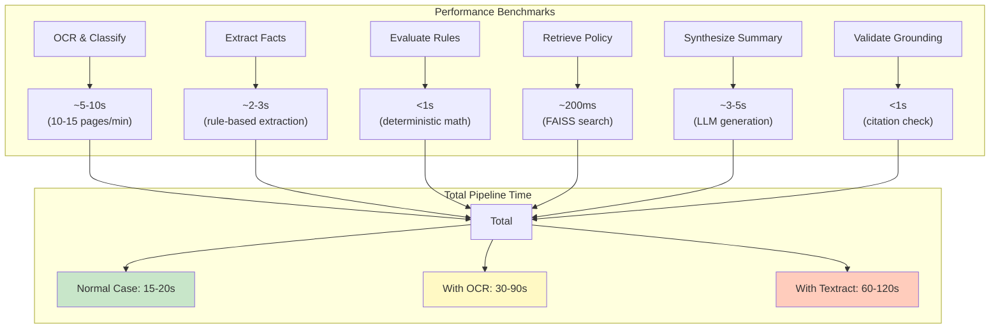
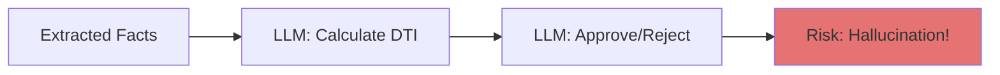
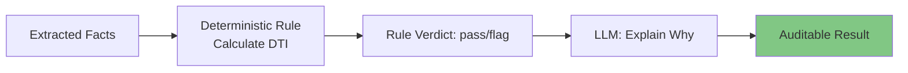

# LangGraph Workflow Documentation

**Stateful Orchestration with Human-in-the-Loop Checkpoints**

---

## 📋 Overview

FinScan AI uses LangGraph for orchestrating the document processing pipeline. The StateGraph ensures transactional state management, checkpoint persistence, and explicit `interrupt()` points for human review.

---

## 🔄 StateGraph Architecture



---

## 🧩 Node Execution Sequence

```mermaid
graph TB
    subgraph "Node 1: Triage"
        T1[triage_node] --> T2{Dossier Valid?}
        T2 -->|Empty| T3[Transition to FAILED]
        T2 -->|Valid| T4[Continue to OCR]
    end
    
    subgraph "Node 2: OCR & Classify"
        O1[ocr_and_classify_node] --> O2[Route PDF Pages]
        O2 --> O3[Native Text: PyMuPDF]
        O2 --> O4[Scanned: PaddleOCR]
        O2 --> O5[Fallback: Textract]
        O3 --> O6[Classify Pages]
        O4 --> O6
        O5 --> O6
    end
    
    subgraph "Node 3: Extract Facts"
        E1[extract_facts_node] --> E2[Payslip Extractor]
        E1 --> E3[Bank Statement Extractor]
        E1 --> E4[Tax Return Extractor]
        E1 --> E5[ID Card Extractor]
        E2 --> E6[Bind EvidenceRefs]
        E3 --> E6
        E4 --> E6
        E5 --> E6
    end
    
    subgraph "Node 4: Evaluate Rules"
        R1[evaluate_rules_node] --> R2[RULE-COMP-01]
        R2 --> R3[RULE-INC-01]
        R3 --> R4[RULE-TAX-01]
        R4 --> R5[RULE-ID-01]
        R5 --> R6[Aggregate Findings]
    end
    
    subgraph "Node 5: Retrieve Policy"
        P1[retrieve_policy_node] --> P2[Hybrid Search BM25+Dense]
        P2 --> P3[RRF Fusion]
        P3 --> P4[Ranked Policy Chunks]
    end
    
    subgraph "Node 6: Synthesize Summary"
        S1[synthesize_summary_node] --> S2[LLM Generates Narrative]
        S2 --> S3[Credit Appraisal Memo]
    end
    
    subgraph "Node 7: Validate Grounding"
        G1[validate_grounding_node] --> G2{All Claims Cited?}
        G2 -->|No| G3[Strip Ungrounded Claims]
        G2 -->|Yes| G4[Accept Memo]
        G3 --> G4
        G4 --> G5[State: READY_FOR_REVIEW]
    end
    
    subgraph "Node 8: Human Review (INTERRUPT)"
        H1[human_review_node] --> H2[interrupt() HALT]
        H2 --> H3{Wait for Resume}
        H3 -->|APPROVED| H4[State: REVIEWED]
        H3 -->|REJECTED| H5[State: FAILED]
        H3 -->|NEEDS_INFO| H6[State: NEEDS_INFORMATION]
    end
    
    T4 --> O1
    O6 --> E1
    E6 --> R1
    R6 --> P1
    P4 --> S1
    S3 --> G1
    G5 --> H1
    
    style H2 fill:#F44336,color:#FFF
    style G1 fill:#FF9800
    style R1 fill:#9C27B0
```

---

## 📦 State Schema



---

## 🔀 Conditional Edge Routing



---

## 💾 Checkpoint Persistence



---

## 🔄 Resume from Interrupt



---

## 🛡️ Error Handling & Recovery



---

## 🔍 Idempotency Guarantees



---

## 📊 Node Execution Metrics



---

## 🚫 Anti-Patterns to Avoid

### ❌ DON'T: Let LLM Make Financial Decisions



### ✅ DO: Deterministic Rules + LLM Explanation



---

## 📚 Related Documentation

- [System Overview](system_overview.md) - Complete pipeline architecture
- **Contracts reference** - state schema in [`core/contracts/state.py`](../core/contracts/state.py); evidence/facts/findings alongside it
- [Worker Implementation](worker_queue_architecture.md) - Consumer loop details
- **Resume endpoint** - see [`apps/api/routes/review.py`](../apps/api/routes/review.py)
