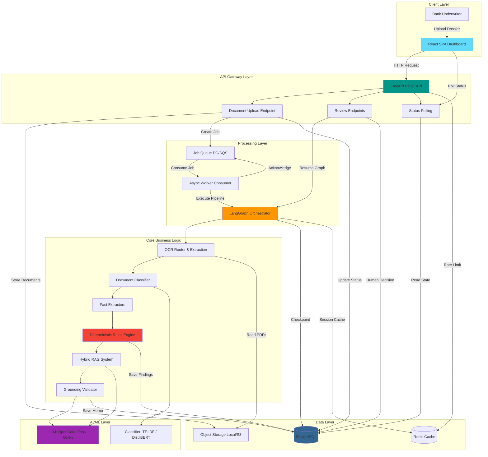
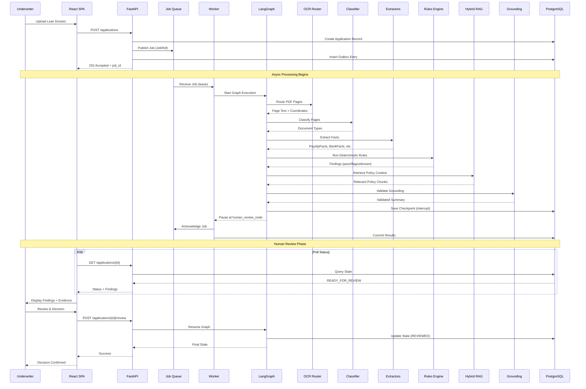
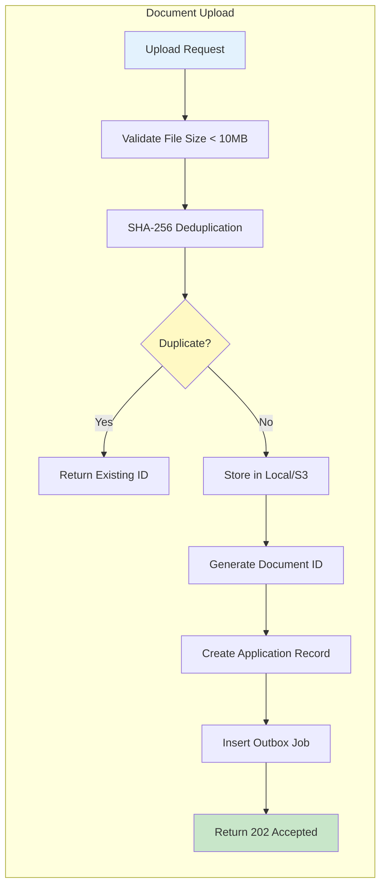
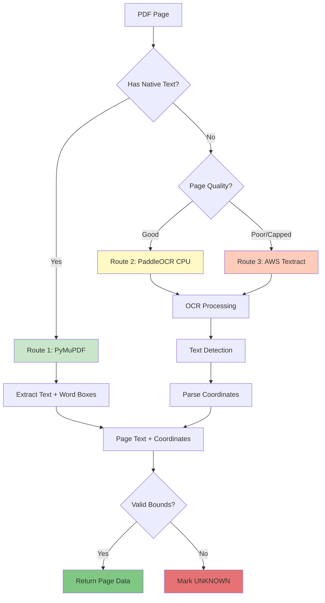
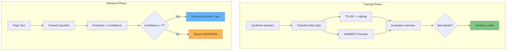
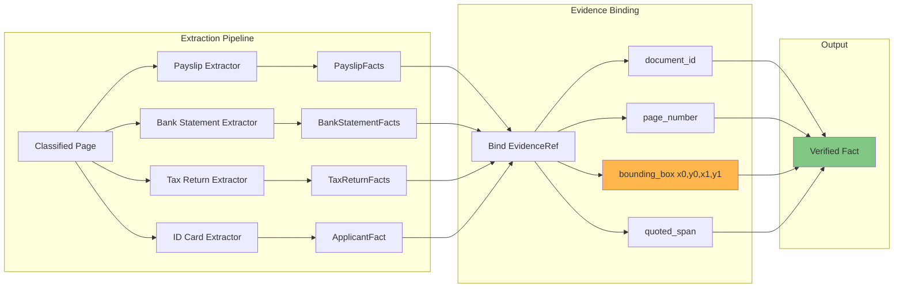
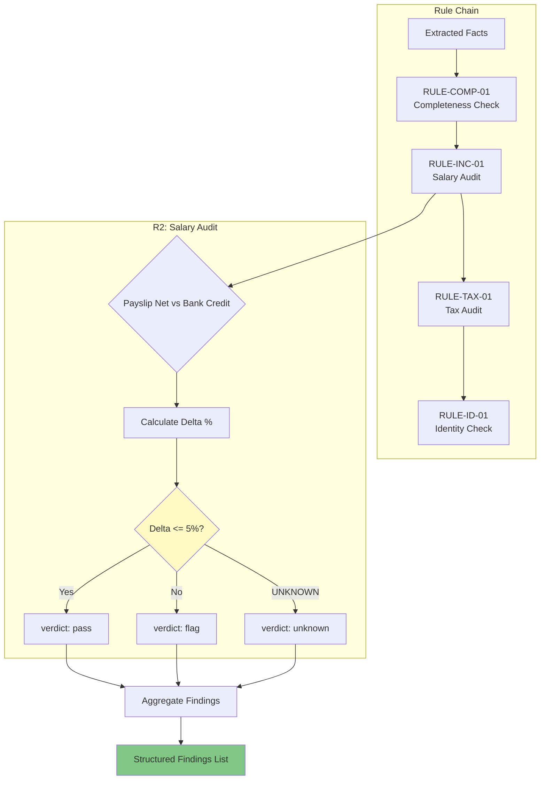
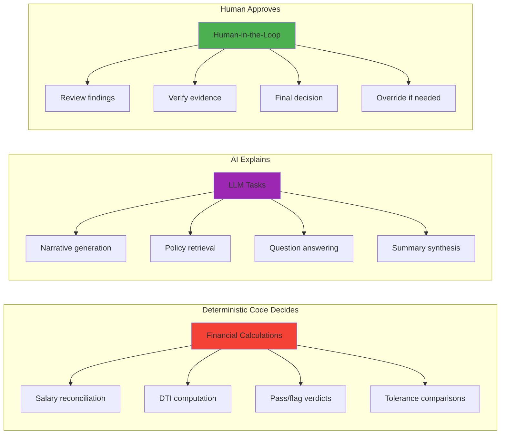
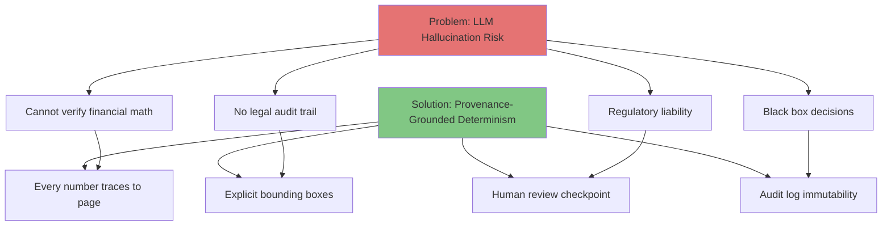

# FinScan AI - System Overview

**GenAI-Enabled Loan Document Processing Agent**  
*Deterministic code decides. AI explains. A human approves.*

---

## 🎯 Executive Summary

FinScan AI is an intelligent loan document verification system designed for bank underwriters. It processes retail loan dossiers containing multiple document types, extracts financial facts with pixel-level evidence, and presents findings for human review.

### Key Value Propositions

| Feature | Traditional Process | FinScan AI | Benefit |
|---------|-------------------|------------|---------|
| **Processing Time** | 24-72 hours | ~90 seconds | 99% faster turnaround |
| **Accuracy** | Manual verification prone to errors | Deterministic arithmetic with evidence | Zero hallucinated numbers |
| **Audit Trail** | Scattered paper trail | Every fact traces to page coordinates | Full regulatory compliance |
| **Decision Authority** | Manual judgment | Human-in-the-loop sign-off | No autonomous AI decisions |

---

## 🏛️ System Architecture Overview

---

## 🔄 Processing Pipeline Flow

---

## 🧩 Core Components Breakdown

### 1. Document Ingestion & Triage

### 2. OCR Routing Strategy

### 3. Document Classification

### 4. Fact Extraction with Evidence

### 5. Deterministic Rules Engine

---

## 🎯 Key Design Decisions

### 1. Deterministic vs AI

### 2. Why Not Use LLMs for Everything?

---

## 📊 Performance & Scalability

### Target Metrics

| Metric | Target | Rationale |
|--------|--------|-----------|
| **End-to-End Processing** | < 90 seconds | Complete dossier processing from upload to review-ready |
| **OCR Throughput** | 10-15 pages/min | PaddleOCR CPU on ARM64 t4g.medium |
| **Classification Latency** | < 100ms p95 | TF-IDF baseline on CPU |
| **RAG Retrieval** | < 200ms p95 | FAISS exact flat search |
| **API Response Time** | < 50ms p95 | For non-processing endpoints |
| **Concurrent Jobs** | 2 per user | Queue lease isolation |
| **Budget Ceiling** | $25/week | Target $8-15 for cloud demo |

---

## 📚 Related Documentation

- [Architecture Details](architecture.md) - Detailed component boundaries
- [LangGraph Workflow](langgraph_workflow.md) - Pipeline orchestration
- [Worker & Queue Architecture](worker_queue_architecture.md) - Async processing
- [Data Flow Diagrams](data_flow_diagrams.md) - End-to-end data movement
- [Deployment Guide](deployment_guide.md) - Local and cloud deployment
- [Security Architecture](security_architecture.md) - Defense in depth
