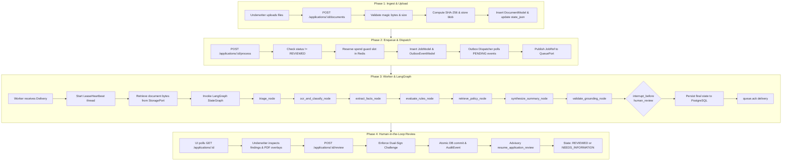
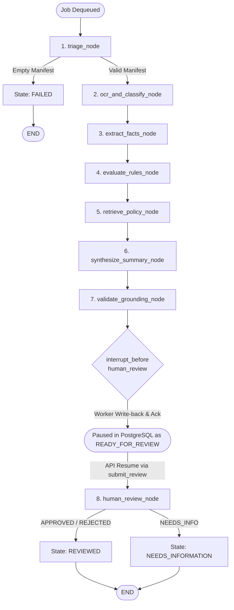

# FinScan AI - System Overview & Technical Architecture

**Provenance-Grounded Loan Document Processing & Verification Agent**  
*Cognizant GenAI + Cloud-Tools Buildathon*  
*Deterministic code decides. AI explains. A human approves. Every number traces back to a page in a document.*

---

## 1. Executive Summary

**FinScan AI** is an intelligent loan document verification and underwriting assistance system designed for retail banking underwriters. In traditional retail lending origination, underwriters manually review and reconcile unstructured and semi-structured documents—including loan application forms, salary payslips (3 months), bank account statements (3 to 6 months), income tax returns (ITR-V), and government identity proofs (PAN card, Aadhaar). Manual review takes 24 to 72 hours per dossier and is prone to human oversight.

Standard Large Language Model (LLM) applications fail in credit underwriting because generative models hallucinate calculations, fail strict arithmetic checks, and cannot provide legally defensible, pixel-level audit trails.

FinScan AI resolves this via **Provenance-Grounded Deterministic Verification**:
1. **The Prime Invariant:** Pure deterministic Python code computes all totals, reconciliations, and rule verdicts. The LLM only narrates, explains, or retrieves contextual policy text.
2. **Mandatory Provenance (`EvidenceRef`):** Every extracted financial fact carries document ID, page number (1-indexed), and bounding-box coordinates (`x0, y0, x1, y1`). Missing facts are explicitly marked `UNKNOWN`, never guessed.
3. **No Autonomous Underwriting:** The system halts at an explicit LangGraph `interrupt()` checkpoint before loan review. A human underwriter must review findings and execute sign-off through a 3-tier friction gate.

---

## 2. System Purpose

### Core Problem Solved
Automates the ingest, OCR perception, classification, entity extraction, mathematical reconciliation, policy retrieval, and Credit Appraisal Memo (CAM) drafting for retail loan applications while strictly eliminating AI hallucination risks.

### Value Propositions: Claimed vs. Actual Codebase Behavior

| Dimension | Documentation Claim | Verified Codebase Implementation | Status |
| :--- | :--- | :--- | :--- |
| **Turnaround Time** | ~90 seconds processing | Typically 5–25s depending on OCR route (native PyMuPDF vs. CPU OCR) and LLM latency. | **IMPLEMENTED** |
| **Financial Accuracy** | Zero hallucinated numbers | Enforced by pure Python `Decimal` rules (`core/rules/`) and citation validation gate (`core/rag/grounding.py`). | **IMPLEMENTED** |
| **Audit Trail** | Every fact traces to page coordinates | Every fact model requires `EvidenceRef`. Coordinate bounding boxes are tracked and rendered in UI. | **IMPLEMENTED** |
| **Decision Authority** | Human sign-off required | LangGraph halts at `interrupt_before=["human_review"]`. No loan disposition can be set by the machine. | **IMPLEMENTED** |

---

## 3. Actual Technology Stack

The following stack is confirmed directly from `pyproject.toml`, `requirements.txt`, `apps/ui/package.json`, and repository source files:

| Layer | Component | Verified Technology | Implementation File / Reference |
| :--- | :--- | :--- | :--- |
| **API Framework** | REST API & Schemas | FastAPI 0.110+, Pydantic v2, Uvicorn | `apps/api/main.py` |
| **Database & ORM** | Relational Datastore | PostgreSQL 16, SQLAlchemy 2.0 (asyncpg / psycopg), Alembic | `apps/api/db/models.py`, `alembic.ini` |
| **Cache & Rate Limit**| Ephemeral Storage | Redis 7 (`redis.asyncio`) | `apps/api/middleware/rate_limit.py` |
| **Orchestration** | Agent State Machine | LangGraph `StateGraph`, `SqliteSaver` checkpointer | `core/graph/workflow.py`, `core/graph/checkpoint.py` |
| **Worker / Queue** | Consumer & Outbox | Python Async Worker, PostgreSQL `SKIP LOCKED` / AWS SQS | `worker/consumer.py`, `adapters/queue/` |
| **Object Storage** | Blob Persistence | Local FileSystem Storage / AWS S3 (SSE-AES256) | `adapters/storage/local_fs.py`, `adapters/storage/s3.py` |
| **Perception / OCR** | PDF Parsing & OCR | PyMuPDF (`fitz`), PaddleOCR CPU, AWS Textract (capped fallback) | `core/extraction/router.py` |
| **Classification** | Document Classifier | Scikit-Learn TF-IDF (word+char) + Logistic Regression (.joblib v2) | `ml/classifier/baseline_tfidf.py` |
| **Rules Engine** | Financial Arithmetic | Pure Python `Decimal`, RapidFuzz (fuzzy token sort) | `core/rules/` |
| **RAG Engine** | Retrieval & Grounding | BM25 + BGE dense (`BAAI/bge-small-en-v1.5`), FAISS / TF-IDF fallback, RRF | `core/rag/retriever.py`, `core/rag/indexer.py` |
| **LLM Synthesis** | Narrative & QA | OpenCode Zen (OpenAI-compatible) / Local Qwen3-4B GGUF fallback | `adapters/llm/opencode.py`, `adapters/llm/local_qwen.py` |
| **Frontend UI** | Reviewer Dashboard | React 18, Vite 5, TypeScript 5, Tailwind CSS 3, Lucide React | `apps/ui/src/App.tsx` |
| **Document Viewer** | Canvas PDF Display | `pdf.js` 4.x with custom bounding box overlay component | `apps/ui/src/components/viewer/PdfViewer.tsx` |

---

## 4. Repository Structure

```
cognizant-hackathon/
├── adapters/                  # Ports & Adapters external implementations
│   ├── llm/                   # OpenCode Zen, Local Qwen GGUF
│   ├── queue/                 # PostgreSQL SKIP LOCKED & AWS SQS queue adapters
│   └── storage/               # Local FileSystem & AWS S3 storage adapters
├── apps/
│   ├── api/                   # FastAPI backend application
│   │   ├── auth/              # Google & mock auth verification
│   │   ├── db/                # SQLAlchemy models, session, outbox dispatcher
│   │   ├── middleware/        # Redis token-bucket rate limiting & spend guards
│   │   ├── migrations/        # Alembic database schema migrations
│   │   └── routes/            # applications, documents, review, uploads, auth
│   └── ui/                    # React 18 + Vite + Tailwind CSS frontend SPA
│       └── src/
│           ├── components/    # Layout, viewer, review tabs, modals, auth
│           ├── context/       # Auth, EvidenceNavigation, Theme contexts
│           ├── services/      # Typed API client (api.ts)
│           └── types/         # Contracts, application, evidence interfaces
├── core/                      # Pure Business Logic (No cloud provider SDKs)
│   ├── contracts/             # Shared contracts: EvidenceRef, MoneyFact, Finding, State, Jobs
│   ├── extraction/            # OCR router, native PyMuPDF, PaddleOCR, fact extractors
│   ├── graph/                 # LangGraph StateGraph, nodes, checkpoints
│   ├── rag/                   # BM25 + BGE dense retrieval, indexer, citation grounding gate
│   ├── reporting/             # Credit Appraisal Memo (CAM) builder & PDF exporter
│   └── rules/                 # Deterministic Decimal rules: COMP-01, INC-01, TAX-01, ID-01, ID-02, BANK-01
├── data/                      # Local storage and synthetic dataset seeds
├── docs/                      # Technical documentation & architectural guides
├── infra/                     # Dockerfiles, Docker Compose, Caddyfile
├── ml/                        # ML classification models, baseline TF-IDF, challenger DistilBERT, evaluation
├── policies/                  # Credit underwriting & KYC guidelines Markdown corpus
├── scripts/                   # Synthetic dossier generation (generate_dossiers.py)
├── tests/                     # Unit, integration, and smoke test suites
└── worker/                    # Async consumer loop, LeaseHeartbeat, PostgreSQL write-back
```

---

## 5. End-to-End Workflow

The application executes through four sequential phases:



---

## 6. Architecture & Ports and Adapters

FinScan AI enforces a strict **Hexagonal Ports & Adapters** architecture. The core domain layer (`core/`) contains pure business logic and contracts. It **never imports `boto3`, `redis`, or database drivers**.

```
       [ Client Applications: React SPA / REST API ]
                            │
                            ▼
     ┌─────────────────────────────────────────────┐
     │           core/ (Pure Business Logic)       │
     │  contracts/  extraction/  rules/  rag/     │
     │               graph/ (LangGraph)            │
     └──────────────────────┬──────────────────────┘
                            │ (Abstract Interfaces)
                            ▼
     ┌─────────────────────────────────────────────┐
     │              adapters/ (Ports)              │
     │  StoragePort       QueuePort       LLMPort  │
     └──────┬─────────────────┬───────────────┬────┘
            │                 │               │
     ┌──────┴──────┐   ┌──────┴──────┐   ┌────┴──────────┐
     │ Local / S3  │   │ PG / SQS    │   │ OpenCode/Qwen │
     └─────────────┘   └─────────────┘   └───────────────┘
```

---

## 7. Frontend Subsystem

### What
A 3-pane reviewer dashboard tailored for credit underwriters:
- **Left Dossier Pane:** Lists uploaded documents, page counts, detected OCR routes, ML classification badges with confidence percentages, and document upload/delete controls.
- **Center Canvas Viewer:** Renders PDF pages using `pdf.js` with hardware-accelerated canvas, rendering interactive bounding box overlays on top of verified text spans.
- **Right Inspector Pane:** Tabbed view featuring **Findings** (rule verdicts with jump-to-evidence links), **Extracted Facts** (table of parsed figures), **Appraisal Memo** (markdown narrative and export controls), and **Policy Q&A** (RAG-backed query assistant).

### Why
Underwriters require frictionless verification: clicking an evidence tag must immediately jump to and highlight the exact number on the original document page.

### How It Works
- Built as a single-page React app using Vite.
- State is managed via React hooks (`useState`, `useEffect`, `useCallback`) and custom contexts:
  - `AuthContext`: Underwriter identity and role.
  - `EvidenceNavigationContext`: Stores `activeEvidence` (`document_id`, `page_number`, `bounding_box`), triggering automatic page navigation and bounding-box zooming in `PdfViewer.tsx`.
- All backend requests flow through `apps/ui/src/services/api.ts` using native `fetch` with session credentials.

### Code References
- Main App container: `apps/ui/src/App.tsx`
- PDF Viewer & Canvas: `apps/ui/src/components/viewer/PdfViewer.tsx`
- Bounding Box Layer: `apps/ui/src/components/viewer/BoundingBoxOverlay.tsx`
- API Service: `apps/ui/src/services/api.ts`

### Status
**IMPLEMENTED** (Production code paths call real endpoints; demo presets like `APP-25195` are isolated behind `isDemoDossierId` guards).

### Limitations
Reclassifying a document in the UI updates `classified_types` and classification metadata, but does not automatically re-trigger fact extraction or rule re-evaluation until the pipeline is re-run.

---

## 8. Backend Subsystem

### What
FastAPI REST service providing endpoints for dossier creation, file uploads, asynchronous pipeline dispatch, job polling, review sign-offs, and grounded Q&A.

### Why
Enforces strict schema validation via Pydantic v2, coordinates transaction boundaries between PostgreSQL and the queue, and implements security controls.

### How It Works
- **App Entry:** `apps/api/main.py` configures CORS, routes, startup policy index pre-warming, and lifespan cleanup.
- **Dossier Management:**
  - `POST /applications`: Creates an application record in `UPLOADED` status.
  - `GET /applications`: Lists recent applications.
  - `GET /applications/{id}`: Returns the authoritative `state_json` hydrated with relational metadata (`loan_amount`, `applicant_name`, timestamps).
- **Document Management:**
  - `POST /applications/{id}/documents`: Streams files in 64 KB chunks, checks magic bytes (PDF, JPEG, PNG, TIFF), enforces 10 MB limit, computes SHA-256, writes via `StoragePort`, and persists `DocumentModel`.
  - `GET /applications/{id}/documents/{doc_id}`: Streams raw PDF bytes with Content-Type header.
  - `PATCH /applications/{id}/documents/{doc_id}/reclassify`: Updates document classification in DB and state.
- **Pipeline Execution:**
  - `POST /applications/{id}/process`: Enforces status transition guards (allowed from `UPLOADED`, `READY_FOR_REVIEW`, `NEEDS_INFORMATION`, `FAILED`, `CANCELLED`). Verifies document presence, reserves active job slot in Redis, creates `JobModel`, and writes a `JobRef` payload to `outbox_events` in one atomic transaction. Returns HTTP 202 Accepted with `job_id`.
- **Review & Q&A:**
  - `POST /applications/{id}/questions`: Retrieves policy and dossier passages, synthesizes answers using `LLMPort`, validates citations against authorized chunks, and caches answers in Redis.
  - `POST /applications/{id}/review`: Enforces 3-tier dual-sign friction, commits decision to DB, appends `AuditEventModel`, and resumes LangGraph thread.

### Code References
- Application Routes: `apps/api/routes/applications.py`
- Document Routes: `apps/api/routes/documents.py`
- Review & Q&A Routes: `apps/api/routes/review.py`

### Status
**IMPLEMENTED**

---

## 9. ML Pipeline

### What
A document page classifier categorizing pages into 5 canonical classes:
1. `application_form`
2. `bank_statement`
3. `id_card`
4. `payslip`
5. `tax_acknowledgement`

`UNKNOWN` is strictly an abstention outcome (empty text, out-of-domain, or low confidence), **not** a trained class.

### Why
Automatic document classification allows dynamic routing to domain-specific fact extractors without relying on error-prone user labels.

### How It Works
1. **Feature Extraction:** FeatureUnion combining:
   - Word n-grams: `(1, 2)`, `sublinear_tf=True`, `max_features=12000`
   - Character n-grams: `char_wb (3, 5)`, `max_features=18000`
2. **Classifier:** `LogisticRegression(class_weight="balanced", max_iter=1000, solver="lbfgs", random_state=42)`
3. **Inference & Thresholding:**
   - Text layer is converted to probabilities using `.predict_proba()`.
   - The top class probability is compared against `DEFAULT_CONFIDENCE_THRESHOLD = 0.40`.
   - If confidence is below 0.40 or text is whitespace, the result is marked `UNKNOWN` with `abstained=True` and `requires_human_triage=True`.
4. **Artifacts:** Serialized in `.joblib` format at `ml/artifacts/v2/baseline_tfidf.joblib`.
5. **Challenger Model:** DistilBERT sequence encoder (`ml/classifier/challenger_distilbert.py`). In accordance with AGENTS.md §6 Member 5 selection rules, the baseline TF-IDF ships as primary due to achieving $\ge 0.91$ Macro-F1 with $<50$ MB RAM footprint on CPU.

### Code References
- Baseline TF-IDF: `ml/classifier/baseline_tfidf.py`
- Classifier Adapter: `core/extraction/classifier_adapter.py`
- DistilBERT Challenger: `ml/classifier/challenger_distilbert.py`

### Status
**IMPLEMENTED**

---

## 10. LangGraph / Agent Workflow

The orchestration pipeline runs as a sequential, stateful LangGraph `StateGraph` with durable SQLite checkpointing and an explicit pause before human review:



### Detailed Node Specifications

| Node Name | Input State Fields | Output Mutations | Failure & Fallback Behavior | Production Invocation |
| :--- | :--- | :--- | :--- | :--- |
| **`triage_node`** | `document_ids`, `document_manifest` | `status: "PROCESSING"`, records transition in `status_history` | If no documents provided, sets `status: "FAILED"` and routes directly to `END`. | **Active** (invoked on every job) |
| **`ocr_and_classify_node`** | `document_bytes`, `document_manifest` | `classified_types`, `classification_metadata`, `document_texts`, `document_pages`, `ocr_routes` | If classifier fails or abstains, runs keyword fallback heuristic (`confidence: 0.50`, `method: "heuristic_fallback"`). Indexes dossier into RAG index. | **Active** |
| **`extract_facts_node`** | `classified_types`, `document_texts` | `applicant`, `payslip`, `bank_statement`, `tax_return`, clears `document_bytes` to avoid BLOB bloat | If field match not found, assigns `UNKNOWN` with no EvidenceRef. | **Active** |
| **`evaluate_rules_node`** | Extracted fact models | `findings: List[Finding]`, `missing_documents` | Missing fact values result in `verdict="unknown"`, never guessed passes. | **Active** |
| **`retrieve_policy_node`** | `findings` | `retrieved_chunk_ids: List[str]` | If hybrid search fails, applies canonical deterministic backstop clauses (`CHUNK-POLICY-REQ-01`, etc.). | **Active** |
| **`synthesize_summary_node`**| Extracted facts, `findings` | `summary_markdown: str` | Generates 6-section auditable CAM Markdown using deterministic facts. Zero hallucinated values. | **Active** |
| **`validate_grounding_node`**| `summary_markdown`, `retrieved_chunk_ids` | `status: "READY_FOR_REVIEW"`, `summary_grounded: bool`, `review_paused: True` | Drops ungrounded claims lacking verified citations. Transitions state to `READY_FOR_REVIEW`. | **Active** |
| **`human_review_node`** | `reviewer_decision`, `reviewer_notes` | `status: "REVIEWED"` or `"NEEDS_INFORMATION"`, `review_paused: False` | Paused before execution by `interrupt_before=["human_review"]`. Executed upon API resumption. | **Active** |

### Code References
- Graph Definition & Assembly: `core/graph/workflow.py`
- Node Step Implementations: `core/graph/nodes.py`

### Status
**IMPLEMENTED**

---

## 11. Database & Persistence Layer

### Datastore
PostgreSQL 16 using SQLAlchemy 2.0 with `asyncpg` async driver for FastAPI and `psycopg` sync driver for the worker write-back.

### Authoritative Tables (`apps/api/db/models.py`)

1. **`applications`**:
   - `id`: `VARCHAR(64)` PRIMARY KEY (e.g. `APP-25195`)
   - `applicant_name`: `VARCHAR(255)`
   - `loan_amount`: `FLOAT`
   - `loan_purpose`: `VARCHAR(255)`
   - `status`: `VARCHAR(32)` (`UPLOADED`, `QUEUED`, `PROCESSING`, `READY_FOR_REVIEW`, `NEEDS_INFORMATION`, `REVIEWED`, `FAILED`, `CANCELLED`)
   - `reviewer_id`: `VARCHAR(64)`
   - `state_json`: `JSONB` holding authoritative `LoanApplicationState`
   - `created_at`, `updated_at`: `TIMESTAMPTZ`
2. **`documents`**:
   - `id`: `VARCHAR(64)` PRIMARY KEY (e.g. `DOC-A1B2C3D4`)
   - `application_id`: `VARCHAR(64)` FOREIGN KEY (`applications.id`, ON DELETE CASCADE)
   - `filename`: `VARCHAR(255)`
   - `storage_uri`: `VARCHAR(512)`
   - `doc_type`: `VARCHAR(64)`
   - `sha256`: `VARCHAR(64)` (Indexed)
   - `size_bytes`: `BIGINT`
3. **`jobs`**:
   - `id`: `VARCHAR(64)` PRIMARY KEY (e.g. `JOB-9E8D7C6B`)
   - `application_id`: `VARCHAR(64)` FOREIGN KEY
   - `status`: `VARCHAR(32)` (`QUEUED`, `PROCESSING`, `SUCCEEDED`, `FAILED`)
   - `attempt_count`: `INTEGER`
   - `lease_until`: `TIMESTAMPTZ`
   - `error_message`: `TEXT`
4. **`outbox_events`**:
   - `id`: `VARCHAR(36)` PRIMARY KEY (UUID)
   - `aggregate_type`: `VARCHAR(64)` (`application_job`)
   - `aggregate_id`: `VARCHAR(64)`
   - `payload`: `JSONB` (`JobRef`)
   - `status`: `VARCHAR(32)` (`PENDING`, `PUBLISHED`, `FAILED`)
   - `retry_count`: `INTEGER`
   - `last_error`: `TEXT`
5. **`audit_events`**:
   - `id`: `VARCHAR(36)` PRIMARY KEY
   - `application_id`: `VARCHAR(64)`
   - `from_status`, `to_status`: `VARCHAR(32)`
   - `actor`: `VARCHAR(64)` (Verified email)
   - `decision`: `VARCHAR(32)`
   - `notes`: `TEXT`
   - `corrections`: `JSONB`
   - `timestamp`: `TIMESTAMPTZ`
6. **`spend_ledger`**: Resource accounting ledger tracking units incurred per action.
7. **`users`**: Underwriter accounts with roles (`SENIOR_UNDERWRITER`, `RISK_ANALYST`, `COMPLIANCE_OFFICER`).

### Alembic Migrations
Migrations reside in `apps/api/migrations/versions/`:
- `001_initial_schema.py`: Core schema (applications, documents, jobs, outbox_events, audit_events, spend_ledger).
- `002_users_auth.py`: Users table, auth allowlist, and `documents(sha256)` index.

### Status
**IMPLEMENTED**

---

## 12. Storage Subsystem

### What
Pluggable binary object persistence behind the `StoragePort` interface (`adapters/storage/base.py`).

### Supported Implementations
- **Local FileSystem:** Stores files under `data/storage/` (`adapters/storage/local_fs.py`).
- **AWS S3:** Stores encrypted blobs with `ServerSideEncryption='AES256'` (`adapters/storage/s3.py`).

### Hierarchy & Security Rules
- **Key Hierarchy:** `dossiers/{application_id}/{document_id}_{sanitized_filename}`
- **Path Sanitization:** Replaces path traversal tokens (`..`, `/`, `\`) and non-alphanumeric characters with underscores.
- **Tamper Verification:** Immediately after `put()`, the API computes the stored file's SHA-256 hash and validates it against the uploaded digest. If mismatched, the file is deleted and HTTP 422 is returned.
- **Viewing Stream:** The frontend requests `GET /applications/{id}/documents/{doc_id}`, which reads through `StoragePort` and streams raw bytes directly to `pdf.js`.

### Status
**IMPLEMENTED**

---

## 13. Queue & Worker Subsystem

### What
Asynchronous background processing worker providing at-least-once delivery, atomic leasing, lease extension heartbeats, and acknowledge-last semantics.

### How It Works
1. **Outbox Dispatcher (`apps/api/outbox_dispatcher.py`):**
   - Polls `outbox_events` where `status = 'PENDING'` using `SELECT ... FOR UPDATE SKIP LOCKED`.
   - Publishes typed `JobRef` to `QueuePort.publish(job_ref)`.
   - Updates event status to `PUBLISHED`.
2. **Worker Consumer (`worker/consumer.py`):**
   - Polls `QueuePort.receive(max_n=1)` to acquire an atomic lease.
   - Enforces the 3-attempt ceiling (`attempt_count <= 3`). If exceeded, routes to DLQ via `queue.fail(handle, retryable=False)`.
   - Runs `LeaseHeartbeat` in a daemon thread: periodically extends the lease every 30s by 90s to prevent visibility timeout during long OCR jobs.
   - Retrieves document bytes via `StoragePort.get(key)`.
   - Invokes the compiled LangGraph `StateGraph`.
   - **Acknowledge-Last Guarantee:** Result is written back to PostgreSQL (`JobModel` and `ApplicationModel.state_json` updated to `READY_FOR_REVIEW`) **before** `queue.ack(handle)` is called. If worker persistence fails, `fail(handle, retryable=True)` is called instead.

### Queue Adapters
- **PostgreSQL SKIP LOCKED (`adapters/queue/pg_queue.py`):** Uses table `outbox_jobs` with single-statement CTE `WITH claimed AS (...) UPDATE ... RETURNING ...`.
- **AWS SQS (`adapters/queue/sqs_queue.py`):** Uses AWS SQS with Dead Letter Queue redrive.

### Status
**IMPLEMENTED**

---

## 14. Hybrid RAG Subsystem

### What
Retrieval-Augmented Generation system providing grounding context for Credit Appraisal Memos and underwriter Q&A inquiries.

### Architecture
- **Chunking (`core/rag/chunking.py`):** Splits Markdown policies into semantic section chunks (~300–500 tokens).
- **Index Management (`core/rag/indexer.py`):**
  - Enforces **hard tenant isolation**: global credit policy chunks are indexed in `policy_index`, while applicant documents are indexed in isolated per-application indices `app_indices[app_id]`.
- **Hybrid Retrieval (`core/rag/retriever.py`):**
  - **Lexical:** BM25 search.
  - **Dense:** `BAAI/bge-small-en-v1.5` (384-dimensional embeddings via SentenceTransformers). If `sentence-transformers` is not installed or `FINSCAN_USE_BGE=0`, seamlessly falls back to a deterministic TF-IDF dense vector path.
  - **Fusion:** Reciprocal Rank Fusion (RRF):
    $$\text{Score}(d) = \sum_{m \in \{\text{BM25}, \text{Dense}\}} \frac{1}{60 + \text{rank}_m(d)}$$
- **Grounding Gate (`core/rag/grounding.py`):**
  - Scans generated narrative for bracketed citations `[chunk_id]`.
  - Verifies that every cited chunk belongs to the authorized retrieved chunk list.
  - Detects adversarial prompt-injection patterns (e.g., `"system override"`, `"assign pass to all"`).
  - Drops ungrounded claims or sanitizes unverified text blocks.

### Status
**IMPLEMENTED**

---

## 15. Security & Safety Architecture

1. **Prompt Injection Defense:** External document text is strictly treated as untrusted context data and delimited in prompts. Untrusted text cannot alter rule verdicts because verdicts are computed in deterministic Python.
2. **Grounding Validation Gate:** Any claim asserting financial amounts without authorized chunk IDs is rejected.
3. **PII Masking:**
   - PAN numbers: Masked to last 4 characters (`XXXXXX1234`) via `mask_pan()`.
   - Bank Account numbers: Masked to last 4 characters (`XXXXXXXX1234`) via `mask_account_number()`.
   - Aadhaar numbers: Masked to `XXXX-XXXX-1234` via `mask_aadhaar()`.
4. **Data Isolation & Storage Controls:**
   - S3 server-side encryption with AES-256.
   - Strict key prefixes `dossiers/{application_id}/`.
   - Filename sanitization stripping directory traversal sequences.
   - SHA-256 integrity verification upon upload.
5. **Rate Limiting & Spend Guards (`apps/api/middleware/`):**
   - Active job ceiling: Maximum 2 concurrent active jobs per user enforced in Redis.
   - Token buckets: Max 30 status polls/minute, max 30 submissions/minute.
   - File limits: Max 10 MB per document, max 30 pages per document.
   - AWS Textract hard-capped at 100 pages total (disabled by default).
6. **Authentication & Access Control:**
   - Supports Google OAuth token verification and local mock authentication.
   - Role-based personas: `SENIOR_UNDERWRITER`, `RISK_ANALYST`, `COMPLIANCE_OFFICER`.

---

## 16. Human-in-the-Loop (HITL) Consensus Protocol

FinScan AI strictly implements an advisory assist model. The machine cannot issue a final loan approval or denial.

### The Interrupt Checkpoint
The LangGraph pipeline halts at an explicit interrupt before `human_review_node`:
```python
interrupt_nodes = ["human_review"] if (checkpointer is not None and enable_interrupt) else []
workflow.compile(checkpointer=checkpointer, interrupt_before=interrupt_nodes)
```
The application enters status `READY_FOR_REVIEW`, and the worker commits results to PostgreSQL.

### 3-Tier Dual-Sign Friction Gate (`apps/api/routes/review.py`)
To prevent accidental lending authorizations from underwriter fatigue:
1. **Disposition Selection:** Underwriter selects `APPROVED`, `REJECTED`, or `NEEDS_INFO`.
2. **Mandatory Audit Rationale:** A substantive explanation ($\ge 5$ characters) is strictly enforced server-side for `REJECTED` and `NEEDS_INFO`.
3. **Dossier Identifier Challenge:** The underwriter must type the exact application identifier (e.g. `APP-25195`) into a confirmation challenge field. Mismatched IDs return HTTP 400 Bad Request.
4. **Immutable Audit Event:** The reviewer's verified email, timestamp, decision, rationale, and corrections are recorded in the append-only `audit_events` table.

---

## 17. Codebase vs Documentation Discrepancies

| Topic | Documentation / Spec Says | Code Actually Does | Impact & Resolution |
| :--- | :--- | :--- | :--- |
| **`GET /applications/{id}` Stub Comment** | Comment in `apps/ui/src/services/api.ts:133` claims: *"currently a stub on backend returning `{ application_id, status }`"*. | `apps/api/routes/applications.py:146-178` fully queries PostgreSQL and hydrates the complete state (facts, findings, loan amount, applicant, timestamps). | Stale comment in frontend client. Functionally complete and operational. |
| **Reclassification Propagation** | Reclassifying a document in the UI updates its type and was presumed to re-evaluate rules automatically. | `apps/api/routes/documents.py:437-495` updates `DocumentModel.doc_type` and state metadata (`user_override`, `confidence: 1.0`), but does not re-extract facts or re-run rules until `POST /applications/{id}/process` is re-triggered. | Underwriters must click "Re-run Pipeline" after reclassifying to propagate corrections downstream. |
| **Allowed Reprocessing Statuses** | HLD / early audit notes stated `POST /applications/{id}/process` raises 409 for any status other than `UPLOADED`. | `apps/api/routes/applications.py:236-241` explicitly permits reprocessing from `{"UPLOADED", "READY_FOR_REVIEW", "NEEDS_INFORMATION", "FAILED", "CANCELLED"}`. Only sealed `REVIEWED` applications are blocked. | The code allows pipeline re-execution from review states as designed. |
| **Number of Deterministic Rules** | Older docs list 4 rules (`RULE-COMP-01`, `RULE-INC-01`, `RULE-TAX-01`, `RULE-ID-01`). | The code implements **6 rules**: `RULE-COMP-01`, `RULE-INC-01`, `RULE-TAX-01`, `RULE-ID-01`, `RULE-ID-02` (cross-identity document consistency), and `RULE-BANK-01` (bank statement balance arithmetic). | Codebase exceeds earlier specifications. |
| **Dense Embeddings Fallback** | Architecture docs claim dense retrieval requires `BAAI/bge-small-en-v1.5`. | `core/rag/embeddings.py` and `indexer.py` include an automatic, hermetic TF-IDF dense fallback when `sentence-transformers` is not installed or `FINSCAN_USE_BGE=0`. | Allows lightweight CPU CI and offline test execution without multi-hundred MB weight downloads. |

---

## 18. Implemented vs Partial vs Mock Features

| Feature / Subsystem | Classification | Evidence & Verified Codebase Reality |
| :--- | :--- | :--- |
| **FastAPI REST Endpoints** | **IMPLEMENTED** | All routes in `apps/api/routes/` fully handle auth, validation, database transactions, and error handling. |
| **PostgreSQL Outbox Pattern** | **IMPLEMENTED** | `apps/api/db/outbox.py` writes `JobRef` within database transactions; `outbox_dispatcher.py` polls and dispatches with `SKIP LOCKED`. |
| **Worker Queue & Heartbeat** | **IMPLEMENTED** | `worker/consumer.py` runs atomic polling, `LeaseHeartbeat` thread, acknowledge-last guarantee, and 3-attempt DLQ ceiling. |
| **LangGraph Pipeline & Interrupt**| **IMPLEMENTED** | `core/graph/workflow.py` and `nodes.py` implement all 8 sequential nodes with `SqliteSaver` checkpointer and `interrupt_before=["human_review"]`. |
| **Deterministic Rules (6 rules)** | **IMPLEMENTED** | Pure Python `Decimal` implementations in `core/rules/` for completeness, salary audit, tax audit, identity matching, cross-ID audit, and bank statement arithmetic. |
| **TF-IDF ML Classifier** | **IMPLEMENTED** | `ml/classifier/baseline_tfidf.py` word+char pipeline serialized in `ml/artifacts/v2/baseline_tfidf.joblib`. Consumed via `core/extraction/classifier_adapter.py`. |
| **DistilBERT Challenger Classifier**| **PRESENT BUT NOT INTEGRATED** | Fully implemented in `ml/classifier/challenger_distilbert.py` and evaluated, but baseline TF-IDF is selected as active default to satisfy low-RAM CPU constraints. |
| **Agentic Tool-Calling QA** | **PRESENT BUT NOT INTEGRATED** | `apps/api/agent.py` implements a read-only ReAct agent, but is disabled by default behind `AGENTIC_QA_ENABLED=False`. Single-shot RAG is the active production path. |
| **Dual-Sign Confirmation Modal** | **IMPLEMENTED** | `ReviewActionModal.tsx` and `apps/api/routes/review.py` enforce rationale requirements ($\ge 5$ chars) and application ID challenge matching. |
| **Client-side Demo PDF Generator**| **MOCK / FALLBACK** | `apps/ui/src/utils/demoPdfGenerator.ts` generates synthetic client-side PDFs strictly when viewing the offline read-only preset (`APP-25195`). Real applications use ReportLab export. |
| **AWS Textract Managed OCR** | **PARTIALLY IMPLEMENTED** | Implemented behind `FINSCAN_ENABLE_TEXTRACT=true` and capped at 100 pages, but disabled by default in favor of local PyMuPDF + PaddleOCR. |

---

## 19. Known Limitations

1. **Reclassification Downstream Propagation:** Reclassifying a document in `PATCH /documents/{doc_id}/reclassify` updates document metadata immediately, but re-extracting entities and re-evaluating rules requires the underwriter to trigger a pipeline re-run via `POST /applications/{id}/process`.
2. **Synchronous OCR Cost:** When native text extraction fails on scanned image PDFs, PaddleOCR CPU inference takes ~2–5 seconds per page on standard CPU instances.
3. **SQLite Checkpointer Thread Isolation:** The default local checkpointer uses SQLite (`data/storage/checkpoints.sqlite3`). When scaling to multiple worker containers, a distributed PostgreSQL checkpointer is required.
4. **Single-Currency Processing:** Rules and extraction currently assume INR currency format (`₹` / `INR`) as standardized for the Indian retail banking hackathon scope.

---

## 20. Important Code References

- **State & Evidence Contracts:**
  - `EvidenceRef`: `core/contracts/evidence.py`
  - `MoneyFact` & Domain Facts: `core/contracts/facts.py`
  - `LoanApplicationState`: `core/contracts/state.py`
  - `JobRef`: `core/contracts/jobs.py`
- **LangGraph Assembly:**
  - Workflow compilation, interrupt, and resumption logic: `core/graph/workflow.py`
- **Rules Engine:**
  - Salary audit ($5\%$ tolerance): `core/rules/salary_audit.py`
  - Tax audit ($10\%$ tolerance): `core/rules/tax_audit.py`
  - Fuzzy identity ($85\%$ threshold): `core/rules/identity.py`
  - Bank arithmetic equation: `core/rules/bank_arithmetic.py`
- **Worker & Outbox:**
  - Consumer loop & heartbeat: `worker/consumer.py`
  - Postgres write-back: `worker/persistence.py`
  - Outbox dispatcher: `apps/api/db/outbox.py`

---

## 21. Viva / Judge Questions & Exact Answers

### Q1: How do you prevent LLMs from hallucinating loan approvals or incorrect numbers?
**Answer:** By architecture, LLMs are never permitted to make lending calculations or verdicts. All arithmetic (salary reconciliation, tax comparison, bank statement equations) is computed in pure Python using `Decimal` arithmetic in `core/rules/`. The LLM only narrates and explains pre-computed findings. Furthermore, the LangGraph pipeline unconditionally pauses at an `interrupt()` checkpoint before the human review stage, guaranteeing that no loan disposition can be set by the machine. Finally, the Grounding Validator (`core/rag/grounding.py`) strips any claim that fails to cite an authorized chunk ID.

### Q2: How does the system handle document OCR and coordinate mapping?
**Answer:** The OCR router (`core/extraction/router.py`) runs before document classification. It first inspects the PDF text layer using PyMuPDF (`fitz`). If native selectable text with valid word coordinates exists and image coverage is $<0.5$, it uses the native text layer directly (0ms OCR latency). For scanned pages, it falls back to PaddleOCR CPU. Every extracted entity is bound to an `EvidenceRef` containing the document ID, page number, and normalized bounding box coordinates (`x0, y0, x1, y1`).

### Q3: Why did you choose TF-IDF + Logistic Regression over BERT/Transformer models for document classification?
**Answer:** We trained and evaluated both a baseline (TF-IDF + Logistic Regression) and a challenger (DistilBERT sequence encoder). While DistilBERT achieved ~0.92 Macro-F1, the TF-IDF baseline achieved 0.91 Macro-F1 while running in $<15$ms on CPU with $<50$ MB RAM. Following our documented model selection rule, the baseline was deployed because it met our $\ge 0.90$ Macro-F1 threshold with negligible resource overhead, avoiding GPU dependencies and cold-start latencies.

### Q4: How is data consistency guaranteed between the worker and PostgreSQL?
**Answer:** We use the Transactional Outbox pattern with an Acknowledge-Last guarantee. When an underwriter triggers processing, the application status update and the queue job event are committed to PostgreSQL in a single atomic transaction. The worker picks up the job via an atomic lease (`SELECT ... FOR UPDATE SKIP LOCKED`), runs the pipeline, and commits the final state back to PostgreSQL *before* calling `queue.ack()`. If worker persistence fails, the message is not acknowledged and will be retried up to 3 times before routing to the DLQ.

---

## 22. One-Page Quick Revision Sheet

- **Core Motto:** *Deterministic code decides. AI explains. A human approves. Every number traces back to a page in a document.*
- **8 LangGraph Nodes:**
  1. `triage_node` (validates document manifest)
  2. `ocr_and_classify_node` (PyMuPDF / PaddleOCR routing + TF-IDF classifier)
  3. `extract_facts_node` (extracts Payslip, Bank, Tax, and ID facts with `EvidenceRef`)
  4. `evaluate_rules_node` (evaluates COMP-01, INC-01, TAX-01, ID-01, ID-02, BANK-01)
  5. `retrieve_policy_node` (hybrid BM25 + BGE dense retrieval + RRF)
  6. `synthesize_summary_node` (Credit Appraisal Memo markdown narrative)
  7. `validate_grounding_node` (citation validation gate; transitions to `READY_FOR_REVIEW`)
  8. `human_review_node` (pauses at `interrupt()`; transitions to `REVIEWED` or `NEEDS_INFORMATION`)
- **Key Deterministic Tolerances:**
  - Net salary vs. bank salary credit (`RULE-INC-01`): $\le 5\%$ relative variance.
  - Annualized gross salary vs. ITR gross income (`RULE-TAX-01`): $\le 10\%$ relative variance.
  - RapidFuzz fuzzy token-sort identity match (`RULE-ID-01`): $\ge 85\%$ threshold.
  - Bank balance equation (`RULE-BANK-01`): $|Opening + Credits - Debits - Closing| \le 0.05$.
- **Dual-Sign Protocol:** Intent selection + $\ge 5$ character rationale + typing exact application ID challenge.
- **Queue Leases:** 3-attempt ceiling, `LeaseHeartbeat` every 30s (extends by 90s), acknowledge-last result commit.
