# Worker & Queue Architecture

**Reliable Async Processing with At-Least-Once Delivery**

---

## 📋 Overview

FinScan AI uses a robust queue-based worker architecture to process loan dossiers asynchronously. The system ensures at-least-once delivery, idempotent processing, and atomic state commits.

---

## 🏗️ Queue Architecture Overview

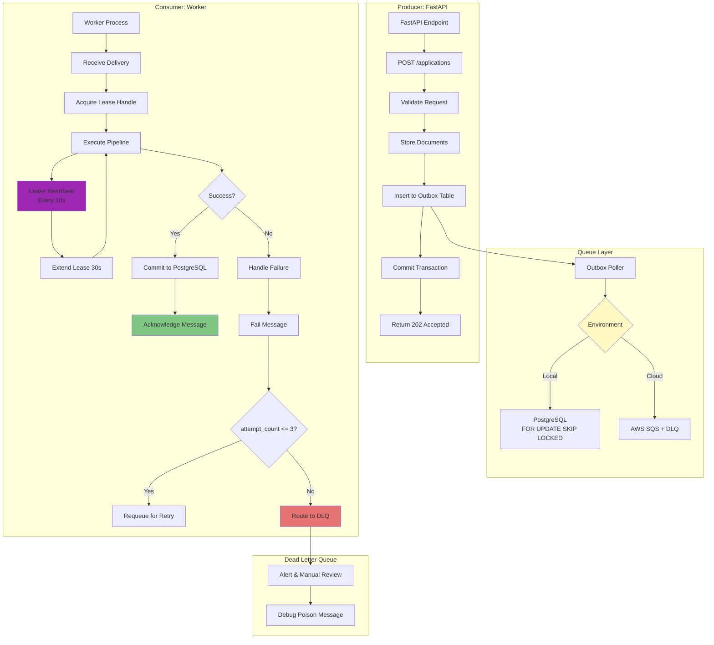

---

## 🔄 At-Least-Once Delivery Protocol

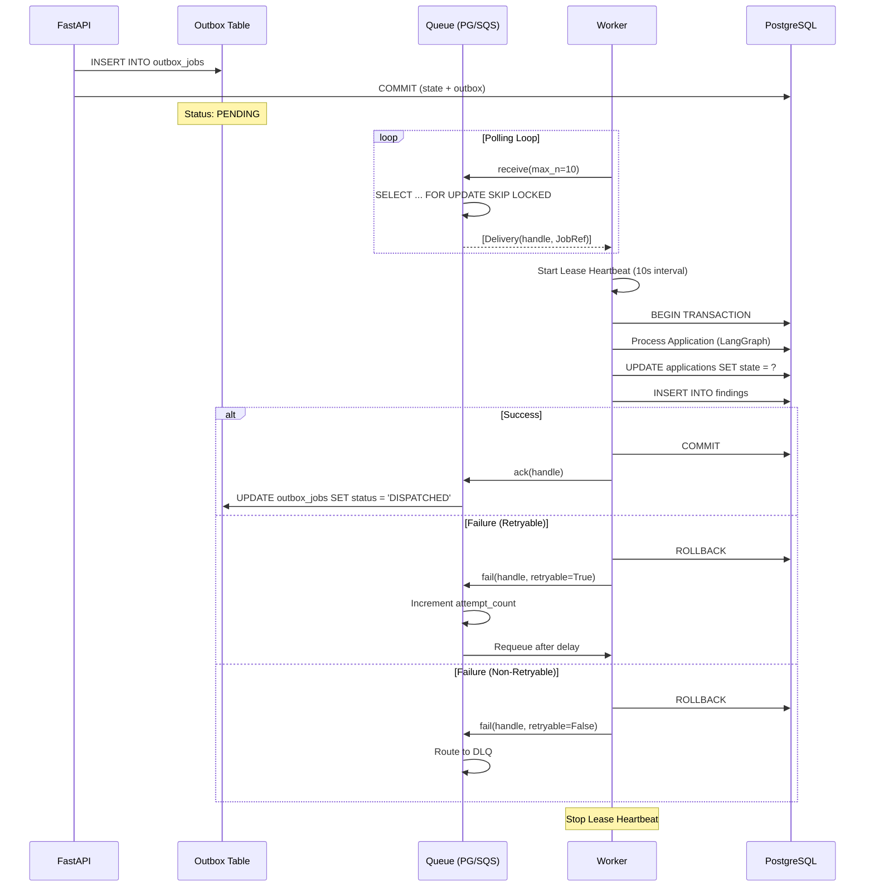

---

## 💓 Lease Heartbeat Mechanism

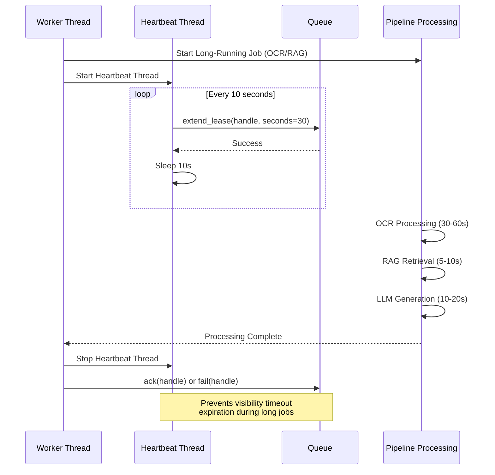

### Why Lease Heartbeat?

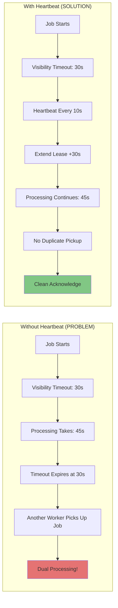

---

## 🔁 Retry Strategy & DLQ

```mermaid
graph TB
    Start[Job Received] --> Process{Execute Pipeline}
    
    Process -->|Success| Commit[Commit Results]
    Commit --> Ack[Acknowledge]
    Ack --> Done[Done ✓]
    
    Process -->|Exception| Catch[Catch Exception]
    Catch --> Classify{Error Type?}
    
    Classify -->|Transient<br/>(Network, Timeout)| Retryable[retryable = True]
    Classify -->|Permanent<br/>(Invalid Data, Corrupted File)| Permanent[retryable = False]
    
    Retryable --> CheckCount{attempt_count <= 3?}
    
    CheckCount -->|Yes| Increment[attempt_count++]
    Increment --> Requeue[Requeue with Delay]
    Requeue --> Backoff[Exponential Backoff<br/>1s → 5s → 30s]
    Backoff --> Start
    
    CheckCount -->|No| MaxRetries[Max Retries Exceeded]
    MaxRetries --> DLQ[Route to DLQ]
    Permanent --> DLQ
    
    DLQ --> Log[Log Error Details]
    Log --> Alert[Alert Team]
    Alert --> Manual[Manual Investigation]
    
    Manual --> Fix[Fix Root Cause]
    Fix --> Reprocess[Reprocess from DLQ]
    
    style Done fill:#81C784
    style DLQ fill:#E57373
    style Alert fill:#FF9800
```

### Retry Configuration

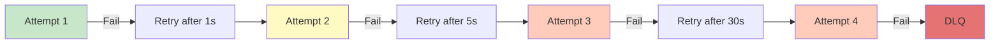

---

## 🎯 Idempotency Design

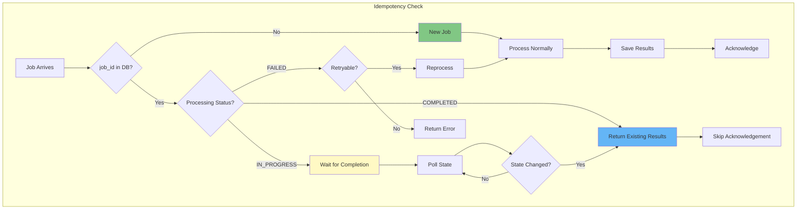

### Idempotency Invariant

> **Processing the same job ID multiple times MUST produce the same result without duplicating findings or corrupting state.**

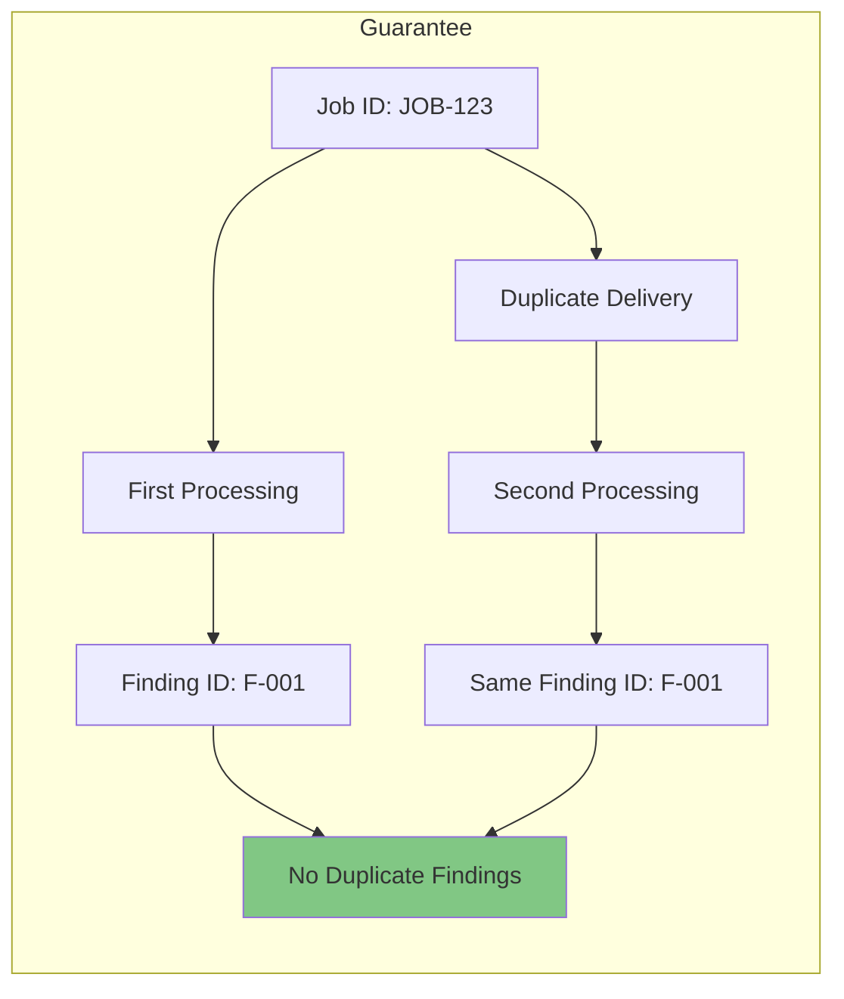

---

## 📦 Outbox Pattern Implementation

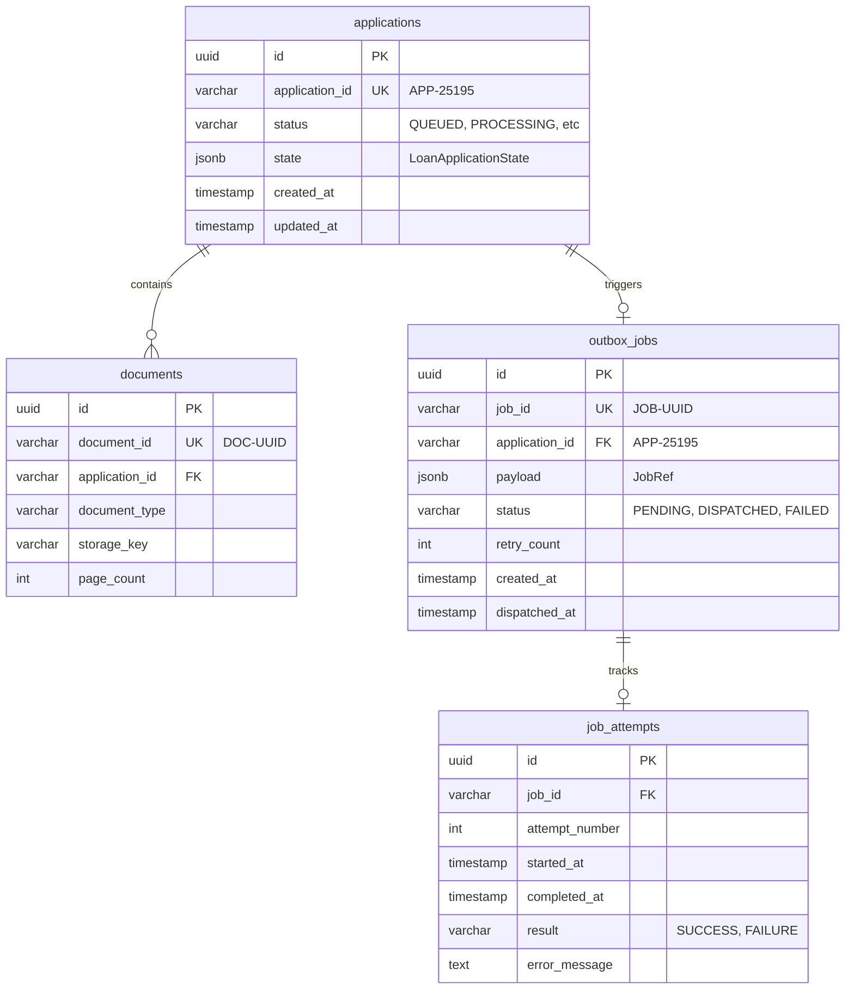

---

## 🚀 Worker Startup & Configuration

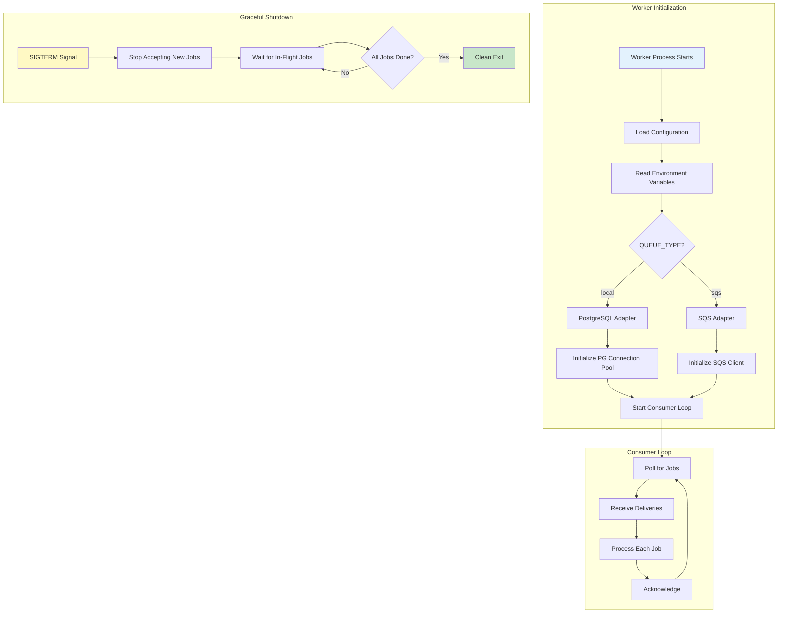

---

## 📊 Queue Adapter Interface

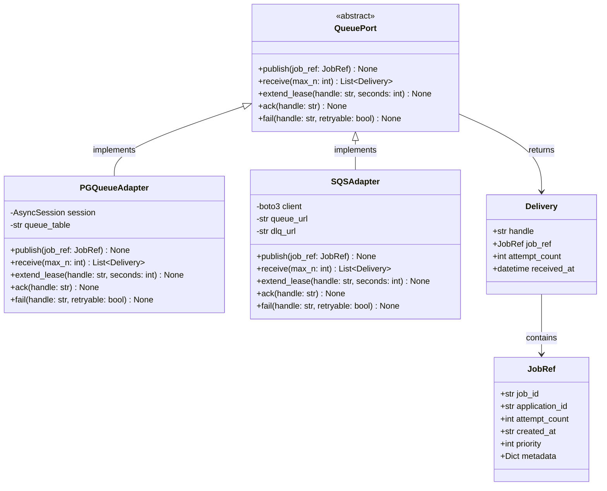

---

## 🔍 Monitoring & Observability

```mermaid
graph TB
    subgraph "Metrics Collection"
        Worker[Worker Process] --> Metrics[Prometheus Metrics]
        
        Metrics --> M1[Jobs Processed]
        Metrics --> M2[Processing Duration]
        Metrics --> M3[Queue Depth]
        Metrics --> M4[Retry Count]
        Metrics --> M5[DLQ Size]
        Metrics --> M6[Lease Extensions]
    end
    
    subgraph "Logging"
        Worker --> Logs[Structured Logs]
        Logs --> L1[job_id]
        Logs --> L2[application_id]
        Logs --> L3[node_name]
        Logs --> L4[duration_ms]
        Logs --> L5[status]
        Logs --> L6[error_details]
    end
    
    subgraph "Alerting"
        Metrics --> AlertManager[Alert Manager]
        AlertManager --> A1[DLQ Not Empty > 5min]
        AlertManager --> A2[Processing Time > 120s]
        AlertManager --> A3[Retry Rate > 10%]
        AlertManager --> A4[Worker Crashes]
    end
    
    subgraph "Dashboards"
        Metrics --> Grafana[Grafana Dashboard]
        Logs --> Grafana
        
        Grafana --> D1[Real-time Queue Status]
        Grafana --> D2[Processing Pipeline Health]
        Grafana --> D3[Error Rate Trends]
    end
    
    style AlertManager fill:#E57373
    style Grafana fill:#64B5F6
```

---

## 🛡️ Failure Scenarios & Handling

```mermaid
graph TB
    subgraph "Scenario 1: Worker Crash"
        A1[Worker Processing Job] --> A2[Crash: SIGKILL]
        A2 --> A3[Lease Expires]
        A3 --> A4[Job Returns to Queue]
        A4 --> A5[Another Worker Picks Up]
        A5 --> A6[Idempotency Prevents Duplicate]
    end
    
    subgraph "Scenario 2: Database Unavailable"
        B1[Worker Commits Results] --> B2[DB Connection Lost]
        B2 --> B3[Rollback Transaction]
        B3 --> B4[Fail Message retryable=True]
        B4 --> B5[Requeue for Retry]
    end
    
    subgraph "Scenario 3: Corrupted Document"
        C1[OCR Processing] --> C2[File Corrupted]
        C2 --> C3[Parser Exception]
        C3 --> C4[Fail Message retryable=False]
        C4 --> C5[Route to DLQ]
        C5 --> C6[Manual Investigation]
    end
    
    subgraph "Scenario 4: LLM Timeout"
        D1[LLM Generation] --> D2[Timeout > 60s]
        D2 --> D3[Extend Lease Failed]
        D3 --> D4[Message Redelivered]
        D4 --> D5[Retry with Fresh Lease]
    end
    
    style A6 fill:#81C784
    style B5 fill:#FFF9C4
    style C5 fill:#FF9800
    style D5 fill:#64B5F6
```

---

## 📚 Related Documentation

- [LangGraph Workflow](langgraph_workflow.md) - Pipeline orchestration
- [System Overview](system_overview.md) - Complete architecture
- **Outbox dispatcher** - see [`apps/api/outbox_dispatcher.py`](../apps/api/outbox_dispatcher.py) and [`adapters/queue/`](../adapters/queue/)
- [Deployment Guide](deployment_guide.md) - Queue provisioning
